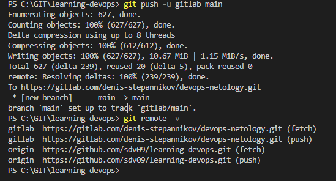
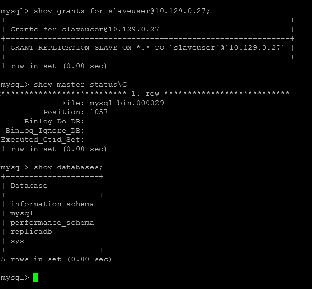
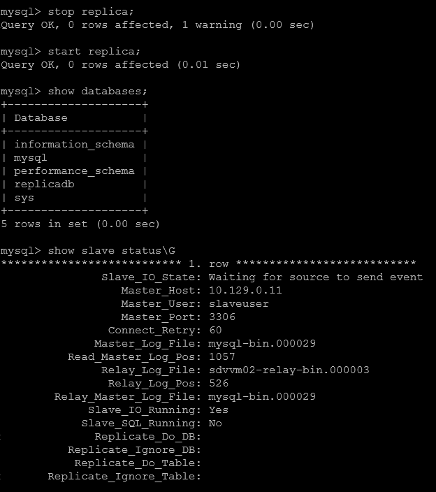

### Домашнее задание к занятию «02.Git.Basic» [Степанников Денис]

---

### Задание 1

GitLab
Создадим аккаунт в GitLab, если у вас его ещё нет:

GitLab. Для регистрации можно использовать аккаунт Google, GitHub и другие.

После регистрации или авторизации в GitLab создайте новый проект, нажав на ссылку Create a projet. Желательно назвать также, как и в GitHub — devops-netology и visibility level, выбрать Public.

Галочку Initialize repository with a README лучше не ставить, чтобы не пришлось разрешать конфликты.

Если вы зарегистрировались при помощи аккаунта в другой системе и не указали пароль, то увидите сообщение: You won't be able to pull or push project code via HTTPS until you set a password on your account. Тогда перейдите по ссылке из этого сообщения и задайте пароль. Если вы уже умеете пользоваться SSH-ключами, то воспользуйтесь этой возможностью (подробнее про SSH мы поговорим в следующем учебном блоке).

Перейдите на страницу созданного вами репозитория, URL будет примерно такой: https://gitlab.com/YOUR_LOGIN/devops-netology. Изучите предлагаемые варианты для начала работы в репозитории в секции Command line instructions.

Запомните вывод команды git remote -v.

Из-за того, что это будет наш дополнительный репозиторий, ни один вариант из перечисленных в инструкции (на странице вновь созданного репозитория) нам не подходит. Поэтому добавляем этот репозиторий, как дополнительный remote, к созданному репозиторию в рамках предыдущего домашнего задания: git remote add gitlab https://gitlab.com/YOUR_LOGIN/devops-netology.git.

Отправьте изменения в новый удалённый репозиторий git push -u gitlab main.

Обратите внимание, как изменился результат работы команды git remote -v.

### Решение:

Регистрируюсь в GitLab, добавляю удаленные репозитории:

- По https:

`git remote add gitlab  https://gitlab.com/denis-stepannikov/devops-netology.git`

- По SSH (процесс генерации ключевой пары оставляем за скобками)

- Результат:

 

---

### Задание 2

Выполните конфигурацию master-slave репликации, примером можно пользоваться из лекции.

*Приложите скриншоты конфигурации, выполнения работы: состояния и режимы работы серверов.*

### Решение:

Конфигурация MASTER сервера:

sudo nano /etc/mysql/mysql.conf.d/mysqld.cnf
```
[mysqld]
user            = mysql
pid-file        = /var/run/mysqld/mysqld.pid
socket  = /var/run/mysqld/mysqld.sock
datadir = /var/lib/mysql

bind-address            = 0.0.0.0
mysqlx-bind-address     = 127.0.0.1
myisam-recover-options  = BACKUP

slow_query_log          = 1
server-id               = 1
log_bin                 = /var/log/mysql/mysql-bin.log
max_binlog_size   = 100M

```



Конфигурация SLAVE сервера:

```
[mysqld]
user            = mysql
pid-file        = /var/run/mysqld/mysqld.pid
socket  = /var/run/mysqld/mysqld.sock
datadir = /var/lib/mysql

bind-address            = 0.0.0.0
mysqlx-bind-address     = 127.0.0.1
myisam-recover-options  = BACKUP

log_error = /var/log/mysql/error.log
slow_query_log          = 1
server-id               = 2
read_only = 1
log_bin                 = /var/log/mysql/mysql-bin.log
max_binlog_size   = 100M

```




---