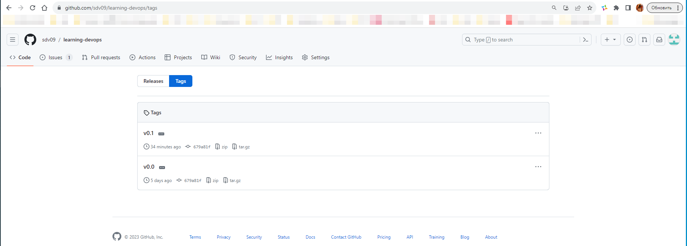
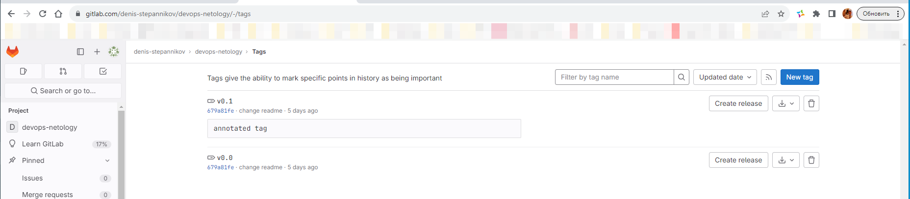
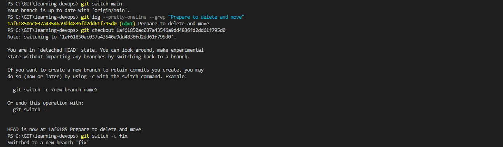
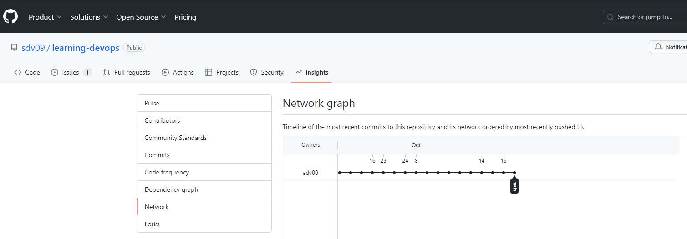
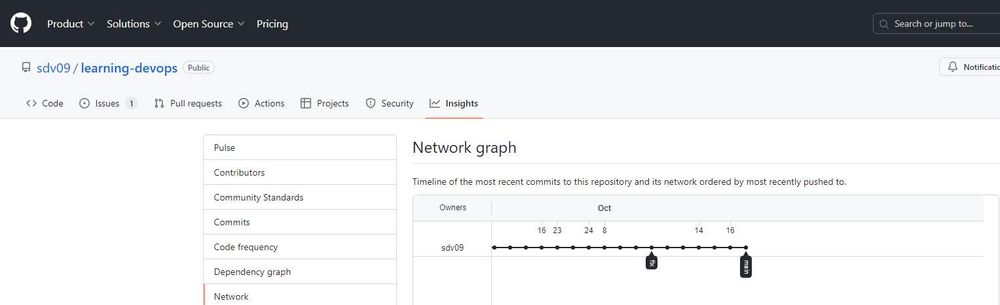
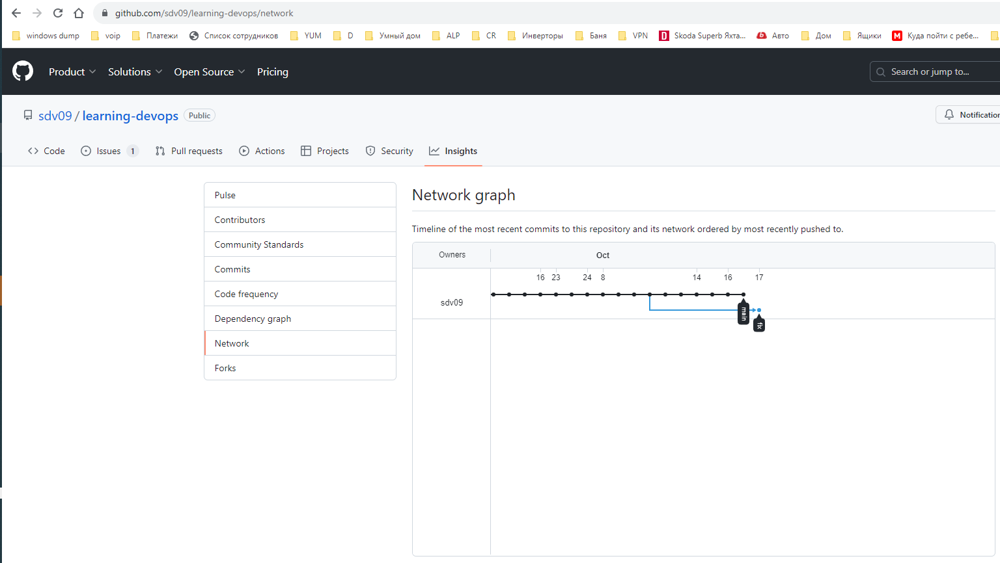

### Домашнее задание к занятию «02.Git.Basic» [Степанников Денис]

---

### Задание 1

GitLab
Создадим аккаунт в GitLab, если у вас его ещё нет:

GitLab. Для регистрации можно использовать аккаунт Google, GitHub и другие.

После регистрации или авторизации в GitLab создайте новый проект, нажав на ссылку Create a projet. Желательно назвать также, как и в GitHub — devops-netology и visibility level, выбрать Public.

Галочку Initialize repository with a README лучше не ставить, чтобы не пришлось разрешать конфликты.

Если вы зарегистрировались при помощи аккаунта в другой системе и не указали пароль, то увидите сообщение: You won't be able to pull or push project code via HTTPS until you set a password on your account. Тогда перейдите по ссылке из этого сообщения и задайте пароль. Если вы уже умеете пользоваться SSH-ключами, то воспользуйтесь этой возможностью (подробнее про SSH мы поговорим в следующем учебном блоке).

Перейдите на страницу созданного вами репозитория, URL будет примерно такой: https://gitlab.com/YOUR_LOGIN/devops-netology. Изучите предлагаемые варианты для начала работы в репозитории в секции Command line instructions.

Запомните вывод команды git remote -v.

Из-за того, что это будет наш дополнительный репозиторий, ни один вариант из перечисленных в инструкции (на странице вновь созданного репозитория) нам не подходит. Поэтому добавляем этот репозиторий, как дополнительный remote, к созданному репозиторию в рамках предыдущего домашнего задания: git remote add gitlab https://gitlab.com/YOUR_LOGIN/devops-netology.git.

Отправьте изменения в новый удалённый репозиторий git push -u gitlab main.

Обратите внимание, как изменился результат работы команды git remote -v.

### Решение:

Регистрируюсь в GitLab, добавляю удаленные репозитории:

- По https:

`git remote add gitlab  https://gitlab.com/denis-stepannikov/devops-netology.git`

- По SSH (процесс генерации ключевой пары оставляем за скобками)

- Результат:

 

---

### Задание 2 Тэги

Представьте ситуацию, когда в коде была обнаружена ошибка — надо вернуться на предыдущую версию кода, исправить её и выложить исправленный код в продакшн. Мы никуда не будем выкладывать код, но пометим некоторые коммиты тегами и создадим от них ветки.

Создайте легковестный тег v0.0 на HEAD-коммите и запуште его во все три добавленных на предыдущем этапе upstream.
Аналогично создайте аннотированный тег v0.1.
Перейдите на страницу просмотра тегов в GitHab (и в других репозиториях) и посмотрите, чем отличаются созданные теги.

в GitHub — https://github.com/YOUR_ACCOUNT/devops-netology/releases;

в GitLab — https://gitlab.com/YOUR_ACCOUNT/devops-netology/-/tags;

### Решение:

**Создаю тэги:**

- простой

`git tag v0.0`

- аннотированный

`git tag -a v0.1 -m "annotated tag`

**Пуш тэгов в репозитории**

`git push https://github.com/sdv09/learning-devops.git v0.0 v0.1`

`git push https://gitlab.com/denis-stepannikov/devops-netology.git v0.0 v0.1`

---

### Задание 3 Ветки

Давайте посмотрим, как будет выглядеть история коммитов при создании веток.

Переключитесь обратно на ветку main, которая должна быть связана с веткой main репозитория на github.

Посмотрите лог коммитов и найдите хеш коммита с названием Prepare to delete and move, который был создан в пределах предыдущего домашнего задания.

Выполните git checkout по хешу найденного коммита.

Создайте новую ветку fix, базируясь на этом коммите git switch -c fix.

Отправьте новую ветку в репозиторий на GitHub git push -u origin fix.

Посмотрите, как визуально выглядит ваша схема коммитов: https://github.com/YOUR_ACCOUNT/devops-netology/network.

Теперь измените содержание файла README.md, добавив новую строчку.

Отправьте изменения в репозиторий и посмотрите, как изменится схема на странице https://github.com/YOUR_ACCOUNT/devops-netology/network и как изменится вывод команды git log.

### Решение:

