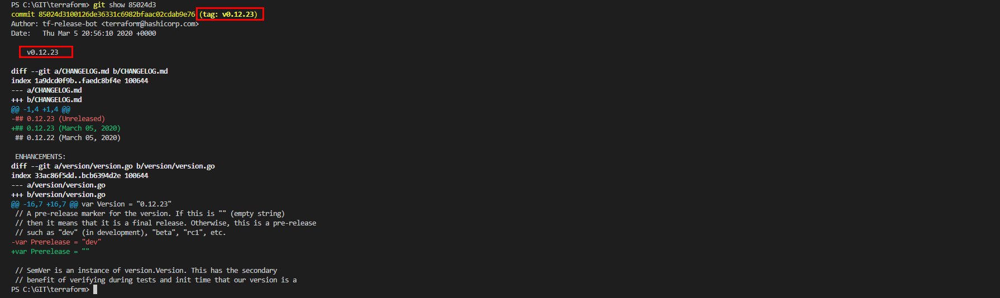
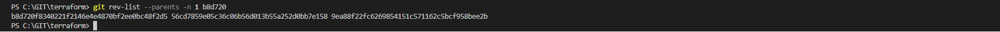

### Домашнее задание к занятию «02.Git.Tools» [Степанников Денис]

---

### Задание 1


В клонированном репозитории:

1. Найдите полный хеш и комментарий коммита, хеш которого начинается на `aefea`.
2. Ответьте на вопросы.

* Какому тегу соответствует коммит `85024d3`?
* Сколько родителей у коммита `b8d720`? Напишите их хеши.
* Перечислите хеши и комментарии всех коммитов, которые были сделаны между тегами  v0.12.23 и v0.12.24.
* Найдите коммит, в котором была создана функция `func providerSource`, её определение в коде выглядит так: `func providerSource(...)` (вместо троеточия перечислены аргументы).
* Найдите все коммиты, в которых была изменена функция `globalPluginDirs`.
* Кто автор функции `synchronizedWriters`? 

*В качестве решения ответьте на вопросы и опишите, как были получены эти ответы.*
### Решение:

> 1. Найдите полный хеш и комментарий коммита, хеш которого начинается на aefea.

`git show aefea`

 

> 2. Ответьте на вопросы:
 
>  - Какому тегу соответствует коммит 85024d3?

`git show 85024d3`

 

> - Сколько родителей у коммита b8d720? Напишите их хеши.

`git rev-list --parents -n 1 b8d720`
- b8d720f8340221f2146e4e4870bf2ee0bc48f2d5 
- 56cd7859e05c36c06b56d013b55a252d0bb7e158 
- 9ea88f22fc6269854151c571162c5bcf958bee2b

 

> - Перечислите хеши и комментарии всех коммитов, которые были сделаны между тегами v0.12.23 и v0.12.24.

`git log --oneline v0.12.23..v0.12.24`
```
PS C:\GIT\terraform> git log --oneline v0.12.23..v0.12.24
33ff1c03bb (tag: v0.12.24) v0.12.24
b14b74c493 [Website] vmc provider links
3f235065b9 Update CHANGELOG.md
6ae64e247b registry: Fix panic when server is unreachable
5c619ca1ba website: Remove links to the getting started guide's old location
06275647e2 Update CHANGELOG.md
d5f9411f51 command: Fix bug when using terraform login on Windows
4b6d06cc5d Update CHANGELOG.md
dd01a35078 Update CHANGELOG.md
225466bc3e Cleanup after v0.12.23 release
PS C:\GIT\terraform> 
```

> - Найдите коммит, в котором была создана функция func providerSource, её определение в коде выглядит так: func providerSource(...) > - (вместо троеточия перечислены аргументы).

Находим хэши и даты коммитов:

`git log -S "func providerSource" --pretty=format:"%h %ad %s" --date=format:"%Y-%m-%d %H:%M"`

```
PS C:\Users\dys5324> cd C:\GIT\terraform              
PS C:\GIT\terraform> git log -S "func providerSource" --pretty=format:"%h %ad %s" --date=format:"%Y-%m-%d %H:%M"
5af1e6234a 2020-04-21 16:28 main: Honor explicit provider_installation CLI config when present
8c928e8358 2020-04-02 18:04 main: Consult local directories as potential mirrors of providers
PS C:\GIT\terraform> 
```
Выбрал по ранней дате, это 
```
8c928e8358 2020-04-02 18:04 main: Consult local directories as potential mirrors of providers
```

> - Найдите все коммиты, в которых была изменена функция globalPluginDirs.

`git log --oneline -S"globalPluginDirs"`

 


Ищем файл, где объявляется функция 
```
PS C:\Git\terraform> git grep "func globalPluginDirs("       
plugins.go:func globalPluginDirs() []string {
```

Ищем коммиты с изменением этой функции в найденном файле
```
PS C:\Git\terraform> git log -s -L :globalPluginDirs:plugins.go --oneline
78b1220558 Remove config.go and update things using its aliases
52dbf94834 keep .terraform.d/plugins for discovery
41ab0aef7a Add missing OS_ARCH dir to global plugin paths      
66ebff90cd move some more plugin search path logic to command  
8364383c35 Push plugin discovery down into command package
PS C:\Git\terraform> 
```

> - Кто автор функции synchronizedWriters?

Находим самый ранний коммит, содержащий *synchronizedWriters*: 

`git log -S "synchronizedWriters" --pretty=format:"%h %an: %ad %s" --date=format:"%Y-%m-%d %H:%M"` --> `5ac311e2a9`

```
PS C:\GIT\terraform> git log -S "synchronizedWriters" --pretty=format:"%h %an: %ad %s" --date=format:"%Y-%m-%d %H:%M"
bdfea50cc8 James Bardin: 2020-11-30 18:02 remove unused
fd4f7eb0b9 James Bardin: 2020-10-21 13:06 remove prefixed io
5ac311e2a9 Martin Atkins: 2017-05-03 16:25 main: synchronize writes to VT100-faker on Windows
PS C:\GIT\terraform> 
```
Определяем имя файла в котором определена функция и номера строк в файле, где находится код функции:

`git grep -C 5 -n "synchronizedWriters" 5ac311e2a9`

Имя файла `synchronized_writers.go`, а строки - начиная с 15.

 

Автор: *Martin Atkins*