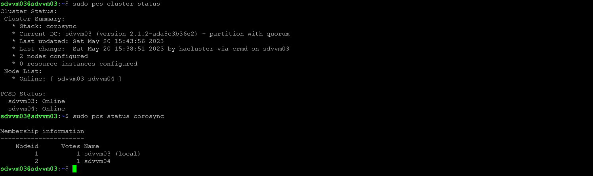
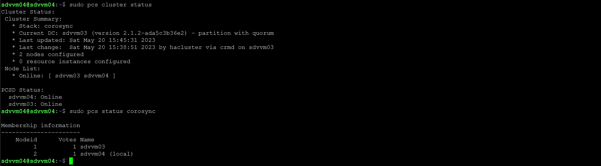
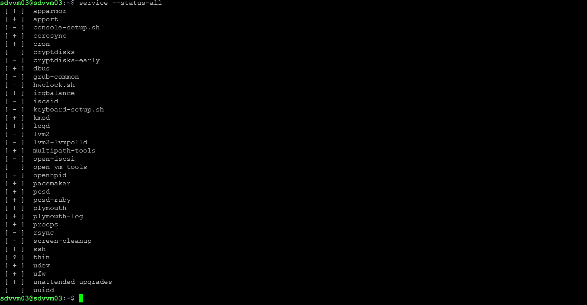
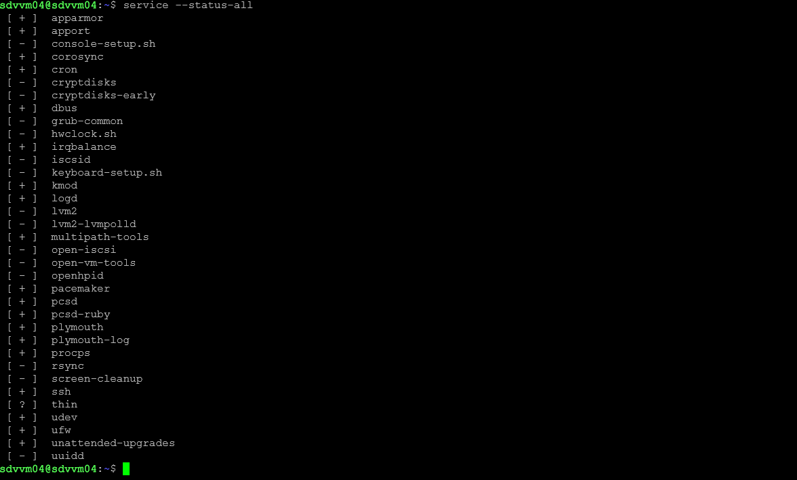

### Домашнее задание к занятию 10.3 «Pacemaker» [Степанников Денис]

---

### Задание 1

Опишите основные функции и назначение Pacemaker.

*Приведите ответ в свободной форме.*

## Решение:
Pacemaker - это инструмент для управления ресурсами в кластере, который работает на основе Corosync. Он контролирует различные ресурсы, такие как программное обеспечение, приложения и виртуальные машины, и обеспечивает их безопасное и восстановительное переключение в случае отказа в одном из узлов или ресурсов.

---

### Задание 2

Опишите основные функции и назначение Corosync.

*Приведите ответ в свободной форме.*

## Решение:
Corosync - это програмный продукт, который обеспечивает гибкую и масштабируемую коммуникацию между узлами кластера, позволяя им работать в согласованном режиме и синхронизировать свои действия.

---

### Задание 3

Соберите модель, состоящую из двух виртуальных машин. Установите Pacemaker, Corosync, Pcs. Настройте HA кластер.

*Пришлите скриншот рабочей конфигурации и состояния сервиса для каждого нода.*

## Решение:

---

