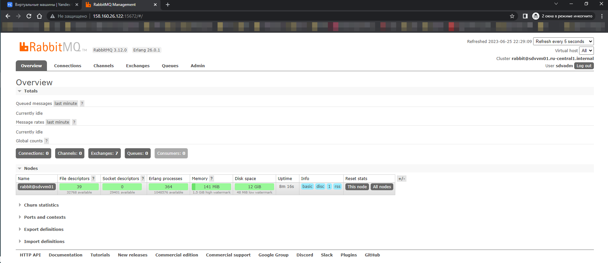
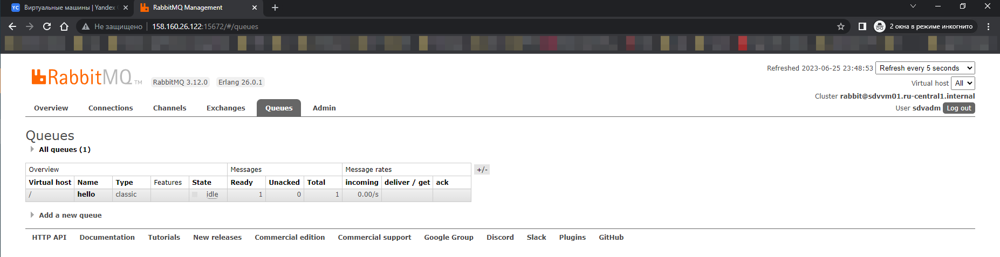
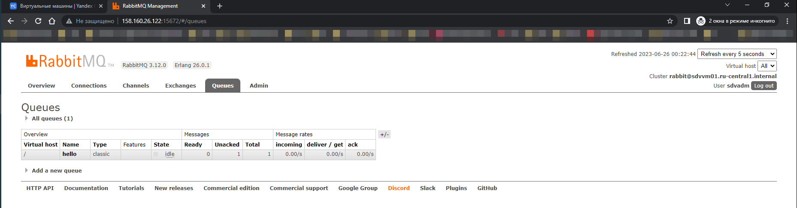
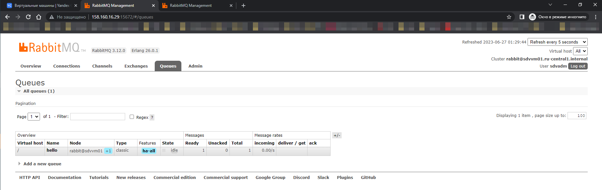
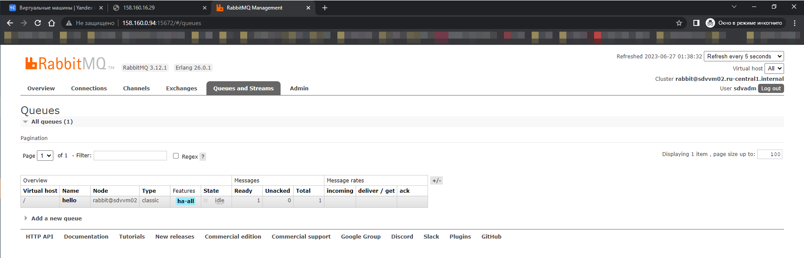
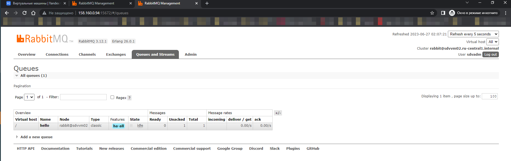

### Домашнее задание к занятию  «Очереди RabbitMQ» [Степанников Денис]

---

### Задание 1. Установка RabbitMQ

Используя Vagrant или VirtualBox, создайте виртуальную машину и установите RabbitMQ.
Добавьте management plug-in и зайдите в веб-интерфейс.

*Итогом выполнения домашнего задания будет приложенный скриншот веб-интерфейса RabbitMQ.*

### Решение:




---

### Задание 2. Отправка и получение сообщений

Используя приложенные скрипты, проведите тестовую отправку и получение сообщения.
Для отправки сообщений необходимо запустить скрипт producer.py.

Для работы скриптов вам необходимо установить Python версии 3 и библиотеку Pika.
Также в скриптах нужно указать IP-адрес машины, на которой запущен RabbitMQ, заменив localhost на нужный IP.

```shell script
$ pip install pika
```

Зайдите в веб-интерфейс, найдите очередь под названием hello и сделайте скриншот.
После чего запустите второй скрипт consumer.py и сделайте скриншот результата выполнения скрипта

*В качестве решения домашнего задания приложите оба скриншота, сделанных на этапе выполнения.*

Для закрепления материала можете попробовать модифицировать скрипты, чтобы поменять название очереди и отправляемое сообщение.


### Решение:




---

### Задание 3. Подготовка HA кластера

Используя Vagrant или VirtualBox, создайте вторую виртуальную машину и установите RabbitMQ.
Добавьте в файл hosts название и IP-адрес каждой машины, чтобы машины могли видеть друг друга по имени.

Пример содержимого hosts файла:
```shell script
$ cat /etc/hosts
192.168.0.10 rmq01
192.168.0.11 rmq02
```
После этого ваши машины могут пинговаться по имени.

Затем объедините две машины в кластер и создайте политику ha-all на все очереди.

*В качестве решения домашнего задания приложите скриншоты из веб-интерфейса с информацией о доступных нодах в кластере и включённой политикой.*

Также приложите вывод команды с двух нод:

```shell script
$ rabbitmqctl cluster_status
```

Для закрепления материала снова запустите скрипт producer.py и приложите скриншот выполнения команды на каждой из нод:

```shell script
$ rabbitmqadmin get queue='hello'
```

После чего попробуйте отключить одну из нод, желательно ту, к которой подключались из скрипта, затем поправьте параметры подключения в скрипте consumer.py на вторую ноду и запустите его.

*Приложите скриншот результата работы второго скрипта.*


### Решение:
## NODE1
```
sdvvm01@sdvvm01:~$ sudo rabbitmqctl cluster_status
Cluster status of node rabbit@sdvvm01 ...
Basics

Cluster name: rabbit@sdvvm01.ru-central1.internal
Total CPU cores available cluster-wide: 4

Disk Nodes

rabbit@sdvvm01
rabbit@sdvvm02

Running Nodes

rabbit@sdvvm01
rabbit@sdvvm02

Versions

rabbit@sdvvm01: RabbitMQ 3.12.0 on Erlang 26.0.1
rabbit@sdvvm02: RabbitMQ 3.12.1 on Erlang 26.0.1

CPU Cores

Node: rabbit@sdvvm01, available CPU cores: 2
Node: rabbit@sdvvm02, available CPU cores: 2

Maintenance status

Node: rabbit@sdvvm01, status: not under maintenance
Node: rabbit@sdvvm02, status: not under maintenance

Alarms

(none)

Network Partitions

(none)

Listeners

Node: rabbit@sdvvm01, interface: [::], port: 15672, protocol: http, purpose: HTTP API
Node: rabbit@sdvvm01, interface: [::], port: 25672, protocol: clustering, purpose: inter-node and CLI tool communication
Node: rabbit@sdvvm01, interface: [::], port: 5672, protocol: amqp, purpose: AMQP 0-9-1 and AMQP 1.0
Node: rabbit@sdvvm02, interface: [::], port: 15672, protocol: http, purpose: HTTP API
Node: rabbit@sdvvm02, interface: [::], port: 25672, protocol: clustering, purpose: inter-node and CLI tool communication
Node: rabbit@sdvvm02, interface: [::], port: 5672, protocol: amqp, purpose: AMQP 0-9-1 and AMQP 1.0

Feature flags

Flag: classic_mirrored_queue_version, state: enabled
Flag: classic_queue_type_delivery_support, state: enabled
Flag: direct_exchange_routing_v2, state: enabled
Flag: drop_unroutable_metric, state: enabled
Flag: empty_basic_get_metric, state: enabled
Flag: feature_flags_v2, state: enabled
Flag: implicit_default_bindings, state: enabled
Flag: listener_records_in_ets, state: enabled
Flag: maintenance_mode_status, state: enabled
Flag: quorum_queue, state: enabled
Flag: restart_streams, state: enabled
Flag: stream_queue, state: enabled
Flag: stream_sac_coordinator_unblock_group, state: enabled
Flag: stream_single_active_consumer, state: enabled
Flag: tracking_records_in_ets, state: enabled
Flag: user_limits, state: enabled
Flag: virtual_host_metadata, state: enabled
sdvvm01@sdvvm01:~$
```

## NODE2

```
sdvvm02@sdvvm02:~$ sudo rabbitmqctl cluster_status
Cluster status of node rabbit@sdvvm02 ...
Basics

Cluster name: rabbit@sdvvm02.ru-central1.internal
Total CPU cores available cluster-wide: 4

Disk Nodes

rabbit@sdvvm01
rabbit@sdvvm02

Running Nodes

rabbit@sdvvm01
rabbit@sdvvm02

Versions

rabbit@sdvvm02: RabbitMQ 3.12.1 on Erlang 26.0.1
rabbit@sdvvm01: RabbitMQ 3.12.0 on Erlang 26.0.1

CPU Cores

Node: rabbit@sdvvm02, available CPU cores: 2
Node: rabbit@sdvvm01, available CPU cores: 2

Maintenance status

Node: rabbit@sdvvm02, status: not under maintenance
Node: rabbit@sdvvm01, status: not under maintenance

Alarms

(none)

Network Partitions

(none)

Listeners

Node: rabbit@sdvvm02, interface: [::], port: 15672, protocol: http, purpose: HTTP API
Node: rabbit@sdvvm02, interface: [::], port: 25672, protocol: clustering, purpose: inter-node and CLI tool communication
Node: rabbit@sdvvm02, interface: [::], port: 5672, protocol: amqp, purpose: AMQP 0-9-1 and AMQP 1.0
Node: rabbit@sdvvm01, interface: [::], port: 15672, protocol: http, purpose: HTTP API
Node: rabbit@sdvvm01, interface: [::], port: 25672, protocol: clustering, purpose: inter-node and CLI tool communication
Node: rabbit@sdvvm01, interface: [::], port: 5672, protocol: amqp, purpose: AMQP 0-9-1 and AMQP 1.0

Feature flags

Flag: classic_mirrored_queue_version, state: enabled
Flag: classic_queue_type_delivery_support, state: enabled
Flag: direct_exchange_routing_v2, state: enabled
Flag: drop_unroutable_metric, state: enabled
Flag: empty_basic_get_metric, state: enabled
Flag: feature_flags_v2, state: enabled
Flag: implicit_default_bindings, state: enabled
Flag: listener_records_in_ets, state: enabled
Flag: maintenance_mode_status, state: enabled
Flag: quorum_queue, state: enabled
Flag: restart_streams, state: enabled
Flag: stream_queue, state: enabled
Flag: stream_sac_coordinator_unblock_group, state: enabled
Flag: stream_single_active_consumer, state: enabled
Flag: tracking_records_in_ets, state: enabled
Flag: user_limits, state: enabled
Flag: virtual_host_metadata, state: enabled
sdvvm02@sdvvm02:~$

```

```
sdvvm03@sdvvm03:~$ python3 producer.py
 [x] Sent 'Hello Netology!'
sdvvm03@sdvvm03:~$
```




Отключил ноду sdvvm01:



Запустил consumer.py с подключением к sdvvm02

```
sdvvm03@sdvvm03:~$ python3 consumer.py
 [x] Received b'Hello Netology!'
```


---
