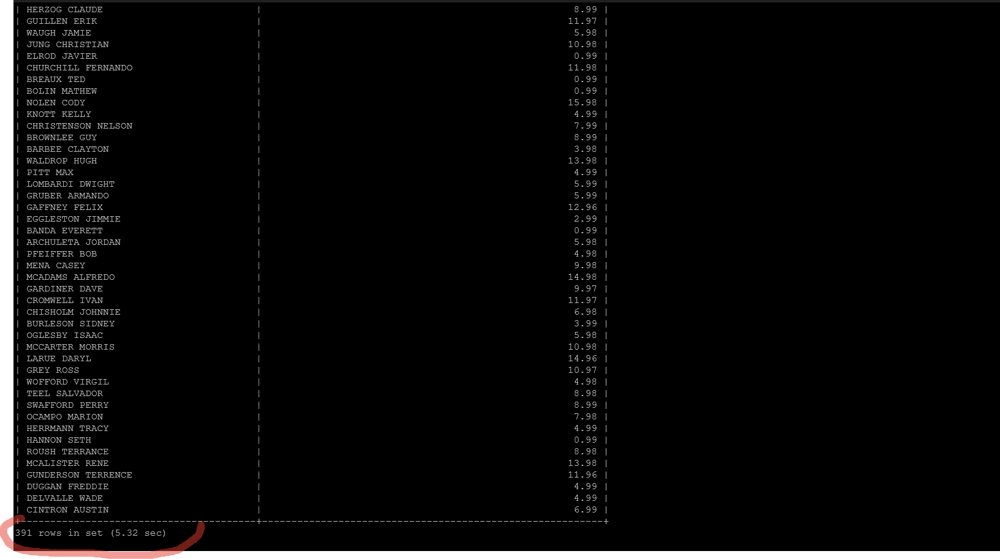

### Домашнее задание к занятию «Индексы» [Степанников Денис]

---

### Задание 1

Напишите запрос к учебной базе данных, который вернёт процентное отношение общего размера всех индексов к общему размеру всех таблиц.

### Решение:
```
select sum(tt.data_length) as data, sum(tt.index_length) as 'index', concat( round ((sum(tt.index_length) / sum(tt.data_length)) *100), ' %') as ratio from information_schema.tables tt where tt.table_schema = 'sakila';
```


---

### Задание 2

Выполните explain analyze следующего запроса:
```sql
select distinct concat(c.last_name, ' ', c.first_name), sum(p.amount) over (partition by c.customer_id, f.title)
from payment p, rental r, customer c, inventory i, film f
where date(p.payment_date) = '2005-07-30' and p.payment_date = r.rental_date and r.customer_id = c.customer_id and i.inventory_id = r.inventory_id
```
- перечислите узкие места;
- оптимизируйте запрос: внесите корректировки по использованию операторов, при необходимости добавьте индексы.

### Решение:
Рекомендуется исключить dictinct и over и обращение к таблице film, потому что это серьезно замедляет выполнение запроса.

```
select concat(c.last_name, ' ', c.first_name) as name, sum(p.amount) as summ from payment p, rental r, customer c, inventory i where date(p.payment_date) = '2005-07-30' and p.payment_date = r.rental_date and r.customer_id = c.customer_id and i.inventory_id = r.inventory_id group by name;
```
Время выполнения запроса из ТЗ:


Время выполнения *оптимизированного* запроса из ТЗ:


---