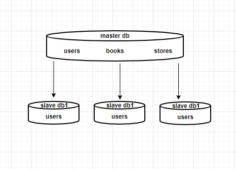
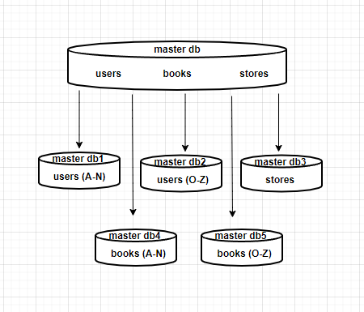

### Домашнее задание к занятию «Репликация и масштабирование. Часть 2» [Степанников Денис]

---

### Задание 1

Опишите основные преимущества использования масштабирования методами:

- активный master-сервер и пассивный репликационный slave-сервер; 
- master-сервер и несколько slave-серверов;
- активный сервер со специальным механизмом репликации — distributed replicated block device (DRBD);
- SAN-кластер.

*Дайте ответ в свободной форме.*

### Решение:
- активный master-сервер и пассивный репликационный slave-сервер - обеспечивает отказоустойчивость, а также снижает нагрузку путем направления части запросов на slave-сервер
- master-сервер и несколько slave-серверов - повышает отказоустойчивость и распределяет нагрузку по нескольким серверам
- активный сервер со специальным механизмом репликации — distributed replicated block device (DRBD)  обеспечивает отказоусточивость, позволяя при этом использовать плюсы RAID1, а также HA-кластера
- SAN-кластер - обеспечивает высокую отказоустойчивость и производительность при отсутствии нагрузки на локальную сеть

---

### Задание 2

Разработайте план для выполнения горизонтального и вертикального шаринга базы данных. База данных состоит из трёх таблиц: 

- пользователи, 
- книги, 
- магазины (столбцы произвольно). 

Опишите принципы построения системы и их разграничение или разбивку между базами данных.

*Пришлите блоксхему, где и что будет располагаться. Опишите, в каких режимах будут работать сервера.* 

### Решение:
Вертикальный шардинг - каждая таблица перенесена на отдельный сервер:

Горизонтальный шардинг - USERS по фамилии (A-N) и (O-Z),  BOOKS (A-N) и (O-Z) по одинаковому принципу вынесены на отдельные сервера, данные STORES целиком на одном сервере:

---