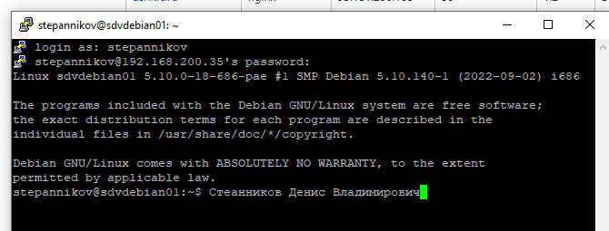
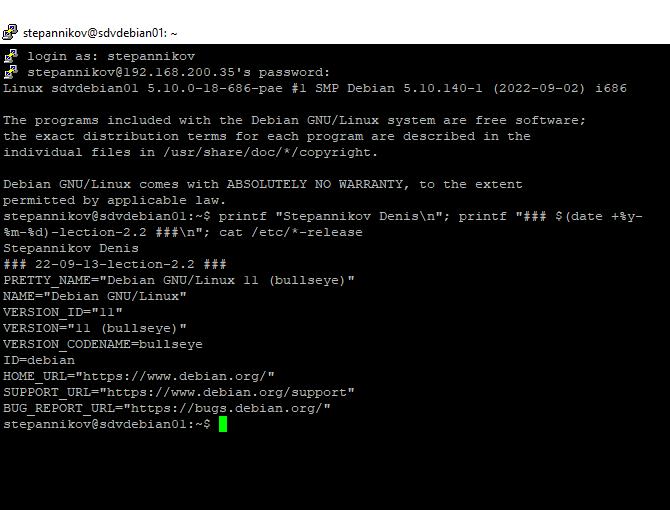
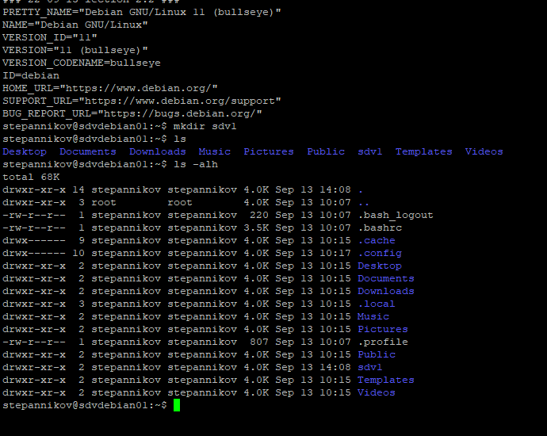
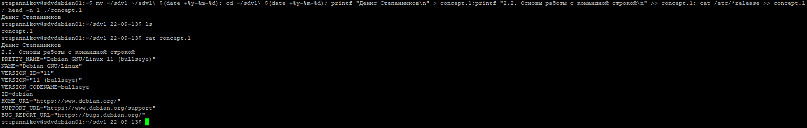
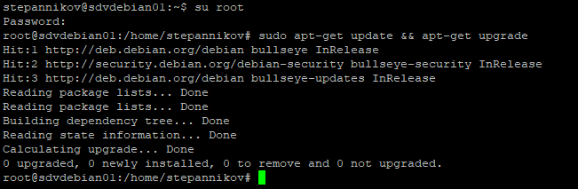
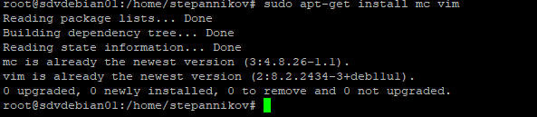
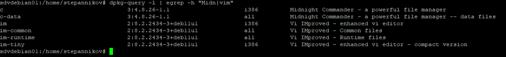

### 2.2. Основы работы с командной строкой [Степанников Денис]
## Задание 1

## Задание 2
```console
printf "Stepannikov Denis\n"; printf "### $(date +%y-%m-%d)-lection-2.2 ###\n"; cat /etc/*-release
```


## Задание 3


## Задание 4
```console
mv ~/sdv1 ~/sdv1\ $(date +%y-%m-%d); cd ~/sdv1\ $(date +%y-%m-%d); printf "Денис Степанников\n" > concept.1;printf "2.2. Основы работы с командной строкой\n" >> concept.1; cat /etc/*release >> concept.1; head -n 1 ./concept.1
```


## Задание 5



Нигде не нашел информацию как посмотреть от какого пользователя был установлен софт. Он ведь от root всегда ставится? 

По софту, который я установил нашел только вот этот вывод:
```console
dpkg-query -l | egrep -h "Midn|vim"
```console



но, это полагаю все равно не то. уточните, пожалуйста задачу.