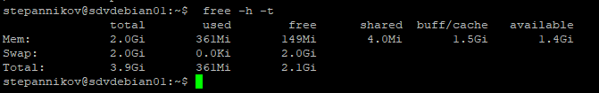

### 2.4 Память, управление памятью [Степанников Денис]
## Задание 1

Что происходит с оперативной памятью во время перехода ПК в:

	1.	сон (suspend)
	2.	гибернацию (hibernate)

## Решение:

	1.	Сон (Sleep) - режим энергосбережения, который позволяет приостановить работу, а в случае необходимости, оперативно ее восстановить на тот момент, на котором она остановилась. При этом все данные системного и прикладного ПО хранятся в оперативной памяти. в итоге компьютер включен, но потребляет мало электроэнергии и может быстро восстановить работу.
	2.	Гибернация (Hibernation) - аналогично предыдущему пункту (Сон), но данные хранятся не в RAM, а на дисках (HDD/SSD). При переходе в режим гибернации содержимое RAM выгружается на диск, а ПК выключается, т.е. никакого питания не потребляет. При включении ПК, данные с диска загружаются в RAM и работа восстанавливается с того момента, на котором была прервана. Процесс в данном случае проиходит значительно медленее предыдущего пункта (Сон), потому что данные загружаются с диска в память.


## Задание 2

В лекции не была упомянута одна известная команда для получения информации о нагрузке на компьютер и в частности на ОЗУ.
*Как называется эта команда? Что такое si и so в примере? *

## Решение:
	vmstat - Report virtual memory statistics
	si - количество памяти, которое система считывает из swap-файла в секунду.
	so - количество памяти, которое система выгружает в swap-файл в секунду.

## Задание 3

Приведите 3 команды, которые выведут на экран следующее::

Архитектуру ПК
Модель процессора
Количество памяти, которая уже не используется процессами, но еще остается в памяти(ключевое слово - inactive).

## Решение:

1. ```lscpu | grep Architecture```


2. ```lscpu | grep "Model name"```


3. ```vmstat -s | grep "inactive"```


## Задание 4

	1.	Создайте скрин вывода команды free -h -t
	2.	Создайте swap-файл размером 1Гб
	3.	Добавьте настройку чтобы swap-файл подключался автоматически при перезагрузке виртуальной машины (подсказка: необходимо внести изменения в файл /etc/fstab)
	4.	Создайте скрин вывода команды free -h -t
	5.	Создайте скрин вывода команды swapon -s
	6.	Измените процент свободной оперативной памяти, при котором начинает использоваться раздел подкачки до 30%. Сделайте скрин внесенного изменения.

## Решение:
	1.	Создайте скрин вывода команды free -h -t


	2.	Создайте swap-файл размером 1Гб


	3.	Добавьте настройку чтобы swap-файл подключался автоматически при перезагрузке виртуальной машины (подсказка: необходимо внести изменения в файл /etc/fstab)


	4.	Создайте скрин вывода команды free -h -t


	5.	Создайте скрин вывода команды swapon -s


	6.	Измените процент свободной оперативной памяти, при котором начинает использоваться раздел подкачки до 30%. Сделайте скрин внесенного изменения.
