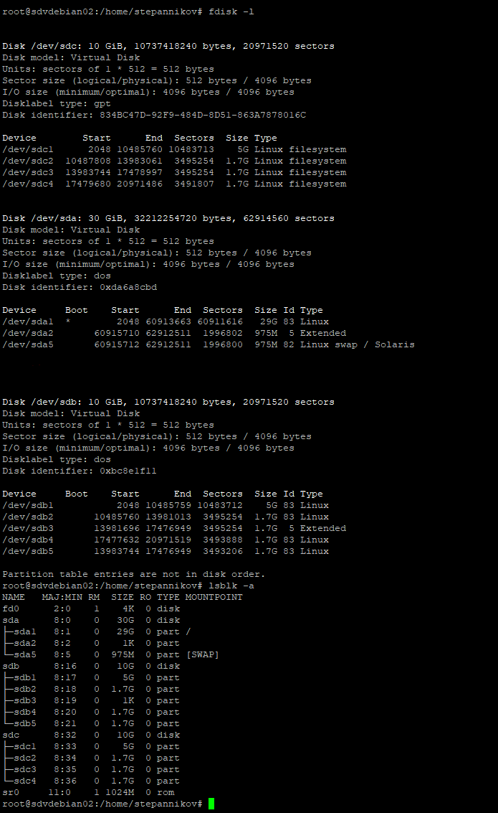

### 2.5 Дисковые системы [Степанников Денис]
## Задание 1
Какие виды RAID увеличивают производительность дисковой системы?

## Решение:
RAID 0
RAID 1
RAID 10	

## Задание 2
Влияет ли количество операций ввода-вывода на параметр `load average`?

*Приведите развернутый ответ в свободной форме.*


## Решение:
Да, влияет, так как параметр ```load average``` кроме числа активных процессов считает так же те, которые находятся в ```uninterruptible state```. 
Uninterruptible state используется для маркировки состояния процесса, когда последние не "хотят" получить прерывание. 

## Задание 3
Подключите к виртуальной машине 2 новых диска. 


1)На первом диске создайте таблицу разделов MBR, Создайте 4 раздела: первый раздел на 50% диска, остальные любого размера на ваше усмотрение. Хотя бы один из разделов должен быть логическим.

2)На втором диске создайте таблицу разделов GPT. Создайте 4 раздела: первый раздел на 50% диска, остальные любого размера на ваше усмотрение.

*В качестве ответа приложите скриншоты, на которых было бы видно разметку диска(например, командами lsblk -a; fdisk -l)*

## Решение:

Добавил:
Disk /dev/sdc: 10 GiB
Disk /dev/sdb: 10 GiB



