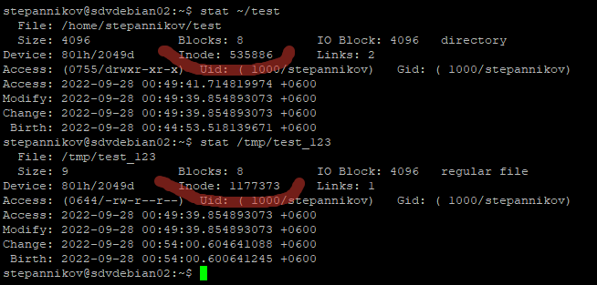
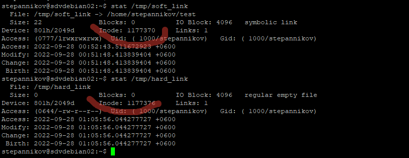
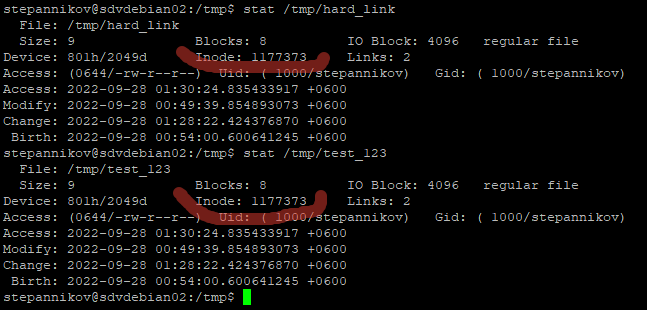
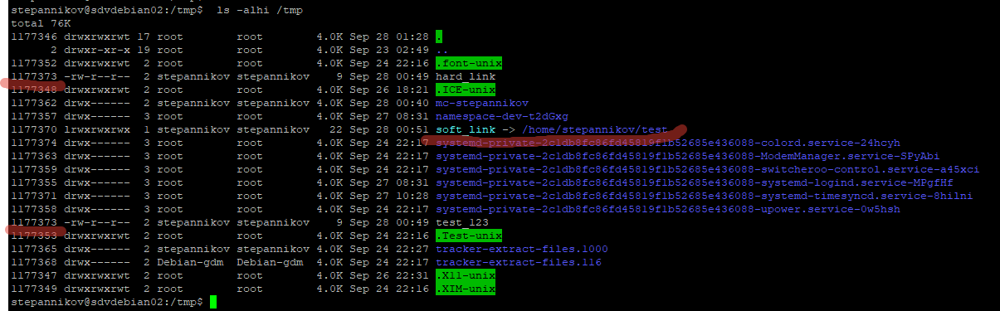
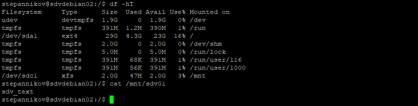
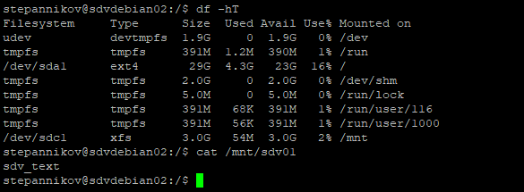

### 2.7 Дисковые системы [Файловые системы]
## Задание 1
* Создайте каталог ~/test и в нем файл test_123 с любым содержимым. 
* Создайте символическую ссылку на каталог ~/test по такому пути: /tmp/soft_link.
* Используя ссылку /tmp/soft_link копируйте файл test_123 в каталог /tmp с тем же именем. Создайте жесткую ссылку на файл /tmp/test_123 с именем /tmp/hard_link.

*Вопрос 1: Файл ~/test и /tmp/test_123 это один и тот же файл(одинаковые inode)?*

*Вопрос 2: Файл /tmp/soft_link и /tmp/hard_link это один и тот же файл(одинаковые inode)?*

*Вопрос 3: Файл /tmp/test_123 и /tmp/hard_link это один и тот же файл(одинаковые inode)?*

*Вопрос 4: Докажите что одна из ссылок символическая, а другая жесткая. Обязательно приложите в ответ скриншоты команд, которые иллюстрируют различия ссылок разного типа или(если не уверены) ход решения задания.*

## Решение:
*Вопрос 1: Файл ~/test и /tmp/test_123 это один и тот же файл(одинаковые inode)?*
Это разные файлы


*Вопрос 2: Файл /tmp/soft_link и /tmp/hard_link это один и тот же файл(одинаковые inode)?*
Это разные файлы


*Вопрос 3: Файл /tmp/test_123 и /tmp/hard_link это один и тот же файл(одинаковые inode)?*
Это одинаковые файлы


*Вопрос 4: Докажите что одна из ссылок символическая, а другая жесткая. Обязательно приложите в ответ скриншоты команд, которые иллюстрируют различия ссылок разного типа или(если не уверены) ход решения задания.*


## Задание 2
* Создайте файл `~/netology`.
* Создайте каталог `~/netology/`.
* Поместите файл `netology` в каталог `netology`.

*Какое(ие) из трех действий выполнить невозможно? Почему?*

## Решение:
Нельзя создавать файл и каталог с одинаковым именем в одном каталоге, потому что с точки зрения Linux это один и тот же объект - файл, (каталог - файл специального типа, содержащий другие файлы), а имя файла в каталоге должно быть уникальным.


## Задание 3
* Как посмотреть количество `inodes`?
* В каких файловых системах не может возникнуть проблемы нехватки `inodes`?

*Приведите ответ в свободной форме.*


## Решение:

```df -i```
В системах с динамическим выделение индексных дескрипторов. Например, btrfs

## Задание 4
В задании не предполагается использование LVM.

* Подключите к системе новый диск 3ГБ.
* Создайте на нем один раздел размером 2 ГБ.
* Разметьте раздел как `xfs`.
* Смонтируйте раздел по пути /mnt. Создайте любой файл на смонтированной файловой системе. Выполните скриншот вывода команды "df -hT".
* Увеличьте раздел до 3 ГБ. 
* Расширьте файловую систему на новое свободное пространство.
* Убедитесь что созданный вами файл остался внутри раздела и файловой системы после всех манипуляций.
* Выпоните скриншот вывода команды "df -hT".

*В качестве ответа приложите выполненные два скриншота.*

## Решение:
* Подключите к системе новый диск 3ГБ.
* Создайте на нем один раздел размером 2 ГБ.
* Разметьте раздел как `xfs`.
* Смонтируйте раздел по пути /mnt. Создайте любой файл на смонтированной файловой системе. Выполните скриншот вывода команды "df -hT".



* Увеличьте раздел до 3 ГБ. 
* Расширьте файловую систему на новое свободное пространство.
* Убедитесь что созданный вами файл остался внутри раздела и файловой системы после всех манипуляций.
* Выпоните скриншот вывода команды "df -hT".

