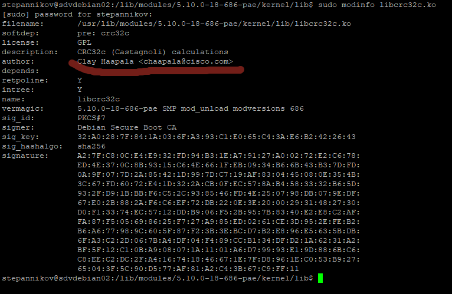

### 2.8 Ядро операционной системы [Степанников Денис]
## Задание 1
При каких событиях выполнение процесса переходит в режим ядра??

## Решение:
1.	Исключение	
2.	Прерывание
3.	Системный вызов


## Задание 2
Найдите имя автора модуля `libcrc32c`.

*В качестве ответа приложите скриншот вывода команды.*

## Решение:


## Задание 3
Подключите к виртуальной машине 2 новых диска. 

Используя утилиту `strace` выясните какой системный вызов использует команда `cd`.

## Решение:

```chdir```

