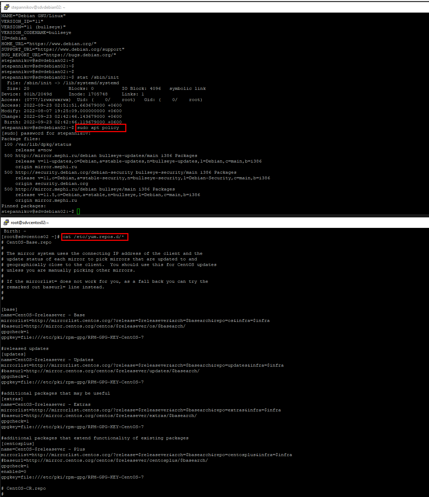

### 3.1 Типы дистрибутивов Linux [Степанников Денис]
## Задание 1
Что такое дистрибутив? Какие компоненты могут входить в поставку дистрибутива?

## Решение:
графический менеджер, система инициализации, ядро ОС, пакетный менеджер.

## Задание 2
Какую роль в появлении Linux сыграл Танненбаум?

## Решение:
Линус Торвальдс воодушевлённый книгой Эндрю Таненбаума, создал ядро операционной системы GNU/Linux. 
Кроме того, из-за недовольства условиий использования UNIX-like ОС MINIX (только для целей обучения), Торвальдс и начал разработку Linux, делал он это, используя для разработки MINIX.

## Задание 3

А теперь перейдем к практике
Вам желательно иметь 2 виртуальные машины (RPM и Debian), чтобы наглядно видеть как отличается в них работа:

3.1
'yum install mc'
'apt install mc'

Как получить информацию из какого репозитория был установлен пакет?

## Решение:

3.2
Какой командой можно получить список доступных репозиториев в RPM и Deb- based системах? Два ответа для каждой из систем.

## Решение:

3.3
Как узнать версию ОС в Linux? Как узнать версию ядра? Укажите для вашей системы, неважно какой.

## Решение:

3.4
Как узнать какая система инициализации используется в Linux? Укажите для вашей системы, неважно какой.

## Решение:

