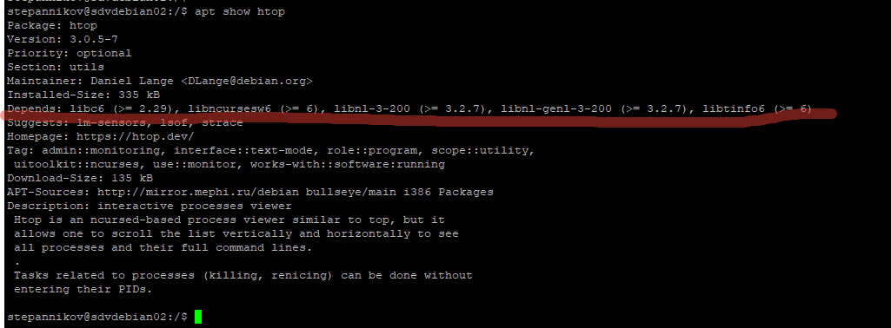
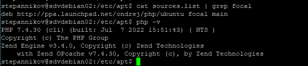
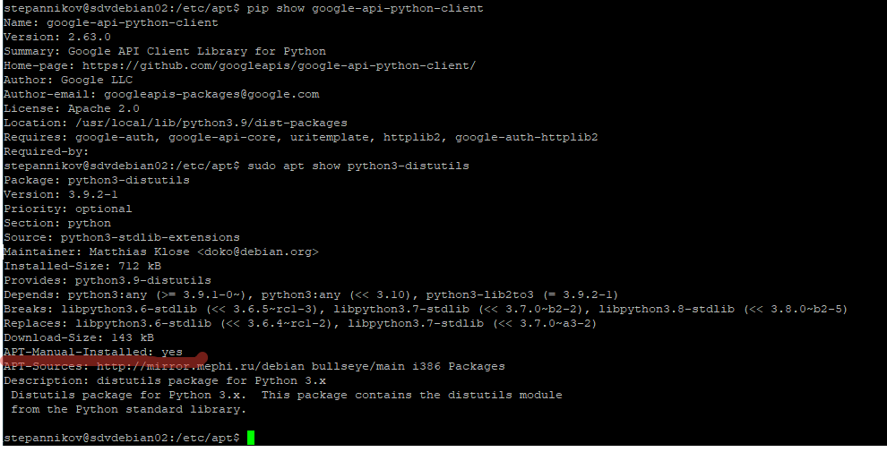

### 3.1 Управление пакетами [Степанников Денис]
## Задание 1
Опишите плюсы работы с пакетным менеджером и репозиторием.

1.	Как вы считаете, в чем основные достоинства такой организации ПО?
2.	Есть ли минусы?

## Решение:
1.	Не нужно тратить время на поиск нужного ПО, простая команда поставить пакет и все его зависимости из репозитория. Иногда нужно добавить нужный репозиторий.
2.	При компрометации репозитория, появляется большой риск в информационной безопасности. Не всегда можно устновить конкретную версию пакета в репозитории, даже если поствишь нестандартную версию, может возникнуть проблемы с зависимостями (их может не быть в данном репозитарии).

## Задание 2
При подключении стороннего репозитория надо выполнить ряд определенных действий.

1.	Каких?
2.	В чем опасность такого способа распространения ПО?
3.	Как это решается?

## Решение:
1.	Подключить репозиторий, выполнить обновление базы пакетного менеджера.
2.	При подключении стороннего репозитария всегда есть риски что в пакеты добавлен вредоносный код.
3.	Из исходников собирать пакеты. но опять же предварительно изучив отзывы о целевом репозитарии.

## Задание 3

#### Перейдем к практике.

1. Запустите свою виртуальную машину.
2. Найдите в репозиториях и установите одной командой пакет `htop`.

Какие зависимости требует `htop`?

## Решение:

## Задание 4
1. Подключите репозиторий PHP и установите PHP 8.0.

*Приложите скриншот содержимого файла, в котором записан адрес репозитория.*

2. При помощи команды `php -v` убедитесь, что бы поставлена корректная версия PHP.

*Приложите к ответу скриншот версии.*

## Решение:

## Задание 5
Ваш коллега-программист просит вас установить модуль `google-api-python-client` на сервер, который необходим для программы, работающей с Google API.

Установите данный пакет при помощи менеджера пакетов `pip`.

**Примечение №1:** для установки может быть необходим пакет `python-distutils`, проверьте его наличие в системе.

**Примечение №2:** не забудьте выдать права на исполение скачанному файлу. Возможно, будет ошибка при установки при помощи Python версии 2, в таком случае воспользйтесь командой `python3`.

*Приложите скриншоты  с установленным пакетом `python-distutils`, с версией `Pip` и установленными модулями (должны быть видимы)*

## Решение:

