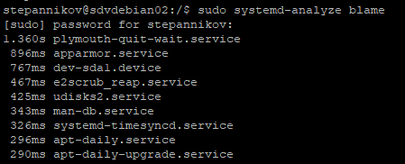
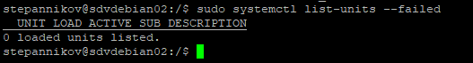

### 3.1 Инициализация системы, Init, systemd [Степанников Денис]
## Задание 1
Выполните systemd-analyze blame.

*Укажите, какие модули загружаются дольше всего.*


## Решение:
`plymouth-quit-wait.service
`apparmor.service




## Задание 2
Какой командой вы посмотрите ошибки ядра, произошедшие начиная со вчерашнего дня?

*Напишите ответ в свободной форме.*


## Решение:
```journalctl --since yesterday --dmesg```


## Задание 3

Запустите команду loginctl user-status.

*Что выполняет, для чего предназначена эта утилита?*

## Решение:
Утилита ```loginctl``` выводит информации о пользовательской сессии. Ключ ```user-status``` возвращает информацию о запушенных в пользовательской сессии процессах и отображает несколько строк последних записей логов из журнала, относящихся к этой сессии.


## Задание 4
Есть ли у вас на машине службы, которые не смогли запуститься? Как вы это определили?

*Приведите ответ в свободной форме.*


## Решение:
```systemctl list-units --failed```


