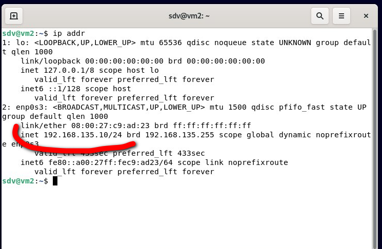

### 4.10. DHCP, PXE [Степанников Денис]
## Задание 1
Для чего служит протокол `DHCP`? 
Может ли работать сеть без `DHCP-сервера`?
 
## Решение:
`DHCP` сервер предназначен для автоматического назначения сетевых параметров (IP, DNS, маска, шлюз) для различных клиентов (win/linux ПК, мобильные устройства и пр.) локальной сети. Он упрощает и ускоряет настройку сетевых параметров клиентов локальной сети.
Да, может, можно назначить все сетевые параметры вручную и локальная сеть также будет работать без проблем.  

## Задание 2
На каком порту/портах работает `DHCP`? 

## Решение:
67/68 UDP

### Задание 3. 

Какие настройки можно произвести используя опции? 

Назовите 5.

## Решение:

Option 3 — основной шлюз;
Option 4 — NTP сервер;
Option 6 — адрес сервера DNS (основной и резервный);
Option 82 — информация об агенте ретрансляции;
Option 66 - для указания имени сервера PXE.

### Задание 4. 

Сконфигурируйте сервер `DHCP`.
*Пришлите получившийся конфигурационный файл.*

## Решение:

***
root@vm1:/home/sdv# cat /etc/dhcp/dhcpd.conf

# dhcpd.conf
#
# Sample configuration file for ISC dhcpd
#

# option definitions common to all supported networks...
option domain-name "sdv.org";
option domain-name-servers 8.8.8.8;

default-lease-time 600;
max-lease-time 7200;

# The ddns-updates-style parameter controls whether or not the server will
# attempt to do a DNS update when a lease is confirmed. We default to the
# behavior of the version 2 packages ('none', since DHCP v2 didn't
# have support for DDNS.)
ddns-update-style none;

# If this DHCP server is the official DHCP server for the local
# network, the authoritative directive should be uncommented.
authoritative;

# Use this to send dhcp log messages to a different log file (you also
# have to hack syslog.conf to complete the redirection).
#log-facility local7;

# No service will be given on this subnet, but declaring it helps the
# DHCP server to understand the network topology.

# A slightly different configuration for an internal subnet.
subnet 192.168.135.0 netmask 255.255.255.0 {
  range 192.168.135.10 192.168.135.30;
  option domain-name-servers 8.8.8.8;
  option routers 192.168.135.254;
  default-lease-time 600;
  max-lease-time 7200;
}

# Hosts which require special configuration options can be listed in
# host statements.   If no address is specified, the address will be
# allocated dynamically (if possible), but the host-specific information
# will still come from the host declaration.

#host passacaglia {
#  hardware ethernet 0:0:c0:5d:bd:95;
#  filename "vmunix.passacaglia";
#  server-name "toccata.example.com";
#}

# Fixed IP addresses can also be specified for hosts.   These addresses
# should not also be listed as being available for dynamic assignment.
# Hosts for which fixed IP addresses have been specified can boot using
# BOOTP or DHCP.   Hosts for which no fixed address is specified can only
# be booted with DHCP, unless there is an address range on the subnet
# to which a BOOTP client is connected which has the dynamic-bootp flag
# set.
#host fantasia {
#  hardware ethernet 08:00:07:26:c0:a5;
#  fixed-address fantasia.example.com;
#}

# You can declare a class of clients and then do address allocation
# based on that.   The example below shows a case where all clients
# in a certain class get addresses on the 10.17.224/24 subnet, and all
# other clients get addresses on the 10.0.29/24 subnet.

#class "foo" {
#  match if substring (option vendor-class-identifier, 0, 4) = "SUNW";
#}

#shared-network 224-29 {
#  subnet 10.17.224.0 netmask 255.255.255.0 {
#    option routers rtr-224.example.org;
#  }
#  subnet 10.0.29.0 netmask 255.255.255.0 {
#    option routers rtr-29.example.org;
#  }
#  pool {
#    allow members of "foo";
#    range 10.17.224.10 10.17.224.250;
#  }
#  pool {
#    deny members of "foo";
#    range 10.0.29.10 10.0.29.230;
#  }
}
root@vm1:/home/sdv#`
***

