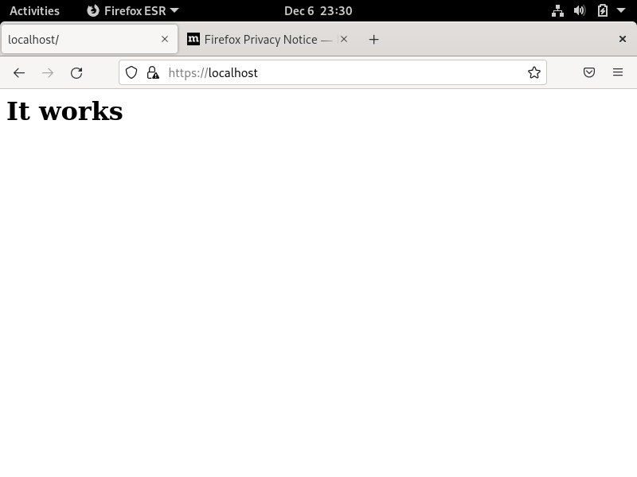
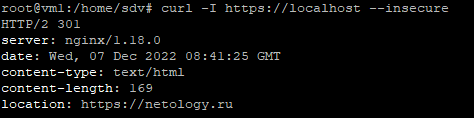

### 4.12. HTTP/HTTPS [Степанников Денис]
## Задание 1
Какие коды ответов HTTP лучше соответствуют описанным ситуациям?

- Данная страница не найдена;
- Страница была перенесена на новый сайт;
- Ресурс удален;
- Пользователь не авторизован для просмотра страницы;
- Превышен лимит запросов от пользователя.
 
## Решение:


## Задание 2
1. Установите Nginx.

`sudo apt-get install nginx`

2. Сгенерируйте сертификат для него указав `localhost` в качестве `CN`.

`sudo openssl req -x509 -nodes -newkey rsa:4096 -keyout /etc/nginx/cert.key -out /etc/nginx/cert.pem -days 365`

3. Отредактируйте модуль `http` в файле `/etc/nginx/nginx.conf`.

```
http {
    gzip on;
    server {
        listen 80 default_server;
        root   /var/www/public;
        listen  443 ssl http2 default_server;
        server_name  localhost;
        ssl_certificate  /etc/nginx/cert.pem;
        ssl_certificate_key /etc/nginx/cert.key;
        ssl_protocols   TLSv1 TLSv1.1 TLSv1.2;
        ssl_ciphers   HIGH:!aNULL:!MD5;
        location / {
            index index.html;
        }
    }
}
```

4. Создайте файл `/var/www/public/index.html` c содержимым.

```
<h1>It works</h1>
```

5. Зайдите на страницу в браузере, пропустив сообщение о неработающем сертификате.

## Решение:



### Задание 3. 

Измените конфигурацию сервера добавив переадресацию c Вашего сервера на сайт `netology.ru`.
```
location / {
  return 301 https://netology.ru;
}
```

*Используя curl сделайте запрос к своему серверу и в качестве ответа пришлите скриншот с 301 ответом.*

## Решение:
