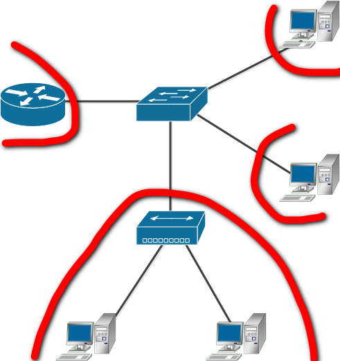
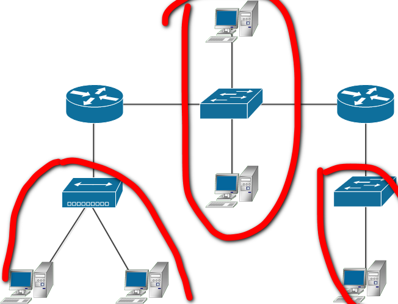

### 4.2. L2-сеть [Степанников Денис]
## Задание 1
Адрес канального уровня – MAC адрес – это 6 байт, первые 3 из которых называются OUI – Organizationally Unique Identifier или уникальный идентификатор организации.
Какому производителю принадлежит `MAC 38:f9:d3:55:55:79`?

## Решение:
Apple, Inc.


## Задание 2
Какой ключ нужно добавить в `tcpdump`, чтобы он начал выводить не только заголовки, но и содержимое фреймов  в:

 - текстовом виде;
 - текстовом и шестнадцатиричном виде?

## Решение:
tcpdump -A
tcpdump -XX


## Задание 3
1. Можно ли изменить MAC-адрес вашего Linux сервера?
2. Если да, то какой командой, если нет - почему?
3. Для чего может понадобиться изменять MAC-адреса?

## Решение:
1. Да.
2. sudo macchanger -m [your_custom_MAC_address] [Targeted_network_interface]
3. Например для резервации IP на DHCP сервере либо ранее этим нужно было заниматься при подключении домашнего интернет провайдера, доступ в интернет там привязан к МАК адресу - чтобы самостоятельно решить этот вопрос нужно просто махнуть МАК :)

## Задание 4
1. Каким образом можно зафиксировать соответствие `IP-MAC` и избежать установления этого соответствия по протоколу ARP?
2. Каковы положительные и отрицательные стороны такой настройки?

## Решение:
Нужно внести статическую запись в ARP-таблицу: arp -s ```IP``` ```MAC```
Положительные стороны - не будет тратиться время на выяснение MAC адреса для конкретного IP.
Отрицательные стороны - если IP будет назначен другому хосту, а статическую запись не удалить/обновить, то этот IP будет недоступен. Если забыть, диагностика этой проблемы может занять продолжительное время :).


## Задание 5
Какой механизм проверки на наличие ошибок используется в `Ethernet`?

## Решение:
Для контроля ошибок используется механизм Frame Check Sequence: подсчет контрольных сумм (CRC32 BZIP2) некоторых заголовков кадра ethernet на стороне отправителя и получателя, и их последующее сравнение.

## Задание 6
Как вы думаете, почему серверы в большинстве случаев подключают проводом, а не через `WiFi`?

## Решение:
Wi-Fi менее надежен по стабильности передачи данных. По задержкам и скорости проводное соединение тоже выигрывает у беспроводной связи. также серверы как правило находятся в одном месте, мобильность (что обеспечивает wi-fi) здесь ни к чему.

## Задание 7
Сколько доменов коллизий изображено на рисунке?

## Решение:
4



## Задание 8
Сколько широковещательных доменов изображено на рисунке?

## Решение:
3

