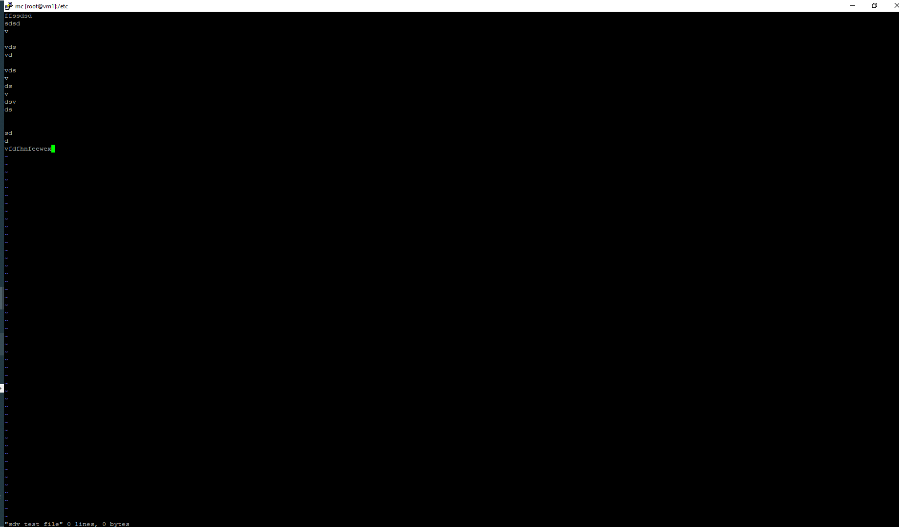
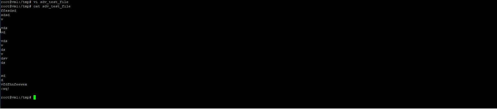
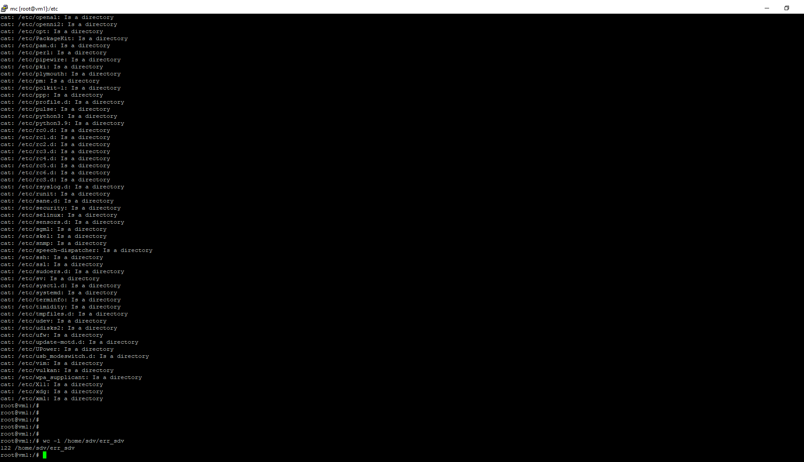
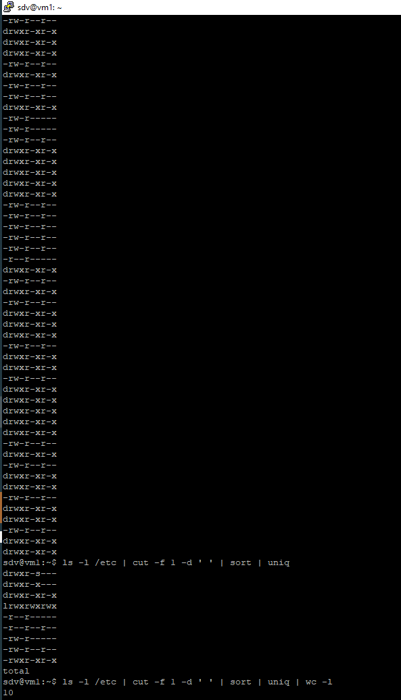

### 5.3. Полезные утилиты [Степанников Денис]
## Задание 1
 - Создайте файл с наполнением, используя несколько способов;
 - Используйте изученные на занятии текстовые редакторы для наполнения файлов произвольными данными.
 
 
## Решение:
- создаем файл:

- наполняем:

## Задание 2
 - Выведите с помощью `cat` содержимое всех файлов в директории `/etc (cat /etc/*)`;
 - Направьте ошибки в отдельный файл в вашей домашней директории.
 
 Сколько объектов не удалось прочесть?

## Решение:
`cat /etc/* 2> /home/sdv/err_sdv`
`wc -l /home/sdv/err_sdv`

### Задание 3. 
 - Используйте команду `cut` на вывод длинного списка каталога, чтобы отобразить только права доступа к файлам;
 - Отправьте в конвейере этот вывод на `sort` и `uniq`, чтобы отфильтровать все повторяющиеся строки;
 - С помощью `wc` подсчитайте различные типы разрешений в этом каталоге.
 - Уберите из подсчета строку `total`.

*Пришлите получившийся скриншот вывода.*

## Решение:
 - `ls -l /etc | cut -f 1 -d ' '`
 - `ls -l /etc | cut -f 1 -d ' ' | sort | uniq`
 - `ls -l /etc | cut -f 1 -d ' ' | sort | uniq | wc -l`
