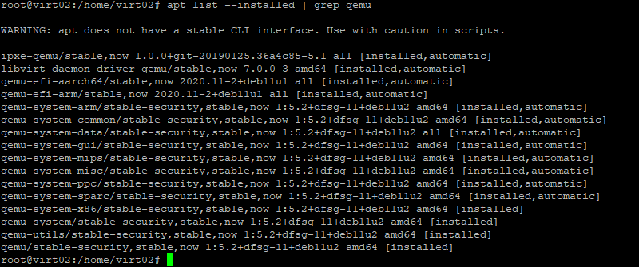

### 6.02 Типы виртуализации: KVM, QEMU. [Степанников Денис]
## Задание 1
>**Ответьте на вопрос в свободной форме.**

Какие виртуализации существуют? Приведите примеры продуктов разных типов виртуализации.

## Решение:
- Аппаратная: на сервере-хосте устанавливается обычная операционная система и создаются полностью изолированные друг от друга виртуальные машины, каждая из которых имеет свою собственную полноценную ОС и использует в работе ее ядро. Примеры: MS Hyper-V,VMWARE
- Программная: Разделение ресурсов сервера осуществляется средствами операционной системы, и все виртуальные машины  используют общее программное ядро. Примеры: OpenVZ, Virtuozzo, VDSmanager
- Контейнерная: Это виртуализация, которая работает на уровне операционной системы, в ядре. Ядро, координирует ресурсы компьютера (процессорное время, память, внешнее аппаратное обеспечение, внешнее устройство ввода и вывода информации) для приложений. Дополнительно ядро предоставляет файловую систему и сетевые протоколы. При контейнеризации ядро операционной системы поддерживает несколько изолированных экземпляров пространства вместо одного. Примеры: Docker

## Задание 2
Выполните действия и приложите скриншоты по каждому этапу:

1. Установите QEMU в зависимости от системы (в лекции рассматривались примеры).
2. Создайте виртуальную машину.
3. Установите виртуальную машину.

## Решение:
1. `sudo apt install qemu qemu-kvm qemu-system qemu-utils`

2. `qemu-img create -f qcow2 alpine.qcow2 512M`
3. `sudo qemu-system-x86_64 -hda alpine.qcow2 -boot d -cdrom alpine-standart-3.13.5-x86.iso -m 256`

## Задание 3
1. Установите kvm и библиотеку libvirt (можете воспользоваться GUI версией из лекции). 
2. Создайте виртуальную машину. 
3. Установите виртуальную машину. 
Для примера можете воспользоваться https://dl-cdn.alpinelinux.org/alpine/v3.13/releases/x86/alpine-standard-3.13.5-x86.iso. 

С сайта https://alpinelinux.org. 

*Приложите скриншоты действий.*

## Решение:

1. Установка libvirt: `sudo apt install libvirt-clients libvirt-daemon-system virtinst`

2-3.

## Задание 4
1. Создайте проект в GNS3 (предварительно установив GNS3  https://github.com/GNS3/gns3-gui/releases).

2. Создайте следующую топологию.

3. Для реализации воспользуйтесь QEMU машинами (можно дублировать, сделанную ранее).

*Приложите скриншоты действий.*

## Решение

