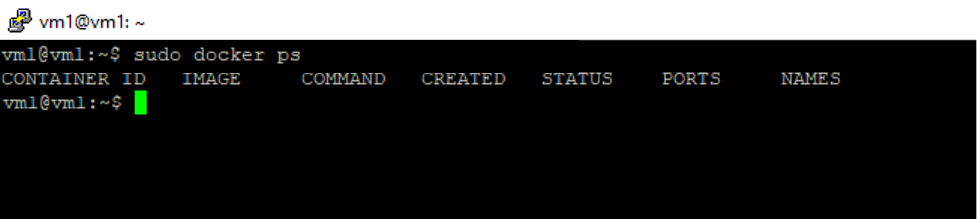
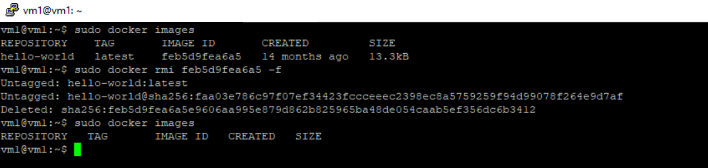

### 6.03 Docker. Часть 1. [Степанников Денис]
## Задание 1
>**Ответьте на вопрос в свободной форме.**

Чем контейнеризация отличается от виртуализации?

## Решение:
Виртуализация это полноценная система, независимая от ОС хоста и обладающая собственным ядром, 
В контейнеризации же используется ядро системы (хоста) на которой развернут контейнер.

## Задание 2
>**Выполните действия:**

1. Установите Docker.
2. Приложите скриншот..

## Решение:

## Задание 3
>**Выполните действия:**
1. Запустите образ hello-world.
2. Приложите скриншот.

## Решение:

## Задание 4
>**Выполните действия:**
1. Удалите образ hello-world.
2. Приложите скриншот.

## Решение

