### 6.04 Docker. Часть 2. [Степанников Денис]
## Задание 1
**Напишите ответ в свободной форме, не больше одного абзаца текста.**

Установите Docker Compose и опишите, для чего он нужен и как может улучшить вашу жизнь.

## Решение:
Docker Compose входит в состав Docker, необходим для облегчения работы со сложными приложениями состоящими более чем из одного контейнера. Т.е., если в приложении используется многоконтейнерная архитектура, то Docker Compose позволит облегчить ее развертывание/администрирование, потому что он позволяет работать с контейнерами, составляющими приложение, одновременно.

## Задание 2
**Выполните действия и приложите текст конфига на этом этапе.** 

Создайте файл docker-compose.yml и внесите туда первичные настройки: 

 * version;
 * services;
 * networks.

При выполнении задания используйте подсеть 172.22.0.0.
Ваша подсеть должна называться: <ваши фамилия и инициалы>-my-netology-hw.

## Решение:
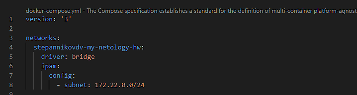

## Задание 3
**Выполните действия и приложите текст конфига текущего сервиса:** 

1. Установите PostgreSQL с именем контейнера <ваши фамилия и инициалы>-netology-db. 
2. Предсоздайте БД <ваши фамилия и инициалы>-db.
3. Задайте пароль пользователя postgres, как <ваши фамилия и инициалы>12!3!!
4. Пример названия контейнера: ivanovii-netology-db.
5. Назначьте для данного контейнера статический IP из подсети 172.22.0.0/24.

## Решение:
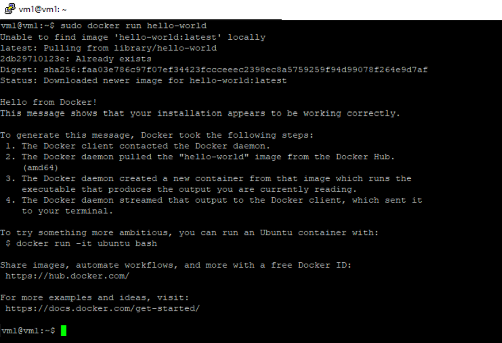

## Задание 4
**Выполните действия:**

1. Установите pgAdmin с именем контейнера <ваши фамилия и инициалы>-pgadmin. 
2. Задайте логин администратора pgAdmin <ваши фамилия и инициалы>@ilove-netology.com и пароль на выбор.
3. Назначьте для данного контейнера статический IP из подсети 172.22.0.0/24.
4. Прокиньте на 80 порт контейнера порт 61231.

В качестве решения приложите:

* текст конфига текущего сервиса;
* скриншот админки pgAdmin.

---

## Решение
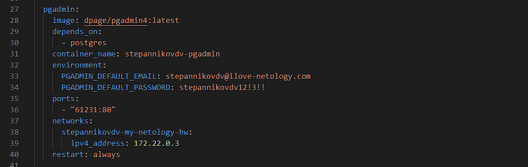
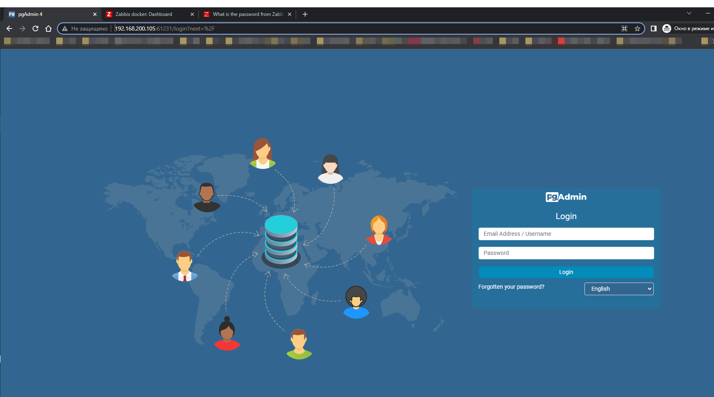

## Задание 5
**Выполните действия и приложите текст конфига текущего сервиса:** 

1. Установите Zabbix Server с именем контейнера <ваши фамилия и инициалы>-zabbix-netology. 
2. Настройте его подключение к вашему СУБД.
3. Назначьте для данного контейнера статический IP из подсети 172.22.0.0/24.

## Решение
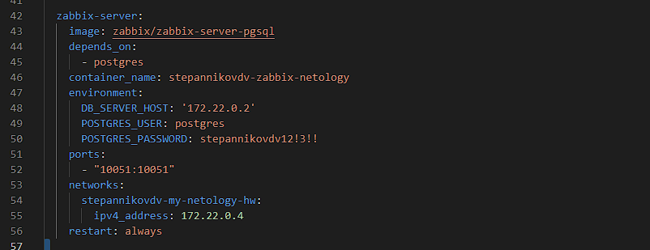

## Задание 6
**Выполните действия и приложите текст конфига текущего сервиса:** 

1. Установите Zabbix Frontend с именем контейнера <ваши фамилия и инициалы>-netology-zabbix-frontend. 
2. Настройте его подключение к вашему СУБД.
3. Назначьте для данного контейнера статический IP из подсети 172.22.0.0/24.

---

## Решение
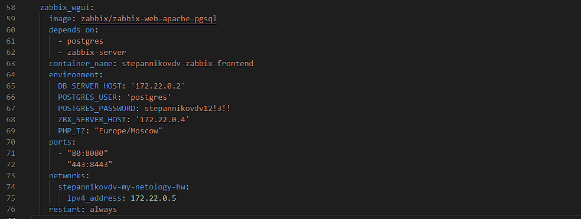

## Задание 7

**Выполните действия.**

Настройте линки, чтобы контейнеры запускались только в момент, когда запущены контейнеры, от которых они зависят.

В качестве решения приложите:

* текст конфига **целиком**;
* скриншот команды docker ps;
* скриншот авторизации в админке Zabbix.

---

## Решение
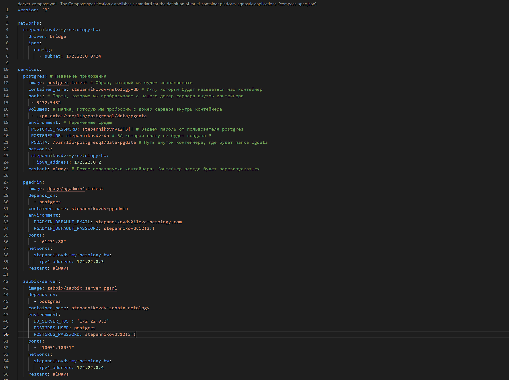
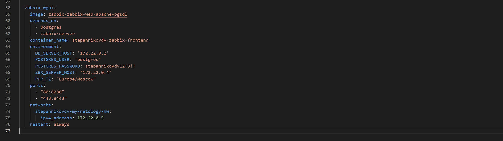
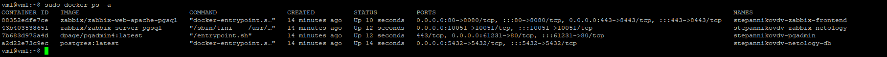
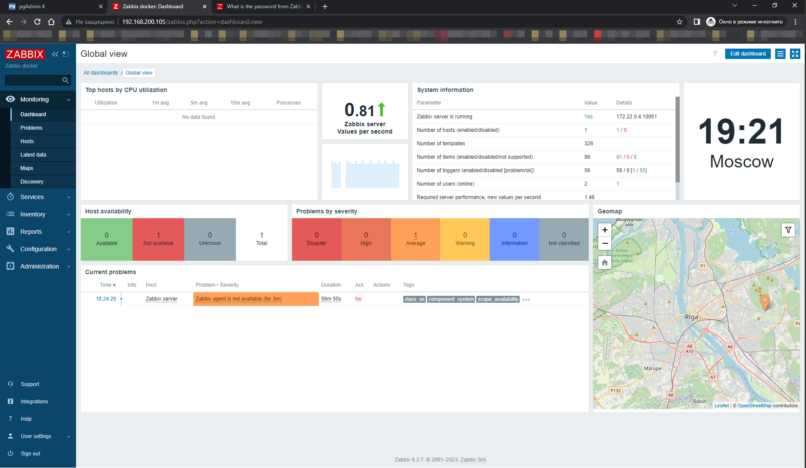

## Задание 8
**Выполните действия:** 

1. Убейте все контейнеры и потом удалите их.
1. Приложите скриншот консоли с проделанными действиями.

---

## Решение
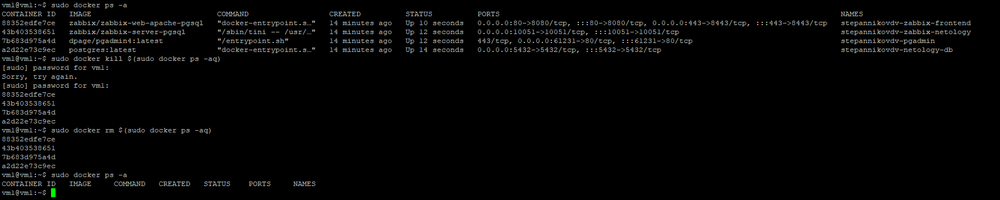