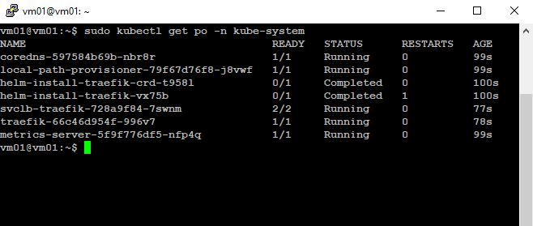
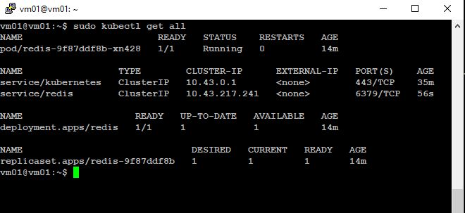

### 6.5. Kubernetes. Часть 1. [Степанников Денис]
## Задание 1
**Выполните действия:**

1. Запустите Kubernetes локально, используя k3s или minikube на свой выбор.
1. Добейтесь стабильной работы всех системных контейнеров.
2. В качестве ответа пришлите скриншот результата выполнения команды kubectl get po -n kube-system.

## Решение:



## Задание 2
Есть файл с деплоем:

```
---
apiVersion: apps/v1
kind: Deployment
metadata:
  name: redis
spec:
  selector:
    matchLabels:
      app: redis
  replicas: 1
  template:
    metadata:
      labels:
        app: redis
    spec:
      containers:
      - name: master
        image: bitnami/redis
        env:
         - name: REDIS_PASSWORD
           value: password123
        ports:
        - containerPort: 6379
```
------
**Выполните действия:**

1. Измените файл с учётом условий:

 * redis должен запускаться без пароля;
 * создайте Service, который будет направлять трафик на этот Deployment;
 * версия образа redis должна быть зафиксирована на 6.0.13.

2. Запустите Deployment в своём кластере и добейтесь его стабильной работы.
3. В качестве решения пришлите получившийся файл.


## Решение:

```
---
apiVersion: apps/v1
kind: Deployment
metadata:
  name: redis
spec:
  selector:
    matchLabels:
      app: redis
  replicas: 1
  template:
    metadata:
      labels:
        app: redis
    spec:
      containers:
      - name: master
        image: bitnami/redis:6.0.13
        env:
         - name: ALLOW_EMPTY_PASSWORD
           value: "yes"
        ports:
         - containerPort: 6379
```

```
---
apiVersion: v1
kind: Service
metadata:
  name: redis
spec:
  selector:
    app: redis
  ports:
    - protocol: TCP
      port: 6379
      targetPort: 6379

```





## Задание 3

**Выполните действия:**

1. Напишите команды kubectl для контейнера из предыдущего задания:

 - выполнения команды ps aux внутри контейнера;
 - просмотра логов контейнера за последние 5 минут;
 - удаления контейнера;
 - проброса порта локальной машины в контейнер для отладки.

2. В качестве решения пришлите получившиеся команды.


## Решение:
```
sudo kubectl exec -it redis-9f87ddf8b-xn428 -- ps aux
sudo kubectl logs --since=5m redis-9f87ddf8b-xn428
sudo kubectl delete -f redis.yaml && sudo kubectl delete -f svc-redis_svc.yaml
sudo kubectl port-forward pod/redis-9f87ddf8b-xn428 65000:6379
```

