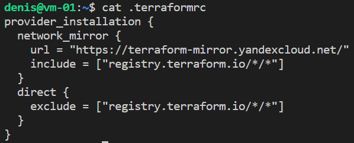

# Домашнее задание к занятию "7.2. Terraform" Степанников Денис
## Задание 1
> Опишите виды подхода к IaC:

- функциональный;

Описывает, что должно быть настроено и как должна работать инфраструктура, но не описывает как этого достичь достичь. Используется декларативный подход, описание выполняется с помощью yaml, json.

- процедурный;

В отличии от функционального подхода, в процедурном подходе как раз описывается каждый шаг для достижения желаемого состояния. Вместо декларативных языков используются императивные - python, go.

- интеллектуальный.

Интеллектуальный подход включает в себя использование алгоритмов и методов машинного обучения для оптимизации и автоматизации управления инфраструктурой, например, для нахождения наиболее эффективных настроек или автоматического обнаружения и устранения проблем.

## Задание 2
>Как вы считаете, в чём преимущество применения Terraform?

С помощью IaC в целом и Terraform в частности можно автоматизировать создание, изменение и удаление инфраструктуры с помощью кода, что делает процесс настройки инфраструктуры быстрее, сам процесс более надежным и масштабируемым. Преимущества непосредственно Терраформ заключаются в его широком распространении, поддержки множества провайдеров публичных "облаков", относительно простого декларативного язык описания инфраструктуры, а также его расширяемость и возможность создания собственных модулей.

## Задание 3
>Какие минусы можно выделить при использовании IaC?

Переход на подход IaC требует времени и ресурсов как для обучения персонала, так и для внедрения новых процессов и методологий. Существует риск зависимости от конкретных инструментов и/или облачных провайдеров, что может осложнить миграцию на другие инструменты или провайдеров. Еще одним недостатком может быть сложность настройки и развертывания инфраструктуры при использовании сложных конфигурационных скриптов. Ошибки в коде IaC могут иметь серьезные последствия для бизнеса, включая потерю данных или простои бизнес-критичных приложений.

## Задание 4
>Установите Terraform на компьютерную систему (виртуальную или хостовую), используя лекцию или инструкцию.

---

---

---
