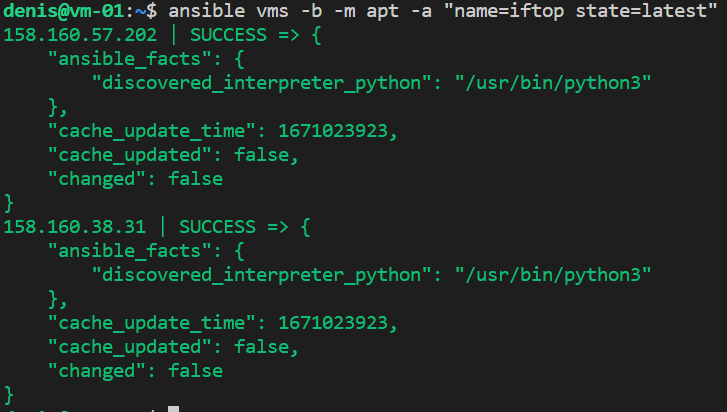

### 7.01. Ansible. Часть 1 [Степанников Денис]
## Задание 1
**Что нужно сделать:**

Какие преимущества даёт подход IAC?

## Решение:

1. Отсутствует необходимость в ручной настройке.
2. Настройка/организация инфраструктуры занимает значительно меньше времени.
3. Воспроизводимость: поднимаемая инфраструктура всегда идентична.
4. Масштабируемость: один инженер может с помощью одного и того же кода настраивать и управлять огромным количеством машин.

## Задание 2
**Что нужно сделать:**
Выполните действия и приложите скриншоты действий.
1. Создайте файл inventory. Предлагается использовать файл, размещённый в папке с проектом, а не файл inventory по умолчанию.
2. Проверьте доступность хостов с помощью модуля ping.

## Решение:

## Задание 3
**Что нужно сделать:**

Какая разница между параметрами forks и serial?

## Решение:
"Forks" определяет количество одновременных подключений к хостам а "serial" - сколько хостов должно быть обработано за один раз.

## Задание 4
**Что нужно сделать:**

Выполните действия и приложите скриншоты запуска команд.
1. Установите на управляемых хостах любой пакет, которого нет.
2. Проверьте статус любого, присутствующего на управляемой машине, сервиса.
3. Создайте файл с содержимым «I like Linux» по пути /tmp/netology.txt

## Решение:

---

---

