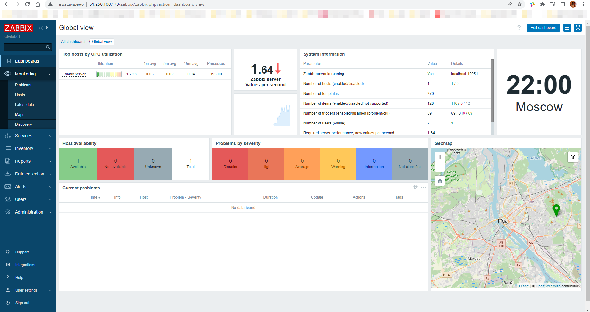
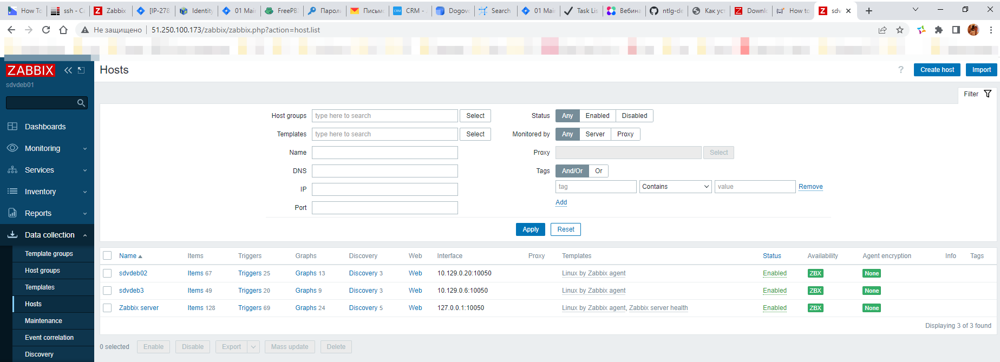
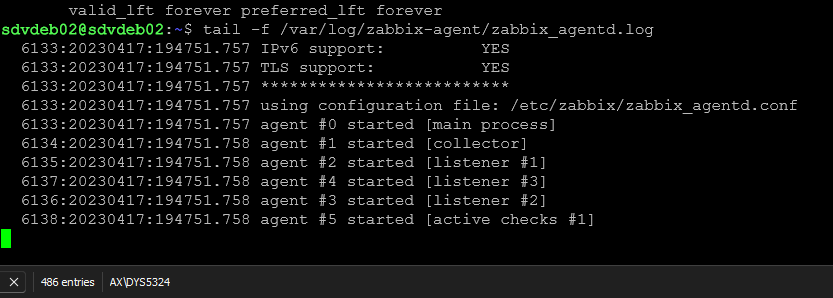
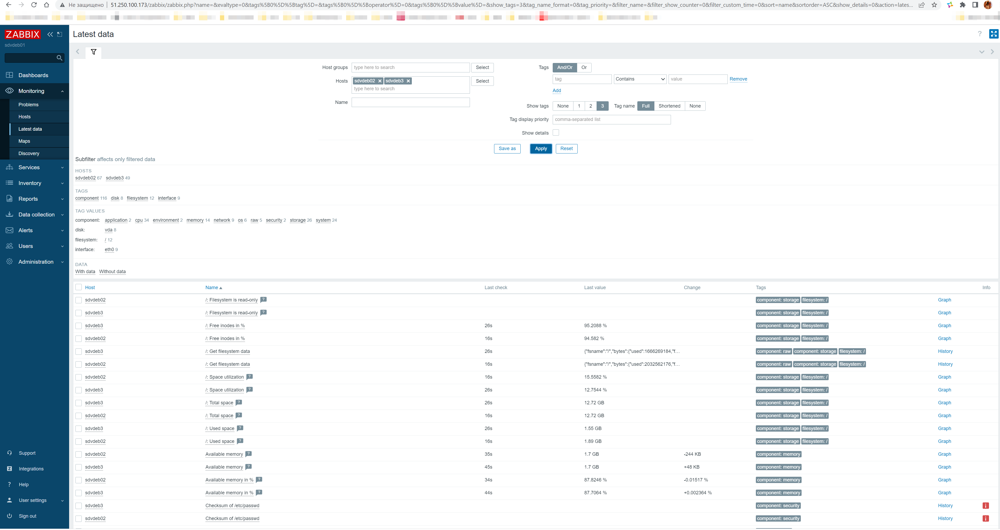

### Домашнее задание к занятию «Система мониторинга Zabbix» [Степанников Денис]
### Задание 1

**Что нужно сделать:**

### Задание 1 

Установите Zabbix Server с веб-интерфейсом.

#### Процесс выполнения
1. Выполняя ДЗ сверяйтесь с процессом отражённым в записи лекции.
2. Установите PostgreSQL. Для установки достаточна та версия что есть в системном репозитороии Debian 11
3. Пользуясь конфигуратором комманд с официального сайта, составьте набор команд для установки последней версии Zabbix с поддержкой PostgreSQL и Apache
4. Выполните все необходимые команды для установки Zabbix Server и Zabbix Web Server

#### Требования к результаты 
1. Прикрепите в файл README.md скриншот авторизации в админке
2. Приложите в файл README.md текст использованных команд в GitHub
---

## Решение:

---



#### Список команд для установки zabbix

```
sudo apt update && sudo apt upgrade -y

#Добавляем репозиторий Zabbix
wget https://repo.zabbix.com/zabbix/6.4/debian/pool/main/z/zabbix-release/zabbix-release_6.4-1+debian11_all.deb
dpkg -i zabbix-release_6.4-1+debian11_all.deb
apt update

#Устанавливаем пакеты
sudo apt install postgresql postgresql-contrib zabbix-server-pgsql zabbix-frontend-php php7.4-pgsql zabbix-apache-conf zabbix-sql-scripts zabbix-agent

#Создаем пользователя, пароль, БД, задаем zabbix ее владельцем
sudo -u postgres createuser --pwprompt zabbix
sudo -u postgres createdb -O zabbix zabbix

#Готовим схему БД и шаблон
zcat /usr/share/zabbix-sql-scripts/postgresql/server.sql.gz | sudo -u zabbix psql zabbix

#Задаем пароль для соединения с СУБД 
корректируем файл /etc/zabbix/zabbix_server.conf

sudo systemctl restart zabbix-server zabbix-agent apache2
sudo systemctl enable zabbix-server zabbix-agent apache2

```

### Задание 2 

Установите Zabbix Agent на два хоста.

#### Процесс выполнения
1. Выполняя ДЗ сверяйтесь с процессом отражённым в записи лекции.
2. Установите Zabbix Agent на 2 виртмашины, одной из них может быть ваш Zabbix Server
3. Добавьте Zabbix Server в список разрешенных серверов ваших Zabbix Agentов
4. Добавьте Zabbix Agentов в раздел Configuration > Hosts вашего Zabbix Servera
5. Проверьте что в разделе Latest Data начали появляться данные с добавленных агентов

#### Требования к результаты 
1. Приложите в файл README.md скриншот раздела Configuration > Hosts, где видно, что агенты подключены к серверу
2. Приложите в файл README.md скриншот лога zabbix agent, где видно, что он работает с сервером
3. Приложите в файл README.md скриншот раздела Monitoring > Latest data для обоих хостов, где видны поступающие от агентов данные.
4. Приложите в файл README.md текст использованных команд в GitHub

## Решение:
1. 
2. 
3. 

4. Список команд для установки zabbix agent:

```
sudo apt update && sudo apt upgrade -y

wget https://repo.zabbix.com/zabbix/6.4/debian/pool/main/z/zabbix-release/zabbix-release_6.4-1+debian11_all.deb

sudo apt install zabbix-agent -y

sudo nano /etc/zabbix/zabbix_agentd.conf
Корректирую:
Server=10.129.0.30
ServerActive=10.129.0.30
ListenPort=10050
StartAgents=3

sudo service zabbix-agent restart

```
