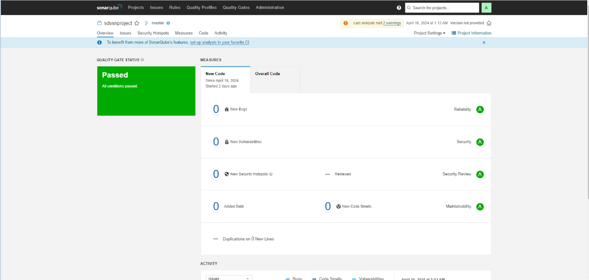
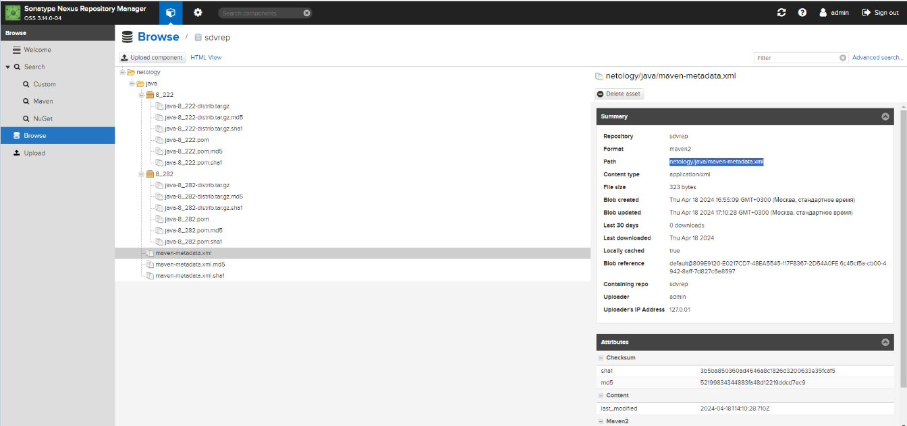

### Домашнее задание к занятию «Процессы CI/CD» [Степанников Денис]

---

### Знакомство с SonarQube
#### Основная часть
1. Создайте новый проект, название произвольное.
2. Скачайте пакет sonar-scanner, который вам предлагает скачать SonarQube.
3. Сделайте так, чтобы binary был доступен через вызов в shell (или поменяйте переменную PATH, или любой другой, удобный вам способ).
4. Проверьте sonar-scanner --version.
5. Запустите анализатор против кода из директории example с дополнительным ключом -Dsonar.coverage.exclusions=fail.py.
6. Посмотрите результат в интерфейсе.
7. Исправьте ошибки, которые он выявил, включая warnings.
8. Запустите анализатор повторно — проверьте, что QG пройдены успешно.
9. Сделайте скриншот успешного прохождения анализа, приложите к решению ДЗ.


### Знакомство с Nexus
#### Основная часть
1. В репозиторий maven-public загрузите артефакт с GAV-параметрами:
groupId: netology;
artifactId: java;
version: 8_282;
classifier: distrib;
type: tar.gz.
2. В него же загрузите такой же артефакт, но с version: 8_102.
3. Проверьте, что все файлы загрузились успешно.
4. В ответе пришлите файл maven-metadata.xml для этого артефекта.

### Знакомство с Maven
#### Подготовка к выполнению
1. Скачайте дистрибутив с maven.
2. Разархивируйте, сделайте так, чтобы binary был доступен через вызов в shell (или поменяйте переменную PATH, или любой другой, удобный вам способ).
3. Удалите из apache-maven-<version>/conf/settings.xml упоминание о правиле, отвергающем HTTP- соединение — раздел mirrors —> id: my-repository-http-unblocker.
4. Проверьте mvn --version.
5. Заберите директорию mvn с pom.

### Основная часть
1. Поменяйте в pom.xml блок с зависимостями под ваш артефакт из первого пункта задания для Nexus (java с версией 8_282).
2. Запустите команду mvn package в директории с pom.xml, ожидайте успешного окончания.
3. Проверьте директорию ~/.m2/repository/, найдите ваш артефакт.
4. В ответе пришлите исправленный файл pom.xml.


### Решение:
### Знакомство с SonarQube


Проверьте sonar-scanner --version.
```
[root@sdvcentos7-01 ~]# sonnar-scanner --version
INFO: Scanner configuration file: /root/sonar-scanner-5.0.1.3006-linux/conf/sonar-scanner.properties
INFO: Project root configuration file: NONE
INFO: SonarScanner 5.0.1.3006
INFO: Java 17.0.7 Eclipse Adoptium (64-bit)
INFO: Linux 3.10.0-1160.114.2.el7.x86_64 amd64
[root@sdvcentos7-01 ~]#
```
Запустите анализатор против кода из директории example с дополнительным ключом -Dsonar.coverage.exclusions=fail.py.
```
[root@sdvcentos7-01 example]# sonnar-scanner -Dsonar.coverage.exclusions=fail.py
INFO: Scanner configuration file: /root/sonar-scanner-5.0.1.3006-linux/conf/sonar-scanner.properties
INFO: Project root configuration file: /root/example/sonar-project.properties
INFO: SonarScanner 5.0.1.3006
INFO: Java 17.0.7 Eclipse Adoptium (64-bit)
INFO: Linux 3.10.0-1160.114.2.el7.x86_64 amd64
INFO: User cache: /root/.sonar/cache
INFO: Analyzing on SonarQube server 9.1.0
INFO: Default locale: "ru_RU", source code encoding: "UTF-8" (analysis is platform dependent)
INFO: Load global settings
INFO: Load global settings (done) | time=134ms
INFO: Server id: 9CFC3560-AY7jjqIR90uWzBNhbNSZ
INFO: User cache: /root/.sonar/cache
INFO: Load/download plugins
INFO: Load plugins index
INFO: Load plugins index (done) | time=74ms
INFO: Load/download plugins (done) | time=569ms
INFO: Process project properties
INFO: Process project properties (done) | time=1ms
INFO: Execute project builders
INFO: Execute project builders (done) | time=2ms
INFO: Project key: sdvsnproject
INFO: Base dir: /root/example
INFO: Working dir: /root/example/.scannerwork
INFO: Load project settings for component key: 'sdvsnproject'
INFO: Load project settings for component key: 'sdvsnproject' (done) | time=43ms
INFO: Load quality profiles
INFO: Load quality profiles (done) | time=299ms
INFO: Load active rules
INFO: Load active rules (done) | time=2920ms
WARN: SCM provider autodetection failed. Please use "sonar.scm.provider" to define SCM of your project, or disable the SCM Sensor in the project settings.
INFO: Indexing files...
INFO: Project configuration:
INFO:   Excluded sources for coverage: fail.py
INFO: 2 files indexed
INFO: Quality profile for py: Sonar way
INFO: ------------- Run sensors on module sdvsnproject
INFO: Load metrics repository
INFO: Load metrics repository (done) | time=56ms
INFO: Sensor Python Sensor [python]
WARN: Your code is analyzed as compatible with python 2 and 3 by default. This will prevent the detection of issues specific to python 2 or python 3. You can get a more precise analysis by setting a python version in your configuration via the parameter "sonar.python.version"
INFO: Starting global symbols computation
INFO: 1 source file to be analyzed
INFO: Load project repositories
INFO: Load project repositories (done) | time=43ms
INFO: 1/1 source file has been analyzed
INFO: Starting rules execution
INFO: 1 source file to be analyzed
INFO: 1/1 source file has been analyzed
INFO: Sensor Python Sensor [python] (done) | time=1044ms
INFO: Sensor Cobertura Sensor for Python coverage [python]
INFO: Sensor Cobertura Sensor for Python coverage [python] (done) | time=8ms
INFO: Sensor PythonXUnitSensor [python]
INFO: Sensor PythonXUnitSensor [python] (done) | time=0ms
INFO: Sensor CSS Rules [cssfamily]
INFO: No CSS, PHP, HTML or VueJS files are found in the project. CSS analysis is skipped.
INFO: Sensor CSS Rules [cssfamily] (done) | time=1ms
INFO: Sensor JaCoCo XML Report Importer [jacoco]
INFO: 'sonar.coverage.jacoco.xmlReportPaths' is not defined. Using default locations: target/site/jacoco/jacoco.xml,target/site/jacoco-it/jacoco.xml,build/reports/jacoco/test/jacocoTestReport.xml
INFO: No report imported, no coverage information will be imported by JaCoCo XML Report Importer
INFO: Sensor JaCoCo XML Report Importer [jacoco] (done) | time=2ms
INFO: Sensor C# Project Type Information [csharp]
INFO: Sensor C# Project Type Information [csharp] (done) | time=0ms
INFO: Sensor C# Analysis Log [csharp]
INFO: Sensor C# Analysis Log [csharp] (done) | time=13ms
INFO: Sensor C# Properties [csharp]
INFO: Sensor C# Properties [csharp] (done) | time=0ms
INFO: Sensor JavaXmlSensor [java]
INFO: Sensor JavaXmlSensor [java] (done) | time=1ms
INFO: Sensor HTML [web]
INFO: Sensor HTML [web] (done) | time=3ms
INFO: Sensor VB.NET Project Type Information [vbnet]
INFO: Sensor VB.NET Project Type Information [vbnet] (done) | time=0ms
INFO: Sensor VB.NET Analysis Log [vbnet]
INFO: Sensor VB.NET Analysis Log [vbnet] (done) | time=13ms
INFO: Sensor VB.NET Properties [vbnet]
INFO: Sensor VB.NET Properties [vbnet] (done) | time=0ms
INFO: ------------- Run sensors on project
INFO: Sensor Zero Coverage Sensor
INFO: Sensor Zero Coverage Sensor (done) | time=1ms
INFO: SCM Publisher No SCM system was detected. You can use the 'sonar.scm.provider' property to explicitly specify it.
INFO: CPD Executor Calculating CPD for 1 file
INFO: CPD Executor CPD calculation finished (done) | time=9ms
INFO: Analysis report generated in 106ms, dir size=103,1 kB
INFO: Analysis report compressed in 16ms, zip size=14,2 kB
INFO: Analysis report uploaded in 77ms
INFO: ANALYSIS SUCCESSFUL, you can browse http://localhost:9000/dashboard?id=sdvsnproject
INFO: Note that you will be able to access the updated dashboard once the server has processed the submitted analysis report
INFO: More about the report processing at http://localhost:9000/api/ce/task?id=AY7w517Cm-xF_dOSkc2s
INFO: Analysis total time: 8.684 s
INFO: ------------------------------------------------------------------------
INFO: EXECUTION SUCCESS
INFO: ------------------------------------------------------------------------
INFO: Total time: 10.800s
INFO: Final Memory: 7M/34M
INFO: ------------------------------------------------------------------------
[root@sdvcentos7-01 example]#
```
Исправьте ошибки, которые он выявил, включая warnings.
Запустите анализатор повторно — проверьте, что QG пройдены успешно.

```
[root@sdvcentos7-01 example]# cat sonar-project.properties
# must be unique in a given SonarQube instance
sonar.projectKey=sdvsnproject

# --- optional properties ---

# defaults to project key
sonar.projectName=sdvsnproject
# defaults to 'not provided'
#sonar.projectVersion=1.0

# Path is relative to the sonar-project.properties file. Defaults to .
#sonar.sources=.

# Encoding of the source code. Default is default system encoding
#sonar.sourceEncoding=UTF-8
sonar.login=c92a2948047dbd3c78101aac5f789211887807d0
sonar.python.version=3.7
sonar.scm.disabled=true
```
```
[root@sdvcentos7-01 example]# sonnar-scanner -Dsonar.coverage.exclusions=fail.py
INFO: Scanner configuration file: /root/sonar-scanner-5.0.1.3006-linux/conf/sonar-scanner.properties
INFO: Project root configuration file: /root/example/sonar-project.properties
INFO: SonarScanner 5.0.1.3006
INFO: Java 17.0.7 Eclipse Adoptium (64-bit)
INFO: Linux 3.10.0-1160.114.2.el7.x86_64 amd64
INFO: User cache: /root/.sonar/cache
INFO: Analyzing on SonarQube server 9.1.0
INFO: Default locale: "ru_RU", source code encoding: "UTF-8" (analysis is platform dependent)
INFO: Load global settings
INFO: Load global settings (done) | time=74ms
INFO: Server id: 9CFC3560-AY7jjqIR90uWzBNhbNSZ
INFO: User cache: /root/.sonar/cache
INFO: Load/download plugins
INFO: Load plugins index
INFO: Load plugins index (done) | time=38ms
INFO: Load/download plugins (done) | time=114ms
INFO: Process project properties
INFO: Process project properties (done) | time=1ms
INFO: Execute project builders
INFO: Execute project builders (done) | time=1ms
INFO: Project key: sdvsnproject
INFO: Base dir: /root/example
INFO: Working dir: /root/example/.scannerwork
INFO: Load project settings for component key: 'sdvsnproject'
INFO: Load project settings for component key: 'sdvsnproject' (done) | time=33ms
INFO: Load quality profiles
INFO: Load quality profiles (done) | time=121ms
INFO: Load active rules
INFO: Load active rules (done) | time=2047ms
INFO: Indexing files...
INFO: Project configuration:
INFO:   Excluded sources for coverage: fail.py
INFO: 2 files indexed
INFO: Quality profile for py: Sonar way
INFO: ------------- Run sensors on module sdvsnproject
INFO: Load metrics repository
INFO: Load metrics repository (done) | time=35ms
INFO: Sensor Python Sensor [python]
INFO: Starting global symbols computation
INFO: Load project repositories
INFO: 1 source file to be analyzed
INFO: Load project repositories (done) | time=17ms
INFO: 1/1 source file has been analyzed
INFO: Starting rules execution
INFO: 1 source file to be analyzed
INFO: 1/1 source file has been analyzed
INFO: Sensor Python Sensor [python] (done) | time=778ms
INFO: Sensor Cobertura Sensor for Python coverage [python]
INFO: Sensor Cobertura Sensor for Python coverage [python] (done) | time=7ms
INFO: Sensor PythonXUnitSensor [python]
INFO: Sensor PythonXUnitSensor [python] (done) | time=1ms
INFO: Sensor CSS Rules [cssfamily]
INFO: No CSS, PHP, HTML or VueJS files are found in the project. CSS analysis is skipped.
INFO: Sensor CSS Rules [cssfamily] (done) | time=1ms
INFO: Sensor JaCoCo XML Report Importer [jacoco]
INFO: 'sonar.coverage.jacoco.xmlReportPaths' is not defined. Using default locations: target/site/jacoco/jacoco.xml,target/site/jacoco-it/jacoco.xml,build/reports/jacoco/test/jacocoTestReport.xml
INFO: No report imported, no coverage information will be imported by JaCoCo XML Report Importer
INFO: Sensor JaCoCo XML Report Importer [jacoco] (done) | time=3ms
INFO: Sensor C# Project Type Information [csharp]
INFO: Sensor C# Project Type Information [csharp] (done) | time=1ms
INFO: Sensor C# Analysis Log [csharp]
INFO: Sensor C# Analysis Log [csharp] (done) | time=12ms
INFO: Sensor C# Properties [csharp]
INFO: Sensor C# Properties [csharp] (done) | time=0ms
INFO: Sensor JavaXmlSensor [java]
INFO: Sensor JavaXmlSensor [java] (done) | time=0ms
INFO: Sensor HTML [web]
INFO: Sensor HTML [web] (done) | time=2ms
INFO: Sensor VB.NET Project Type Information [vbnet]
INFO: Sensor VB.NET Project Type Information [vbnet] (done) | time=1ms
INFO: Sensor VB.NET Analysis Log [vbnet]
INFO: Sensor VB.NET Analysis Log [vbnet] (done) | time=13ms
INFO: Sensor VB.NET Properties [vbnet]
INFO: Sensor VB.NET Properties [vbnet] (done) | time=0ms
INFO: ------------- Run sensors on project
INFO: Sensor Zero Coverage Sensor
INFO: Sensor Zero Coverage Sensor (done) | time=1ms
INFO: SCM Publisher is disabled
INFO: CPD Executor Calculating CPD for 1 file
INFO: CPD Executor CPD calculation finished (done) | time=8ms
INFO: Analysis report generated in 94ms, dir size=102,7 kB
INFO: Analysis report compressed in 19ms, zip size=13,8 kB
INFO: Analysis report uploaded in 63ms
INFO: ANALYSIS SUCCESSFUL, you can browse http://localhost:9000/dashboard?id=sdvsnproject
INFO: Note that you will be able to access the updated dashboard once the server has processed the submitted analysis report
INFO: More about the report processing at http://localhost:9000/api/ce/task?id=AY7w8jsUm-xF_dOSkc2t
INFO: Analysis total time: 5.047 s
INFO: ------------------------------------------------------------------------
INFO: EXECUTION SUCCESS
INFO: ------------------------------------------------------------------------
INFO: Total time: 6.137s
INFO: Final Memory: 7M/30M
INFO: ------------------------------------------------------------------------
[root@sdvcentos7-01 example]#
```

### Знакомство с Nexus



```
<?xml version="1.0" encoding="UTF-8"?>
<metadata>
  <groupId>netology</groupId>
  <artifactId>java</artifactId>
  <versioning>
    <release>8_222</release>
    <versions>
      <version>8_282</version>
      <version>8_222</version>
    </versions>
    <lastUpdated>20240418141026</lastUpdated>
  </versioning>
</metadata>
```

### Знакомство с Maven
```
[root@sdvcentos7-02 /]# mvn -version
Apache Maven 3.9.6 (bc0240f3c744dd6b6ec2920b3cd08dcc295161ae)
Maven home: /opt/apache-maven-3.9.6
Java version: 1.8.0_402, vendor: Red Hat, Inc., runtime: /usr/lib/jvm/java-1.8.0-openjdk-1.8.0.402.b06-1.el7_9.x86_64/jre
Default locale: ru_RU, platform encoding: UTF-8
OS name: "linux", version: "3.10.0-1160.114.2.el7.x86_64", arch: "amd64", family: "unix"
[root@sdvcentos7-02 /]#
```

```
[root@sdvcentos7-02 maven]# ls -lah /path/to/local/repo/netology/java/8_282/
итого 40M
drwxr-xr-x 2 root root 233 апр 18 14:42 .
drwxr-xr-x 3 root root 122 апр 18 14:42 ..
-rw-r--r-- 1 root root 40M апр 18 13:55 java-8_282-distrib.tar.gz
-rw-r--r-- 1 root root 451 апр 18 14:42 java-8_282-distrib.tar.gz.lastUpdated
-rw-r--r-- 1 root root  40 апр 18 14:42 java-8_282-distrib.tar.gz.sha1
-rw-r--r-- 1 root root 418 апр 18 13:55 java-8_282.pom
-rw-r--r-- 1 root root 451 апр 18 14:42 java-8_282.pom.lastUpdated
-rw-r--r-- 1 root root  40 апр 18 14:42 java-8_282.pom.sha1
-rw-r--r-- 1 root root 199 апр 18 14:42 _remote.repositories
[root@sdvcentos7-02 maven]#
```
```
[root@sdvcentos7-02 maven]# cat pom.xml
<project xmlns="http://maven.apache.org/POM/4.0.0"
         xmlns:xsi="http://www.w3.org/2001/XMLSchema-instance"
         xsi:schemaLocation="http://maven.apache.org/POM/4.0.0 http://maven.apache.org/xsd/maven-4.0.0.xsd">
  <modelVersion>4.0.0</modelVersion>

  <groupId>com.netology.app</groupId>
  <artifactId>simple-app</artifactId>
  <version>1.0-SNAPSHOT</version>

  <repositories>
    <repository>
      <id>my-repo</id>
      <name>maven-public</name>
      <url>http://localhost:8081/repository/sdvrep/</url>
    </repository>
  </repositories>

  <dependencies>
    <dependency>
      <groupId>netology</groupId>
      <artifactId>java</artifactId>
      <version>8_282</version>
      <classifier>distrib</classifier>
      <type>tar.gz</type>
    </dependency>
  </dependencies>
</project>
```
