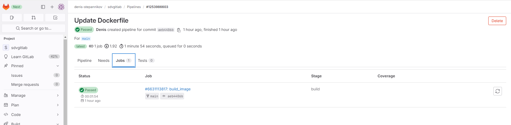
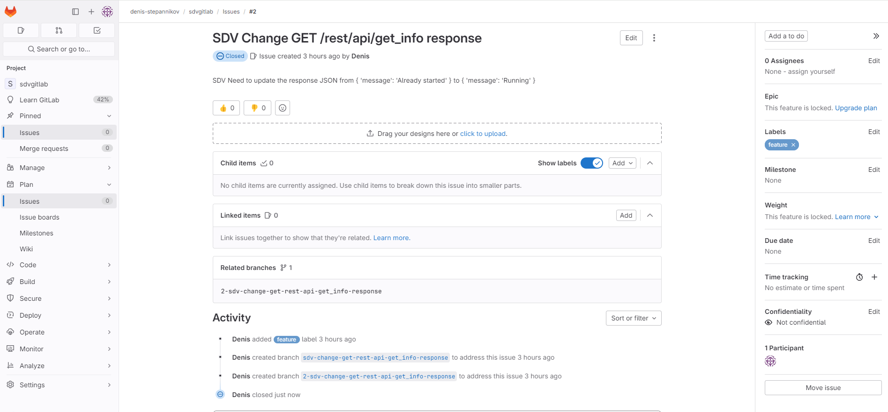
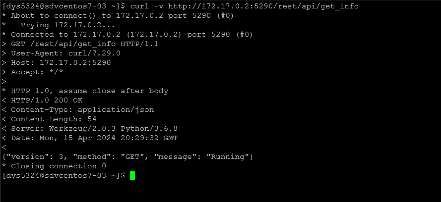

### Домашнее задание к занятию «GitLab» [Степанников Денис]

---

### Основная часть

### DevOps
В репозитории содержится код проекта на Python. Проект — RESTful API сервис. Ваша задача — автоматизировать сборку образа с выполнением python-скрипта:

Образ собирается на основе centos:7.
Python версии не ниже 3.7.
Установлены зависимости: flask flask-jsonpify flask-restful.
Создана директория /python_api.
Скрипт из репозитория размещён в /python_api.
Точка вызова: запуск скрипта.
При комите в любую ветку должен собираться docker image с форматом имени hello:gitlab-$CI_COMMIT_SHORT_SHA . Образ должен быть выложен в Gitlab registry или yandex registry.

### Product Owner
Вашему проекту нужна бизнесовая доработка: нужно поменять JSON ответа на вызов метода GET /rest/api/get_info, необходимо создать Issue в котором указать:

Какой метод необходимо исправить.
Текст с { "message": "Already started" } на { "message": "Running"}.
Issue поставить label: feature.

### Developer
Пришёл новый Issue на доработку, вам нужно:

Создать отдельную ветку, связанную с этим Issue.
Внести изменения по тексту из задания.
Подготовить Merge Request, влить необходимые изменения в master, проверить, что сборка прошла успешно.

### Tester
Разработчики выполнили новый Issue, необходимо проверить валидность изменений:

Поднять докер-контейнер с образом python-api:latest и проверить возврат метода на корректность.
Закрыть Issue с комментарием об успешности прохождения, указав желаемый результат и фактически достигнутый.

### Итог
В качестве ответа пришлите подробные скриншоты по каждому пункту задания:

* файл gitlab-ci.yml;
* Dockerfile;
* лог успешного выполнения пайплайна;
* решённый Issue.

### Решение:
* файл gitlab-ci.yml:

```
stages:
  - build

build_image:
  stage: build
  image: docker:19.03.12
  services:
    - docker:dind
  script:
    - docker login -u gitlab-ci-token -p $CI_JOB_TOKEN $CI_REGISTRY
    - docker build -t $CI_REGISTRY_IMAGE/hello:gitlab-$CI_COMMIT_SHORT_SHA .
    - docker push $CI_REGISTRY_IMAGE/hello:gitlab-$CI_COMMIT_SHORT_SHA
  only:
    - main
```

* Dockerfile:
```
FROM centos:7
RUN yum -y update && yum -y install python3
RUN pip3 install flask flask-jsonpify flask-restful

WORKDIR /python_api
COPY ./python_api /python_api

CMD ["python3", "python-api.py"]
```

* лог успешного выполнения пайплайна:



* решённый Issue:

