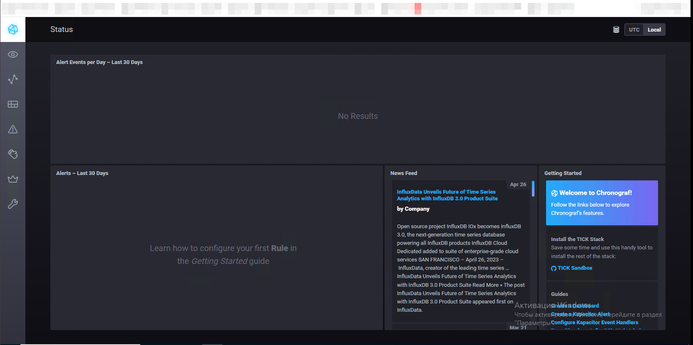
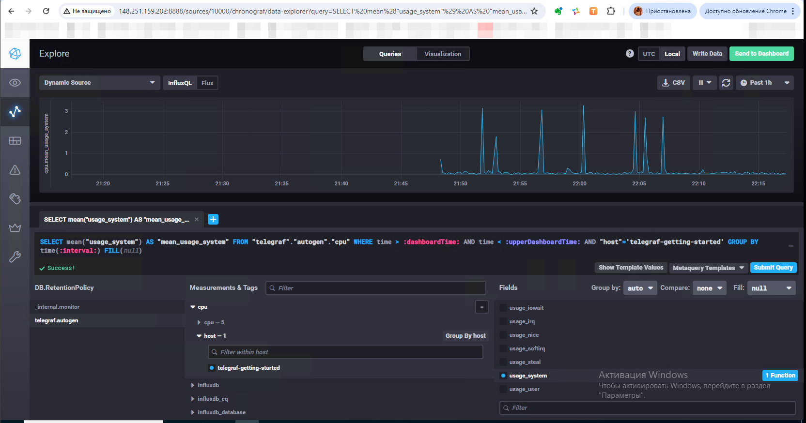
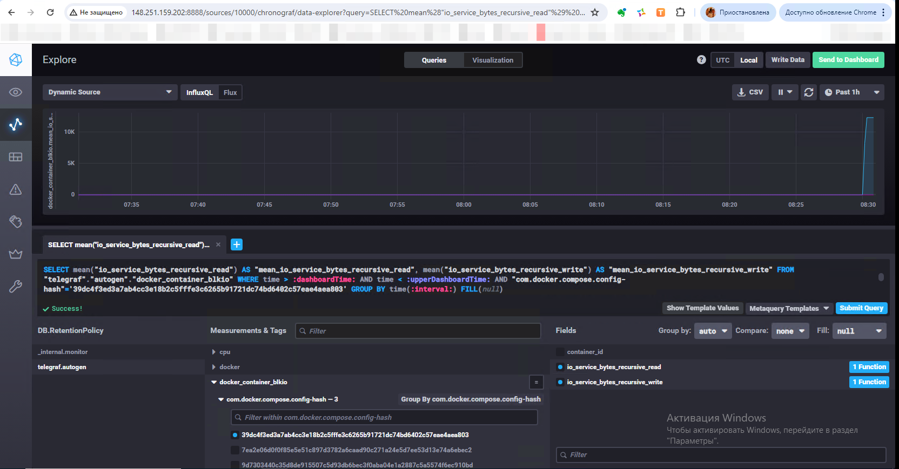

### Домашнее задание к занятию "13.Системы мониторинга" [Степанников Денис]

---
### Основная часть

## Обязательные задания

1. Вас пригласили настроить мониторинг на проект. На онбординге вам рассказали, что проект представляет из себя 
платформу для вычислений с выдачей текстовых отчетов, которые сохраняются на диск. Взаимодействие с платформой 
осуществляется по протоколу http. Также вам отметили, что вычисления загружают ЦПУ. Какой минимальный набор метрик вы
выведите в мониторинг и почему?
#
2. Менеджер продукта посмотрев на ваши метрики сказал, что ему непонятно что такое RAM/inodes/CPUla. Также он сказал, 
что хочет понимать, насколько мы выполняем свои обязанности перед клиентами и какое качество обслуживания. Что вы 
можете ему предложить?
#
3. Вашей DevOps команде в этом году не выделили финансирование на построение системы сбора логов. Разработчики в свою 
очередь хотят видеть все ошибки, которые выдают их приложения. Какое решение вы можете предпринять в этой ситуации, 
чтобы разработчики получали ошибки приложения?
#
4. Вы, как опытный SRE, сделали мониторинг, куда вывели отображения выполнения SLA=99% по http кодам ответов. 
Вычисляете этот параметр по следующей формуле: summ_2xx_requests/summ_all_requests. Данный параметр не поднимается выше 
70%, но при этом в вашей системе нет кодов ответа 5xx и 4xx. Где у вас ошибка?
#
5. Опишите основные плюсы и минусы pull и push систем мониторинга.
#
6. Какие из ниже перечисленных систем относятся к push модели, а какие к pull? А может есть гибридные?

    - Prometheus 
    - TICK
    - Zabbix
    - VictoriaMetrics
    - Nagios
#
7. Склонируйте себе [репозиторий](https://github.com/influxdata/sandbox/tree/master) и запустите TICK-стэк, 
используя технологии docker и docker-compose.

В виде решения на это упражнение приведите скриншот веб-интерфейса ПО chronograf (`http://localhost:8888`). 

P.S.: если при запуске некоторые контейнеры будут падать с ошибкой - проставьте им режим `Z`, например
`./data:/var/lib:Z`
#
8. Перейдите в веб-интерфейс Chronograf (http://localhost:8888) и откройте вкладку Data explorer.
        
    - Нажмите на кнопку Add a query
    - Изучите вывод интерфейса и выберите БД telegraf.autogen
    - В `measurments` выберите cpu->host->telegraf-getting-started, а в `fields` выберите usage_system. Внизу появится график утилизации cpu.
    - Вверху вы можете увидеть запрос, аналогичный SQL-синтаксису. Поэкспериментируйте с запросом, попробуйте изменить группировку и интервал наблюдений.

Для выполнения задания приведите скриншот с отображением метрик утилизации cpu из веб-интерфейса.
#
9. Изучите список [telegraf inputs](https://github.com/influxdata/telegraf/tree/master/plugins/inputs). 
Добавьте в конфигурацию telegraf следующий плагин - [docker](https://github.com/influxdata/telegraf/tree/master/plugins/inputs/docker):
```
[[inputs.docker]]
  endpoint = "unix:///var/run/docker.sock"
```

Дополнительно вам может потребоваться донастройка контейнера telegraf в `docker-compose.yml` дополнительного volume и 
режима privileged:
```
  telegraf:
    image: telegraf:1.4.0
    privileged: true
    volumes:
      - ./etc/telegraf.conf:/etc/telegraf/telegraf.conf:Z
      - /var/run/docker.sock:/var/run/docker.sock:Z
    links:
      - influxdb
    ports:
      - "8092:8092/udp"
      - "8094:8094"
      - "8125:8125/udp"
```

После настройке перезапустите telegraf, обновите веб интерфейс и приведите скриншотом список `measurments` в 
веб-интерфейсе базы telegraf.autogen . Там должны появиться метрики, связанные с docker.


### Решение:
---
*1. Вас пригласили настроить мониторинг на проект. На онбординге вам рассказали, что проект представляет из себя платформу для вычислений с выдачей текстовых отчетов, которые сохраняются на диск. Взаимодействие с платформой осуществляется по протоколу http. Также вам отметили, что вычисления загружают ЦПУ. Какой минимальный набор метрик вы выведите в мониторинг и почему?*

#### Метрики производительности сервера:
- **CPU Usage (Загрузка ЦПУ)**: Высокая загрузка ЦПУ может указывать на интенсивные вычислительные задачи. Мониторинг поможет выявить пиковые нагрузки и потенциальные узкие места.
- **Memory Usage (Использование памяти)**: Важно отслеживать использование оперативной памяти для предотвращения сбоев из-за её исчерпания.
- **Disk I/O (Ввод/вывод на диск)**: Поскольку отчеты сохраняются на диск, нужно отслеживать производительность дисковой системы.
- **Disk Space (Свободное место на диске)**: Контроль свободного пространства на диске важен для предотвращения ошибок при записи отчетов.

#### Метрики доступности и производительности HTTP-сервиса:
- **HTTP Response Time (Время отклика HTTP)**: Время, затрачиваемое на обработку запросов, является важным показателем производительности сервиса.
- **HTTP Error Rates (Частота ошибок HTTP)**: Отслеживание количества ошибок (например, 4xx и 5xx) позволяет своевременно выявлять и исправлять проблемы с доступностью или конфигурацией сервиса.
- **Request Rate (Частота запросов)**: Количество запросов в секунду поможет понять нагрузку на сервис и выявить моменты пикового использования.

#### Метрики состояния системы:
- **System Uptime (Время безотказной работы системы)**: Мониторинг времени работы системы без перезагрузок или сбоев.
- **Process Health (Состояние процессов)**: Отслеживание состояния ключевых процессов платформы, чтобы убедиться, что они работают корректно.

#### Метрики специфичные для приложения:
- **Job Queue Length (Длина очереди задач)**: Если вычисления выполняются асинхронно, важно отслеживать длину очереди задач, чтобы понять, есть ли задержки в обработке.
- **Job Completion Time (Время выполнения задач)**: Время, необходимое для выполнения каждой вычислительной задачи, поможет оценить производительность платформы и выявить возможные проблемы.

#### Логи и их анализ:
- **Log Monitoring (Мониторинг логов)**: Анализ логов на предмет ошибок, предупреждений и других значимых событий, чтобы быстро реагировать на проблемы.

---
*2. Менеджер продукта посмотрев на ваши метрики сказал, что ему непонятно что такое RAM/inodes/CPUla. Также он сказал, что хочет понимать, насколько мы выполняем свои обязанности перед клиентами и какое качество обслуживания. Что вы можете ему предложить?*

Чтобы менеджер продукта мог понимать, насколько платформа выполняет свои обязанности перед клиентами и какое качество обслуживания она предоставляет, необходимо представить метрики в более бизнес-ориентированных терминах и внедрить подходы SLO, SLA и SLI.

#### **Метрики качества обслуживания (Service Quality Metrics):**
- **Среднее время отклика (Average Response Time)**: Время, за которое платформа обрабатывает запросы клиентов. Это поможет менеджеру понять, насколько быстро пользователи получают ответы на свои запросы.
- **Процент успешных запросов (Success Rate)**: Доля запросов, завершившихся без ошибок. Это покажет стабильность и надежность платформы.
- **Процент ошибок (Error Rate)**: Процент запросов, завершившихся ошибками (например, HTTP 4xx и 5xx). Высокий уровень ошибок может указывать на проблемы с доступностью или качеством обслуживания.
- **Время выполнения вычислений (Computation Time)**: Среднее время, необходимое для выполнения вычислительных задач и генерации отчетов. Это поможет оценить, насколько эффективно платформа справляется с обработкой задач.
- **Среднее время генерации отчета (Average Report Generation Time)**: Время, за которое генерируется и сохраняется отчет. Это напрямую влияет на удовлетворенность клиентов.

#### **Метрики доступности (Availability Metrics):**
- **Время безотказной работы (Uptime)**: Процент времени, в течение которого платформа доступна для пользователей. Например, 99.9% времени доступности означает, что платформа работает стабильно и редко бывает недоступна.
- **Количество инцидентов (Incident Count)**: Количество случаев, когда платформа была недоступна или работала с ошибками. Это поможет отслеживать и анализировать причины сбоев.

#### **Метрики использования (Usage Metrics):**
- **Количество запросов в секунду (Requests per Second, RPS)**: Показывает нагрузку на платформу и помогает понять пиковые моменты использования.
- **Количество активных пользователей (Active Users)**: Число пользователей, активно использующих платформу в определенный момент времени или за определенный период.

#### **Показатели удовлетворенности клиентов (Customer Satisfaction Metrics):**
- **Время отклика службы поддержки (Support Response Time)**: Время, за которое служба поддержки отвечает на запросы клиентов. Это может быть важным показателем качества обслуживания.
- **Оценка удовлетворенности клиентов (Customer Satisfaction Score, CSAT)**: Анкеты или опросы, которые помогают понять, насколько клиенты довольны работой платформы.

#### Внедрение подходов SLO, SLA и SLI:
- **SLA (Service Level Agreement)**: Соглашение с клиентами о том, какие уровни обслуживания должны быть достигнуты. Например, SLA может включать обязательства по времени отклика, доступности и времени выполнения задач.
- **SLO (Service Level Objective)**: Внутренние цели, которые помогают достичь уровней обслуживания, указанных в SLA. Должны устанвливаться чуть выше чем SLA.
- **SLI (Service Level Indicator)**: Метрики, которые используются для измерения выполнения SLO. Например, SLI для времени отклика будет измерять фактическое время отклика запросов и сравнивать его с целевым значением из SLO.

#### Примеры визуализации:
- **Дашборды с ключевыми метриками**: Использование инструментов, таких как Grafana, для создания наглядных дашбордов, которые будут показывать среднее время отклика, процент успешных запросов, время выполнения задач и т.д.
- **Графики и отчеты**: Построение графиков и отчетов, которые показывают изменения ключевых метрик во времени, помогая выявить тенденции и потенциальные проблемы.

---
*3. Вашей DevOps команде в этом году не выделили финансирование на построение системы сбора логов. Разработчики в свою очередь хотят видеть все ошибки, которые выдают их приложения. Какое решение вы можете предпринять в этой ситуации, чтобы разработчики получали ошибки приложения?*

Использование Elastic Stack, Graylog, Grafana (с Loki), Prometheus и Zabbix позволяет организовать эффективный сбор, хранение и анализ логов даже при ограниченном бюджете. 
Эти инструменты помогут разработчикам получать ошибки приложений и своевременно реагировать на них. Выбор конкретного решения зависит от требований проекта, наличия ресурсов и предпочтений команды.


#### **Elastic Stack (ELK Stack):**
Elastic Stack (Elasticsearch, Logstash, Kibana) — мощный инструмент для централизованного сбора, хранения и анализа логов.

- **Elasticsearch:** Хранение логов и их индексация для быстрого поиска.
- **Logstash:** Сбор, преобразование и отправка логов в Elasticsearch. Logstash может читать логи из файлов, баз данных или получать их через различные протоколы (например, syslog).
- **Kibana:** Визуализация логов. Разработчики могут использовать Kibana для поиска и анализа логов, создания дашбордов и отчетов.
  
  **Пример решения с использованием Elastic Stack:**
  1. Настройка Logstash для чтения логов приложений.
  2. Отправка логов в Elasticsearch.
  3. Использование Kibana для поиска и визуализации логов.

#### **Graylog:**
Graylog — это платформа для централизованного управления логами, которая позволяет собирать, индексировать и анализировать логи.

- **Graylog Server:** Центральный сервер для приема и хранения логов.
- **Inputs:** Механизмы для получения логов из различных источников (например, syslog, GELF).
- **Streams:** Фильтрация и маршрутизация логов по различным потокам, что позволяет разработчикам получать только интересующие их логи.
- **Dashboards:** Создание дашбордов для визуализации логов.

  **Пример решения с использованием Graylog:**
  1. Настройка входов (inputs) для получения логов приложений.
  2. Создание потоков (streams) для фильтрации и маршрутизации логов.
  3. Использование дашбордов для анализа и мониторинга логов.

#### **Grafana:**
Grafana — инструмент для визуализации метрик и логов, который может интегрироваться с различными источниками данных, включая Elasticsearch и Prometheus.

- **Grafana Loki:** Легковесная система сбора логов, интегрируемая с Grafana, позволяет хранить и визуализировать логи.
- **Дашборды:** Создание дашбордов для отображения логов и метрик.

  **Пример решения с использованием Grafana и Loki:**
  1. Настройка Loki для сбора и хранения логов.
  2. Интеграция Loki с Grafana для визуализации логов.
  3. Создание дашбордов в Grafana для мониторинга ошибок приложения.

#### **Prometheus:**
Prometheus в первую очередь предназначен для сбора метрик, но его можно использовать для мониторинга событий и состояния приложений.

- **Alertmanager:** Отправка уведомлений при возникновении определенных условий (например, увеличение числа ошибок).
- **Экспортеры:** Использование экспортеров для сбора метрик из приложений.

  **Пример решения с использованием Prometheus:**
  1. Настройка экспортеров для сбора метрик из приложений.
  2. Создание правил алертинга для уведомления о событиях (например, при повышенном уровне ошибок).
  3. Использование Alertmanager для отправки уведомлений разработчикам.

#### **Zabbix:**
Zabbix — система мониторинга, которая может использоваться для сбора и анализа логов и метрик.

- **Zabbix Agent:** Сбор логов и метрик с серверов и приложений.
- **Triggers and Actions:** Настройка триггеров и действий для уведомления разработчиков о возникновении ошибок.
- **Web Interface:** Веб-интерфейс для анализа логов и создания дашбордов.

  **Пример решения с использованием Zabbix:**
  1. Установка и настройка Zabbix Agent на серверах приложений для сбора логов.
  2. Настройка триггеров для обнаружения ошибок в логах.
  3. Настройка действий для отправки уведомлений разработчикам.

---
*4. Вы, как опытный SRE, сделали мониторинг, куда вывели отображения выполнения SLA=99% по http кодам ответов. Вычисляете этот параметр по следующей формуле: summ_2xx_requests/summ_all_requests. Данный параметр не поднимается выше 70%, но при этом в вашей системе нет кодов ответа 5xx и 4xx. Где у вас ошибка?*

Если параметр SLA для HTTP кодов ответа, не поднимается выше 70%, но при этом в системе нет кодов ответа 5xx и 4xx, то вероятная причина заключается в наличии других кодов ответов, которые мы не учли.
В частности, это могут быть ответы с кодами 1xx и 3xx. Нужно проверить коды 1xx и 3xx и пересчитайть SLA с учетом этих кодов.

---
*5. Опишите основные плюсы и минусы pull и push систем мониторинга.*

#### Pull-модель мониторинга

**Плюсы:**

1. **Централизованный контроль:** Центральный сервер опрашивает все целевые системы, что упрощает управление конфигурацией и обновлениями агентов.
2. **Безопасность:** Контроль над соединениями находится на стороне сервера, что позволяет лучше защищать его от несанкционированных подключений и атак.
3. **Обнаружение неисправностей:** Если целевая система недоступна, это легко заметить, так как сервер не получит ответа на запрос.
4. **Гибкость опроса:** Возможность настраивать частоту опроса для различных метрик в зависимости от их важности и частоты изменений.
5. **Проверка состояния:** Сервер может контролировать состояние и доступность каждого узла при каждом опросе.

**Минусы:**

1. **Масштабируемость:** С увеличением количества целевых систем нагрузка на центральный сервер растет, что может привести к проблемам масштабируемости.
2. **Требования к сетевой доступности:** Целевые системы должны быть доступны для опроса с центрального сервера, что может быть проблематично в сложных сетевых топологиях.
3. **Ограниченная гибкость агентов:** Агенты должны поддерживать протоколы и методы, используемые сервером для опроса, что может ограничивать выбор используемых технологий.

#### Push-модель мониторинга

**Плюсы:**

1. **Масштабируемость:** Целевые системы сами отправляют данные на центральный сервер, что позволяет распределять нагрузку по всей инфраструктуре и легко добавлять новые узлы.
2. **Реактивность:** Целевые системы могут отправлять данные сразу по событию, что обеспечивает более быструю реакцию на инциденты.
3. **Гибкость агентов:** Агенты могут отправлять данные в произвольном формате и по любому протоколу, что дает больше свободы в выборе технологий и реализации.
4. **Низкие требования к сетевой доступности:** Нет необходимости обеспечивать доступность целевых систем для центрального сервера, что упрощает работу в сложных сетевых конфигурациях.

**Минусы:**

1. **Сложность управления конфигурацией:** Требуется настройка агентов на всех целевых системах, что может быть трудоемким процессом.
2. **Безопасность:** Центральный сервер должен быть доступен для подключения с агентов, что может увеличивать поверхность для атак.
3. **Потеря данных:** При сбоях сети или агентов могут теряться данные, если не предусмотрена буферизация и повторная отправка.
4. **Отсутствие контроля:** Центральный сервер не имеет контроля над состоянием агентов, что может затруднять обнаружение недоступных или некорректно работающих систем.
---

*6. Какие из ниже перечисленных систем относятся к push модели, а какие к pull? А может есть гибридные?*

* Prometheus - **Pull**
* TICK - **Push**
* Zabbix - **Гибридная**
* VictoriaMetrics - **Гибридная**
* Nagios - **Pull**
---

*7. Склонируйте себе репозиторий и запустите TICK-стэк, используя технологии docker и docker-compose.*



*8. Перейдите в веб-интерфейс Chronograf (http://localhost:8888) и откройте вкладку Data explorer.*

* Нажмите на кнопку Add a query
* Изучите вывод интерфейса и выберите БД telegraf.autogen
* В measurments выберите cpu->host->telegraf-getting-started, а в fields выберите usage_system. Внизу появится график утилизации cpu.
* Вверху вы можете увидеть запрос, аналогичный SQL-синтаксису. Поэкспериментируйте с запросом, попробуйте изменить группировку и интервал наблюдений.

*Для выполнения задания приведите скриншот с отображением метрик утилизации cpu из веб-интерфейса.*



---
9. 




---