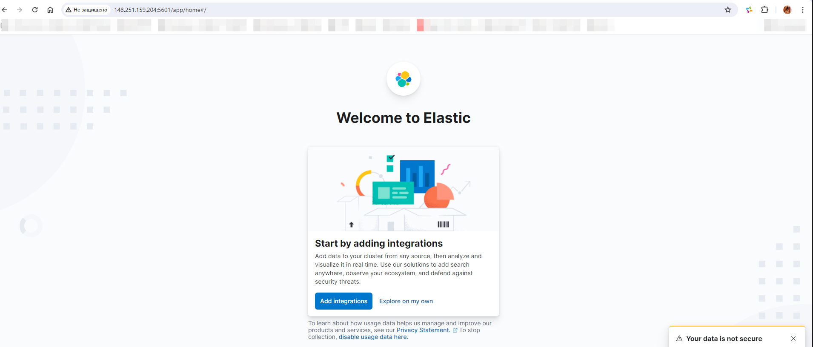
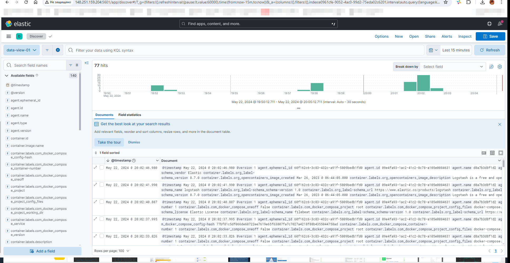

### Домашнее задание к занятию "15.Система сбора логов Elastic Stack" [Степанников Денис]

---

## Задание 1

Вам необходимо поднять в докере и связать между собой:

* elasticsearch (hot и warm ноды);
* logstash;
* kibana;
* filebeat.
Logstash следует сконфигурировать для приёма по tcp json-сообщений.

Filebeat следует сконфигурировать для отправки логов docker вашей системы в logstash.

В директории help находится манифест docker-compose и конфигурации filebeat/logstash для быстрого выполнения этого задания.

Результатом выполнения задания должны быть:

* скриншот docker ps через 5 минут после старта всех контейнеров (их должно быть 5);
* скриншот интерфейса kibana;

---

### Задание 2
Перейдите в меню создания index-patterns в kibana и создайте несколько index-patterns из имеющихся.

Перейдите в меню просмотра логов в kibana (Discover) и самостоятельно изучите, как отображаются логи и как производить поиск по логам.

В манифесте директории help также приведенно dummy-приложение, которое генерирует рандомные события в stdout-контейнера. Эти логи должны порождать индекс logstash-* в elasticsearch. Если этого индекса нет — воспользуйтесь советами и источниками из раздела «Дополнительные ссылки» этого задания.

---

### Решение:
---
1.
```
root@hw15:~# docker ps -a
CONTAINER ID   IMAGE                    COMMAND                  CREATED          STATUS          PORTS                                                                                            NAMES
d8a7b3d8f1d2   elastic/filebeat:8.7.0   "/usr/bin/tini -- /u…"   16 minutes ago   Up 16 minutes                                                                                                    filebeat
13bee398f51a   logstash:8.7.0           "/usr/local/bin/dock…"   16 minutes ago   Up 16 minutes   0.0.0.0:5044->5044/tcp, :::5044->5044/tcp, 0.0.0.0:5046->5046/tcp, :::5046->5046/tcp, 9600/tcp   logstash
13b71f458502   kibana:8.7.0             "/bin/tini -- /usr/l…"   16 minutes ago   Up 16 minutes   0.0.0.0:5601->5601/tcp, :::5601->5601/tcp                                                        kibana
0075696125c3   elasticsearch:8.7.0      "/bin/tini -- /usr/l…"   16 minutes ago   Up 9 minutes    0.0.0.0:9200->9200/tcp, :::9200->9200/tcp, 9300/tcp                                              es-hot
d97c15b31d94   elasticsearch:8.7.0      "/bin/tini -- /usr/l…"   17 minutes ago   Up 10 minutes   9200/tcp, 9300/tcp                                                                               es-warm
```



---
2. 



---