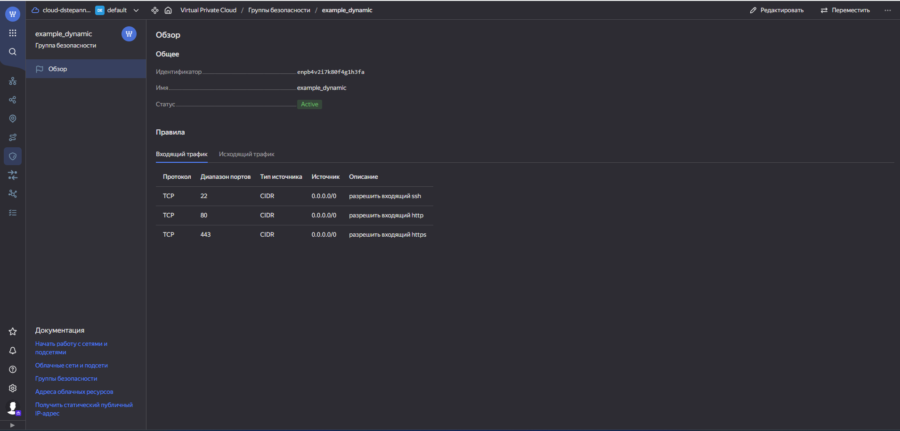

### Домашнее задание к занятию 3. «Управляющие конструкции в коде Terraform» [Степанников Денис]

---

### Задача 1
1. Изучите проект.
2. Заполните файл personal.auto.tfvars.
3. Инициализируйте проект, выполните код. Он выполнится, даже если доступа к preview нет.

Примечание. Если у вас не активирован preview-доступ к функционалу «Группы безопасности» в Yandex Cloud, запросите доступ у поддержки облачного провайдера. Обычно его выдают в течение 24-х часов.

Приложите скриншот входящих правил «Группы безопасности» в ЛК Yandex Cloud или скриншот отказа в предоставлении доступа к preview-версии.

### Решение:



### Задача 2

1. Создайте файл count-vm.tf. Опишите в нём создание двух одинаковых ВМ web-1 и web-2 (не web-0 и web-1) с минимальными параметрами, используя мета-аргумент count loop. Назначьте ВМ созданную в первом задании группу безопасности.(как это сделать узнайте в документации провайдера yandex/compute_instance )
2. Создайте файл for_each-vm.tf. Опишите в нём создание двух ВМ для баз данных с именами "main" и "replica" разных по cpu/ram/disk_volume , используя мета-аргумент for_each loop. Используйте для обеих ВМ одну общую переменную типа:
```
variable "each_vm" {
  type = list(object({  vm_name=string, cpu=number, ram=number, disk_volume=number }))
}
```
При желании внесите в переменную все возможные параметры. 4. ВМ из пункта 2.1 должны создаваться после создания ВМ из пункта 2.2. 5. Используйте функцию file в local-переменной для считывания ключа ~/.ssh/id_rsa.pub и его последующего использования в блоке metadata, взятому из ДЗ 2. 6. Инициализируйте проект, выполните код.


### Решение:
```
sdvvm01@sdvvm01:/usr/src$ cat locals.tf
#locals {
#  db_vm_name    = "${var.proj}-${var.env}-${var.app}-db"
#  web_vm_name   = "${var.proj}-${var.env}-${var.app}-web"
#}
locals {
  ssh_key_path = "/home/sdvvm01/.ssh/id_rsa.pub"
}
```
```
sdvvm01@sdvvm01:/usr/src$ cat count-vm.tf
data "yandex_compute_image" "ubuntu" {
  family = var.vm_image_name
}

resource "yandex_compute_instance" "web" {
  count         = 2

  name          = "web-${count.index + 1}"
  platform_id   = var.platform_id

  resources {
    cores         = var.vm_web_cores
    memory        = var.vm_web_memory
    core_fraction = var.core_fraction
  }

  boot_disk {
    initialize_params {
      image_id = data.yandex_compute_image.ubuntu.image_id
      size = var.boot_disk_size
    }
  }

  scheduling_policy {
    preemptible = true
  }

  network_interface {
    subnet_id = yandex_vpc_subnet.develop.id
    security_group_ids = [yandex_vpc_security_group.example.id]
    nat       = true
  }

  metadata = {
    serial-port-enable = var.serial_port_state
    ssh-keys           = "ubuntu:${file(local.ssh_key_path)}"
  }

  depends_on = [
    yandex_compute_instance.db["main"],
    yandex_compute_instance.db["replica"]
  ]
}
sdvvm01@sdvvm01:/usr/src$
```
```
sdvvm01@sdvvm01:/usr/src$ cat for_each-vm.tf
resource "yandex_compute_instance" "db" {
  for_each      = var.each_vm

  name          = each.key

  resources {
    cores       = each.value.cpu
    memory      = each.value.ram
  }

  boot_disk {
    initialize_params {
      image_id  = data.yandex_compute_image.ubuntu.image_id
      size      = each.value.disk_volume
    }
  }

  network_interface {
     subnet_id  = yandex_vpc_subnet.develop.id
     security_group_ids = [yandex_vpc_security_group.example.id]
     nat        = true
  }

  metadata = {
     serial-port-enable = var.serial_port_state
     ssh-keys           = "ubuntu:${file(local.ssh_key_path)}"
  }
}
sdvvm01@sdvvm01:/usr/src$
```

Результат выполнения:
```
Plan: 8 to add, 0 to change, 0 to destroy.

Do you want to perform these actions?
  Terraform will perform the actions described above.
  Only 'yes' will be accepted to approve.

  Enter a value: yes

yandex_compute_disk.extra_disks[2]: Creating...
yandex_compute_disk.extra_disks[0]: Creating...
yandex_compute_instance.db["replica"]: Creating...
yandex_compute_disk.extra_disks[1]: Creating...
yandex_compute_instance.db["main"]: Creating...
yandex_compute_disk.extra_disks[2]: Creation complete after 8s [id=fhmgogtso8uftu0pufkk]
yandex_compute_disk.extra_disks[0]: Creation complete after 10s [id=fhmupqavut6quqp2shdi]
yandex_compute_instance.db["replica"]: Still creating... [10s elapsed]
yandex_compute_disk.extra_disks[1]: Still creating... [10s elapsed]
yandex_compute_instance.db["main"]: Still creating... [10s elapsed]
yandex_compute_disk.extra_disks[1]: Creation complete after 12s [id=fhmad1m8g9fdd1gqqlk0]
yandex_compute_instance.storage_vm: Creating...
yandex_compute_instance.db["replica"]: Still creating... [20s elapsed]
yandex_compute_instance.db["main"]: Still creating... [20s elapsed]
yandex_compute_instance.storage_vm: Still creating... [10s elapsed]
yandex_compute_instance.db["replica"]: Still creating... [30s elapsed]
yandex_compute_instance.db["main"]: Still creating... [30s elapsed]
yandex_compute_instance.storage_vm: Still creating... [20s elapsed]
yandex_compute_instance.db["replica"]: Still creating... [40s elapsed]
yandex_compute_instance.db["main"]: Still creating... [40s elapsed]
yandex_compute_instance.storage_vm: Still creating... [30s elapsed]
yandex_compute_instance.db["replica"]: Creation complete after 42s [id=fhmv73bgjan4k5bg4010]
yandex_compute_instance.db["main"]: Creation complete after 49s [id=fhmheu7v773ki47lp23u]
yandex_compute_instance.web[0]: Creating...
yandex_compute_instance.web[1]: Creating...
yandex_compute_instance.storage_vm: Still creating... [40s elapsed]
yandex_compute_instance.storage_vm: Creation complete after 42s [id=fhmrp3v1ooihd1bfl0s4]
yandex_compute_instance.web[1]: Still creating... [10s elapsed]
yandex_compute_instance.web[0]: Still creating... [10s elapsed]
yandex_compute_instance.web[1]: Still creating... [20s elapsed]
yandex_compute_instance.web[0]: Still creating... [20s elapsed]
yandex_compute_instance.web[0]: Still creating... [30s elapsed]
yandex_compute_instance.web[1]: Still creating... [30s elapsed]
yandex_compute_instance.web[0]: Creation complete after 40s [id=fhmqdv72tcojh7dt88hp]
yandex_compute_instance.web[1]: Still creating... [40s elapsed]
yandex_compute_instance.web[1]: Creation complete after 49s [id=fhms8cjnv867rv6v13sl]

Apply complete! Resources: 8 added, 0 changed, 0 destroyed.
```


### Задача 3

1. Создайте 3 одинаковых виртуальных диска размером 1 Гб с помощью ресурса yandex_compute_disk и мета-аргумента count в файле disk_vm.tf .
2. Создайте в том же файле одиночную(использовать count или for_each запрещено из-за задания №4) ВМ c именем "storage" . Используйте блок dynamic secondary_disk{..} и мета-аргумент for_each для подключения созданных вами дополнительных дисков.

### Решение
*Создайте 3 одинаковых виртуальных диска размером 1 Гб с помощью ресурса yandex_compute_disk и мета-аргумента count в файле disk_vm.tf .*
```
sdvvm01@sdvvm01:/usr/src$ cat disk_vm.tf
resource "yandex_compute_disk" "extra_disks" {
  count = 3

  name = "disk-${count.index}"
  size = 1
}
```
*Создайте в том же файле одиночную(использовать count или for_each запрещено из-за задания №4) ВМ c именем "storage" . Используйте блок dynamic secondary_disk{..} и мета-аргумент for_each для подключения созданных вами дополнительных дисков.*

```
sdvvm01@sdvvm01:/usr/src$ cat disk_vm.tf
resource "yandex_compute_disk" "extra_disks" {
  count = 3

  name = "disk-${count.index}"
  size = 1
}

resource "yandex_compute_instance" "storage_vm" {

  name = "storage"

  platform_id   = var.platform_id

  resources {
    cores         = var.vm_web_cores
    memory        = var.vm_web_memory
    core_fraction = var.core_fraction
  }

  boot_disk {
    initialize_params {
      image_id = data.yandex_compute_image.ubuntu.image_id
      size = var.boot_disk_size
    }
  }

  scheduling_policy {
    preemptible = true
  }

  network_interface {
    subnet_id = yandex_vpc_subnet.develop.id
    security_group_ids = [yandex_vpc_security_group.example.id]
    nat       = true
  }

  metadata = {
    serial-port-enable = var.serial_port_state
    ssh-keys           = "ubuntu:${file(local.ssh_key_path)}"
  }

  # Использование dynamic блока для подключения дополнительных дисков
  dynamic "secondary_disk" {
    for_each = yandex_compute_disk.extra_disks.*.id

    content {
      disk_id = secondary_disk.value
      mode    = "READ_WRITE"
    }
  }
}
```

### Задача 4
1. В файле ansible.tf создайте inventory-файл для ansible. Используйте функцию tepmplatefile и файл-шаблон для создания ansible inventory-файла из лекции. Готовый код возьмите из демонстрации к лекции demonstration2. Передайте в него в качестве переменных группы виртуальных машин из задания 2.1, 2.2 и 3.2, т. е. 5 ВМ.
2. Инвентарь должен содержать 3 группы и быть динамическим, т. е. обработать как группу из 2-х ВМ, так и 999 ВМ.
3. Добавьте в инвентарь переменную fqdn.
```
[webservers]
web-1 ansible_host=<внешний ip-адрес> fqdn=<полное доменное имя виртуальной машины>
web-2 ansible_host=<внешний ip-адрес> fqdn=<полное доменное имя виртуальной машины>

[databases]
main ansible_host=<внешний ip-адрес> fqdn=<полное доменное имя виртуальной машины>
replica ansible_host<внешний ip-адрес> fqdn=<полное доменное имя виртуальной машины>

[storage]
storage ansible_host=<внешний ip-адрес> fqdn=<полное доменное имя виртуальной машины>
```
Пример fqdn: web1.ru-central1.internal(в случае указания имени ВМ); fhm8k1oojmm5lie8i22a.auto.internal(в случае автоматической генерации имени ВМ зона изменяется). нужную вам переменную найдите в документации провайдера или terraform console. 
4. Выполните код. Приложите скриншот получившегося файла.

Для общего зачёта создайте в вашем GitHub-репозитории новую ветку terraform-03. Закоммитьте в эту ветку свой финальный код проекта, пришлите ссылку на коммит.
Удалите все созданные ресурсы.

### Решение
*В файле ansible.tf создайте inventory-файл для ansible. Используйте функцию tepmplatefile и файл-шаблон для создания ansible inventory-файла из лекции. Готовый код возьмите из демонстрации к лекции demonstration2. Передайте в него в качестве переменных группы виртуальных машин из задания 2.1, 2.2 и 3.2, т. е. 5 ВМ.*

*Инвентарь должен содержать 3 группы [webservers], [databases], [storage] и быть динамическим, т. е. обработать как группу из 2-х ВМ, так и 999 ВМ.*

*Добавьте в инвентарь переменную fqdn.*

*Выполните код. Приложите скриншот получившегося файла.*

```
sdvvm01@sdvvm01:/usr/src$ cat ansible_hosts.tftpl
[web]

%{~ for i in web ~}
${i["name"]}   ansible_host=${i["network_interface"][0]["nat_ip_address"]} fqdn=${i["fqdn"]}
%{~ endfor ~}

[db]

%{~ for i in db ~}
${i["name"]}   ansible_host=${i["network_interface"][0]["nat_ip_address"]} fqdn=${i["fqdn"]}
%{~ endfor ~}

[storage]

%{~ for i in storage ~}
${i["name"]}   ansible_host=${i["network_interface"][0]["nat_ip_address"]} fqdn=${i["fqdn"]}
%{~ endfor ~}
```
```
sdvvm01@sdvvm01:/usr/src$ cat ansible.tf
resource "local_file" "ansible_inventory" {
  content       = templatefile("${path.module}/ansible_hosts.tftpl",
    {
        web     =  yandex_compute_instance.web,
        db      =  yandex_compute_instance.db,
        storage =  [yandex_compute_instance.storage_vm]
    }
)

  filename = "${abspath(path.module)}/hosts.cfg"
}
```
Результат выполнения:
```
Plan: 1 to add, 0 to change, 0 to destroy.

Do you want to perform these actions?
  Terraform will perform the actions described above.
  Only 'yes' will be accepted to approve.

  Enter a value: yes

local_file.ansible_inventory: Creating...
local_file.ansible_inventory: Creation complete after 0s [id=0f7e253e3a299b4ee3d8890e6cbc0fce8e38934c]

Apply complete! Resources: 1 added, 0 changed, 0 destroyed.
```
```
sdvvm01@sdvvm01:/usr/src$ cat hosts.cfg
[web]
web-1   ansible_host=51.250.80.116 fqdn=fhmqdv72tcojh7dt88hp.auto.internalweb-2   ansible_host=158.160.40.26 fqdn=fhms8cjnv867rv6v13sl.auto.internal
[db]
main   ansible_host=158.160.33.71 fqdn=fhmheu7v773ki47lp23u.auto.internalreplica   ansible_host=51.250.74.83 fqdn=fhmv73bgjan4k5bg4010.auto.internal
[storage]
storage   ansible_host=62.84.124.98 fqdn=fhmrp3v1ooihd1bfl0s4.auto.internal
sdvvm01@sdvvm01:/usr/src$
```
[Ссылка на конфиг файлы.](./src/3)
