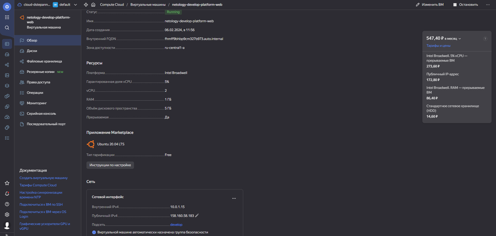
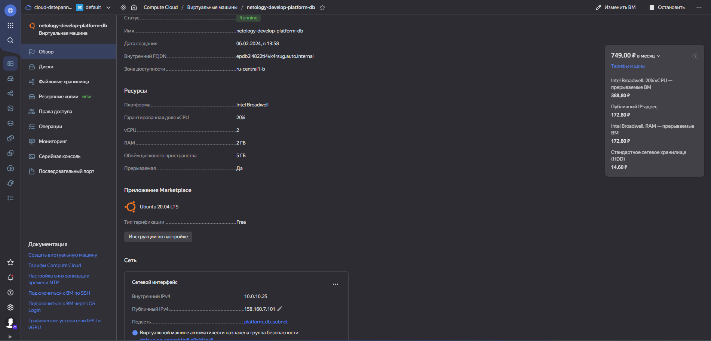

### Домашнее задание к занятию 2. «Основы Terraform. Yandex Cloud» [Степанников Денис]

---

### Цели задания
1. Создать свои ресурсы в облаке Yandex Cloud с помощью Terraform.
2. Освоить работу с переменными Terraform.

### Чек-лист готовности к домашнему заданию
1. Зарегистрирован аккаунт в Yandex Cloud. Использован промокод на грант.
2. Установлен инструмент Yandex CLI.
3. Исходный код для выполнения задания расположен в директории 02/src.

### Задача 1
В качестве ответа всегда полностью прикладывайте ваш terraform-код в git. Убедитесь что ваша версия Terraform =1.5.Х (версия 1.6.Х может вызывать проблемы с Яндекс провайдером)

1. Изучите проект. В файле variables.tf объявлены переменные для Yandex provider.
2. Создайте сервисный аккаунт и ключ. service_account_key_file.
3. Сгенерируйте новый или используйте свой текущий ssh-ключ. Запишите его открытую(public) часть в переменную vms_ssh_public_root_key.
4. Инициализируйте проект, выполните код. Исправьте намеренно допущенные синтаксические ошибки. Ищите внимательно, посимвольно. Ответьте, в чём заключается их суть.
5. Подключитесь к консоли ВМ через ssh и выполните команду  curl ifconfig.me. Примечание: К OS ubuntu "out of a box, те из коробки" необходимо подключаться под пользователем ubuntu: "ssh ubuntu@vm_ip_address". Предварительно убедитесь, что ваш ключ добавлен в ssh-агент: eval $(ssh-agent) && ssh-add Вы познакомитесь с тем как при создании ВМ создать своего пользователя в блоке metadata в следующей лекции.;
6. Ответьте, как в процессе обучения могут пригодиться параметры preemptible = true и core_fraction=5 в параметрах ВМ.

В качестве решения приложите:

* скриншот ЛК Yandex Cloud с созданной ВМ, где видно внешний ip-адрес;
* скриншот консоли, curl должен отобразить тот же внешний ip-адрес;
* ответы на вопросы.

### Решение:
*Инициализируйте проект, выполните код. Исправьте намеренно допущенные синтаксические ошибки. Ищите внимательно, посимвольно. Ответьте, в чём заключается их суть.*

Опечатка в слове standart, должно быть standard. Указана платформа v4, в ЯО максимально доступная версия платформы v3. Изменено на standard-v1 и cores = 2. core_fraction = 5, значит число ядер должно быть 2 или 4.

Исправленный файл main.tf
```
sdvvm01@sdvvm01:/usr/src$ cat main.tf
resource "yandex_vpc_network" "develop" {
  name = var.vpc_name
}

resource "yandex_vpc_subnet" "develop" {
  name           = var.vpc_name
  zone           = var.default_zone
  network_id     = yandex_vpc_network.develop.id
  v4_cidr_blocks = var.default_cidr
}

data "yandex_compute_image" "ubuntu" {
  family = "ubuntu-2004-lts"
}

resource "yandex_compute_instance" "platform" {
  name        = "netology-develop-platform-web"
  platform_id = "standard-v1"
  resources {
    cores         = 2
    memory        = 1
    core_fraction = 5
  }

  boot_disk {
    initialize_params {
      image_id = data.yandex_compute_image.ubuntu.image_id
    }
  }

  scheduling_policy {
    preemptible = true
  }

  network_interface {
    subnet_id = yandex_vpc_subnet.develop.id
    nat       = true
  }

  metadata = {
    serial-port-enable = 1
    ssh-keys           = "ubuntu:${var.vms_ssh_root_key}"
  }

}
sdvvm01@sdvvm01:/usr/src$
```

*Ответьте, как в процессе обучения могут пригодиться параметры preemptible = true и core_fraction=5 в параметрах ВМ.*

Эти опции позволяют снизить расходы на ресурсы в ЯО:

* preemptible = true - позволяет создать прерываемую виртуальную машину, она может быть принудительно остановлена в любой момент со стороны ЯО.
* core_fraction = 5 - определяет уровень производительности (утилизации хоста) CPU

*скриншот ЛК Yandex Cloud с созданной ВМ, где видно внешний ip-адрес;*


```
ubuntu@fhmff9bhbp9cm327b973:~$ curl ifconfig.me
158.160.58.183ubuntu@fhmff9bhbp9cm327b973:~$
```

### Задача 2

1. Замените все хардкод-значения для ресурсов yandex_compute_image и yandex_compute_instance на отдельные переменные. К названиям переменных ВМ добавьте в начало префикс vm_web_ . Пример: vm_web_name.
2. Объявите нужные переменные в файле variables.tf, обязательно указывайте тип переменной. Заполните их default прежними значениями из main.tf.
3. Проверьте terraform plan. Изменений быть не должно.

### Решение:

Исправленный файл main.tf
```
sdvvm01@sdvvm01:/usr/src$ cat main.tf
resource "yandex_vpc_network" "develop" {
  name = var.vpc_name
}

resource "yandex_vpc_subnet" "develop" {
  name           = var.vpc_name
  zone           = var.default_zone
  network_id     = yandex_vpc_network.develop.id
  v4_cidr_blocks = var.default_cidr
}

data "yandex_compute_image" "ubuntu" {
  family = var.vm_web_image_name
}

resource "yandex_compute_instance" "platform" {
  name        = var.vm_web_compute_instance_name
  platform_id = var.vm_web_platform_name
  resources {
    cores         = var.vm_web_compute_map.cores
    memory        = var.vm_web_compute_map.memory
    core_fraction = var.vm_web_compute_map.core_fraction
  }

  boot_disk {
    initialize_params {
      image_id = data.yandex_compute_image.ubuntu.image_id
    }
  }

  scheduling_policy {
    preemptible = true
  }

  network_interface {
    subnet_id = yandex_vpc_subnet.develop.id
    nat       = true
  }

  metadata = {
    serial-port-enable = 1
    ssh-keys           = "ubuntu:${var.vms_ssh_root_key}"
  }

}
sdvvm01@sdvvm01:/usr/src$
```

Исправленный файл variables.tf
```
sdvvm01@sdvvm01:/usr/src$ cat variables.tf
###cloud vars
variable "token" {
  type        = string
  description = "OAuth-token; https://cloud.yandex.ru/docs/iam/concepts/authorization/oauth-token"
}

variable "cloud_id" {
  type        = string
  default     = "b1gma921cmet0l8l5tr8"
  description = "https://cloud.yandex.ru/docs/resource-manager/operations/cloud/get-id"
}

variable "folder_id" {
  type        = string
  default     = "b1gg662d7uu2dkqqod4s"
  description = "https://cloud.yandex.ru/docs/resource-manager/operations/folder/get-id"
}

variable "default_zone" {
  type        = string
  default     = "ru-central1-a"
  description = "https://cloud.yandex.ru/docs/overview/concepts/geo-scope"
}
variable "default_cidr" {
  type        = list(string)
  default     = ["10.0.1.0/24"]
  description = "https://cloud.yandex.ru/docs/vpc/operations/subnet-create"
}

variable "vpc_name" {
  type        = string
  default     = "develop"
  description = "VPC network & subnet name"
}

###ssh vars

variable "vms_ssh_root_key" {
  type        = string
  default     = "ssh-rsa AAAAB3NzaC1yc2EAAAADAQABAAABgQD+eBTx0Db5bOfaXqyqMeL....= DYS5324@MOSDYS5324"
  description = "ssh-keygen -t ed25519"
}


variable "vm_web_compute_map" {
  type    = map(number)
  default = {
    cores         = 2
    memory        = 1
    core_fraction = 5
  }
}

variable "vm_web_image_name" {
  type         = string
  default       = "ubuntu-2004-lts"
  description   = "vm web image name"
}

variable "vm_web_platform_name" {
  type          = string
  default       = "standard-v1"
  description   = "wm web platform id at yc"
}

variable "vm_web_compute_instance_name" {
  type          = string
  default       = "netology-develop-platform-web"
  description   = "vm web compute instance name"
}
sdvvm01@sdvvm01:/usr/src$
```
```
sdvvm01@sdvvm01:/usr/src$ sudo terraform plan
var.token
  OAuth-token; https://cloud.yandex.ru/docs/iam/concepts/authorization/oauth-token

  Enter a value: *****

data.yandex_compute_image.ubuntu: Reading...
yandex_vpc_network.develop: Refreshing state... [id=enpaqhfqdjlg9nk6rbc8]
data.yandex_compute_image.ubuntu: Read complete after 0s [id=fd8bt3r9v1tq5fq7jcna]
yandex_vpc_subnet.develop: Refreshing state... [id=e9bshjnnt0aduhe1jan5]
yandex_compute_instance.platform: Refreshing state... [id=fhmff9bhbp9cm327b973]

No changes. Your infrastructure matches the configuration.

Terraform has compared your real infrastructure against your configuration and found no differences, so no changes are needed.
```

### Задача 3

1. Создайте в корне проекта файл 'vms_platform.tf' . Перенесите в него все переменные первой ВМ.
2. Скопируйте блок ресурса и создайте с его помощью вторую ВМ в файле main.tf: "netology-develop-platform-db" , cores  = 2, memory = 2, core_fraction = 20. Объявите её переменные с префиксом vm_db_ в том же файле ('vms_platform.tf'). ВМ должна работать в зоне "ru-central1-b"
3. Примените изменения.

### Решение:

Файл `vms_platform.tf`
```
sdvvm01@sdvvm01:/usr/src$ cat vms_platform.tf
### db vm variables

variable "vm_db_zone" {
  type        = string
  default     = "ru-central1-b"
  description = "db vm zone"
}

variable "vm_db_compute_resources_map" {
  type    = map(number)
  default = {
    cores         = 2
    memory        = 2
    core_fraction = 20
  }
}

variable "vm_db_image_name" {
  type         = string
  default       = "ubuntu-2004-lts"
  description   = "vm web image name"
}

variable "vm_db_platform_name" {
  type          = string
  default       = "standard-v1"
  description   = "wm web platform id at yc"
}

variable "vm_db_compute_instance_name" {
  type          = string
  default       = "netology-develop-platform-db"
  description   = "vm web compute instance name"
}

variable "vm_db_subnet" {
  type          = list(string)
  default       = ["10.0.10.0/24"]
  description   = "subnet for vm db"
}

variable "vm_db_subnet_name" {
  type          = string
  default       = "platform_db_subnet"
  description   = "subnet for vm db"
}

### create a subnet in new zone

resource "yandex_vpc_subnet" "platform_db" {
  name           = var.vm_db_subnet_name
  zone           = var.vm_db_zone
  network_id     = yandex_vpc_network.develop.id
  v4_cidr_blocks = var.vm_db_subnet
}

### db compute node instance declaration

resource "yandex_compute_instance" "platform_db" {
  name        = var.vm_db_compute_instance_name
  zone        = var.vm_db_zone
  platform_id = var.vm_db_platform_name
  resources {
    cores         = var.vm_db_compute_resources_map.cores
    memory        = var.vm_db_compute_resources_map.memory
    core_fraction = var.vm_db_compute_resources_map.core_fraction
  }

  boot_disk {
    initialize_params {
      image_id = data.yandex_compute_image.ubuntu.image_id
    }
  }

  scheduling_policy {
    preemptible = true
  }

  network_interface {
    subnet_id = yandex_vpc_subnet.platform_db.id
    nat       = true
  }

  metadata = {
    serial-port-enable = 1
    ssh-keys           = "ubuntu:${var.vms_ssh_root_key}"
  }

}
sdvvm01@sdvvm01:/usr/src$
```
Результат выполнения:



### Задача 4

1. Объявите в файле outputs.tf один output , содержащий: instance_name, external_ip, fqdn для каждой из ВМ в удобном лично для вас формате.
2. Примените изменения.

В качестве решения приложите вывод значений ip-адресов команды terraform output.

### Решение
Файл `outputs.tf`
```
output "platform_outputs_map" {
  description = "outputs - platform"
  value = {
    web_vm_name = "${yandex_compute_instance.platform.name}"
    web_vm_fqdn = "${yandex_compute_instance.platform.fqdn}"
    web_vm_external_ip = "${yandex_compute_instance.platform.network_interface.0.nat_ip_address}"

    db_vm_name = "${yandex_compute_instance.platform_db.name}"
    db_vm_fqdn = "${yandex_compute_instance.platform_db.fqdn}"
    db_vm_external_ip = "${yandex_compute_instance.platform_db.network_interface.0.nat_ip_address}"
  }
}
```
```
sdvvm01@sdvvm01:/usr/src$ sudo terraform apply
var.token
  OAuth-token; https://cloud.yandex.ru/docs/iam/concepts/authorization/oauth-token

  Enter a value: ******

data.yandex_compute_image.ubuntu: Reading...
yandex_vpc_network.develop: Refreshing state... [id=enpaqhfqdjlg9nk6rbc8]
data.yandex_compute_image.ubuntu: Read complete after 1s [id=fd8bt3r9v1tq5fq7jcna]
yandex_vpc_subnet.develop: Refreshing state... [id=e9bshjnnt0aduhe1jan5]
yandex_vpc_subnet.platform_db: Refreshing state... [id=e2l688lhqh3t6pl814p3]
yandex_compute_instance.platform_db: Refreshing state... [id=epdb2i4822ti4vk4rsug]
yandex_compute_instance.platform: Refreshing state... [id=fhmff9bhbp9cm327b973]

Changes to Outputs:
  + platform_outputs_map = {
      + db_vm_external_ip  = "158.160.7.101"
      + db_vm_fqdn         = "epdb2i4822ti4vk4rsug.auto.internal"
      + db_vm_name         = "netology-develop-platform-db"
      + web_vm_external_ip = "158.160.58.183"
      + web_vm_fqdn        = "fhmff9bhbp9cm327b973.auto.internal"
      + web_vm_name        = "netology-develop-platform-web"
    }

You can apply this plan to save these new output values to the Terraform state, without changing any real infrastructure.

Do you want to perform these actions?
  Terraform will perform the actions described above.
  Only 'yes' will be accepted to approve.

  Enter a value: yes


Apply complete! Resources: 0 added, 0 changed, 0 destroyed.

Outputs:

platform_outputs_map = {
  "db_vm_external_ip" = "158.160.7.101"
  "db_vm_fqdn" = "epdb2i4822ti4vk4rsug.auto.internal"
  "db_vm_name" = "netology-develop-platform-db"
  "web_vm_external_ip" = "158.160.58.183"
  "web_vm_fqdn" = "fhmff9bhbp9cm327b973.auto.internal"
  "web_vm_name" = "netology-develop-platform-web"
}
sdvvm01@sdvvm01:/usr/src$
```

### Задача 5
1. В файле locals.tf опишите в одном local-блоке имя каждой ВМ, используйте интерполяцию ${..} с НЕСКОЛЬКИМИ переменными по примеру из лекции.
2. Замените переменные внутри ресурса ВМ на созданные вами local-переменные.
3. Примените изменения.

### Решение
```
sdvvm01@sdvvm01:/usr/src$ sed -n '71,85p' variables.tf

variable "proj" {
  type         = string
  description   = "interpolation: project"
}

variable "env" {
  type         = string
  description   = "interpolation: environment"
}

variable "app" {
  type         = string
  description   = "interpolation: app"
}
```
```
sdvvm01@sdvvm01:/usr/src$ cat locals.tf
locals {
  db_vm_name    = "${var.proj}-${var.env}-${var.app}-db"
  web_vm_name   = "${var.proj}-${var.env}-${var.app}-web"
}
```
```
sdvvm01@sdvvm01:/usr/src$ cat terraform.tfvars
proj    = "netology"
env     = "develop"
app     = "platform"
sdvvm01@sdvvm01:/usr/src$
```

*Замените переменные внутри ресурса ВМ на созданные вами local-переменные.*

```
sdvvm01@sdvvm01:/usr/src$ sed -n '15,24p' main.tf

resource "yandex_compute_instance" "platform" {
  name            = local.web_vm_name
  platform_id     = var.vm_web_platform_name
  resources {
    cores         = var.vm_web_compute_map.cores
    memory        = var.vm_web_compute_map.memory
    core_fraction = var.vm_web_compute_map.core_fraction
  }
```
```
sdvvm01@sdvvm01:/usr/src$ sed -n '58,68p' vms_platform.tf

resource "yandex_compute_instance" "platform_db" {
  name            = local.db_vm_name
  zone            = var.vm_db_zone
  platform_id     = var.vm_db_platform_name
  resources {
    cores         = var.vm_db_compute_resources_map.cores
    memory        = var.vm_db_compute_resources_map.memory
    core_fraction = var.vm_db_compute_resources_map.core_fraction
  }

sdvvm01@sdvvm01:/usr/src$
```
*Примените изменения.*
```
sdvvm01@sdvvm01:/usr/src$ sudo terraform plan
var.token
  OAuth-token; https://cloud.yandex.ru/docs/iam/concepts/authorization/oauth-token

  Enter a value: ******

data.yandex_compute_image.ubuntu: Reading...
yandex_vpc_network.develop: Refreshing state... [id=enpaqhfqdjlg9nk6rbc8]
data.yandex_compute_image.ubuntu: Read complete after 1s [id=fd8bt3r9v1tq5fq7jcna]
yandex_vpc_subnet.develop: Refreshing state... [id=e9bshjnnt0aduhe1jan5]
yandex_vpc_subnet.platform_db: Refreshing state... [id=e2l688lhqh3t6pl814p3]
yandex_compute_instance.platform: Refreshing state... [id=fhmff9bhbp9cm327b973]
yandex_compute_instance.platform_db: Refreshing state... [id=epdb2i4822ti4vk4rsug]

No changes. Your infrastructure matches the configuration.

Terraform has compared your real infrastructure against your configuration and found no differences, so no changes are needed.
sdvvm01@sdvvm01:/usr/src$
```
### Задача 6

1. Вместо использования трёх переменных ".._cores",".._memory",".._core_fraction" в блоке resources {...}, объедините их в единую map-переменную vms_resources и внутри неё конфиги обеих ВМ в виде вложенного map.
```
пример из terraform.tfvars:
vms_resources = {
  web={
    cores=
    memory=
    core_fraction=
    ...
  },
  db= {
    cores=
    memory=
    core_fraction=
    ...
  }
}
```
2. Создайте и используйте отдельную map переменную для блока metadata, она должна быть общая для всех ваших ВМ.
```
пример из terraform.tfvars:
metadata = {
  serial-port-enable = 1
  ssh-keys           = "ubuntu:ssh-ed25519 AAAAC..."
}
```
3. Найдите и закоментируйте все, более не используемые переменные проекта.

4. Проверьте terraform plan. Изменений быть не должно.

### Решение
*Вместо использования трёх переменных ".._cores",".._memory",".._core_fraction" в блоке resources {...}, объедините их в единую map-переменную vms_resources и внутри неё конфиги обеих ВМ в виде вложенного map.*

```
sdvvm01@sdvvm01:/usr/src$ cat variables.tf
# declaire map variable for vm resources

variable "vms_resources" {
  type = map(object({
    cores         = number
    memory        = number
    core_fraction = number
  }))
}
```
```
sdvvm01@sdvvm01:/usr/src$ cat terraform.tfvars
vms_resources = {
  web = {
    cores         = 2
    memory        = 1
    core_fraction = 5
  },
  db = {
    cores         = 2
    memory        = 2
    core_fraction = 20
  }
}
```
```
sdvvm01@sdvvm01:/usr/src$ sed -n '15,24p' main.tf

resource "yandex_compute_instance" "platform_web" {
  name            = local.web_vm_name
  platform_id     = var.vm_web_platform_name
  resources {
    cores         = var.vms_resources.web.cores
    memory        = var.vms_resources.web.memory
    core_fraction = var.vms_resources.web.core_fraction
  }
```
```
sdvvm01@sdvvm01:/usr/src$ sed -n '58,68p' vms_platform.tf

resource "yandex_compute_instance" "platform_db" {
  name            = local.db_vm_name
  zone            = var.vm_db_zone
  platform_id     = var.vm_db_platform_name
  resources {
    cores         = var.vms_resources.db.cores
    memory        = var.vms_resources.db.memory
    core_fraction = var.vms_resources.db.core_fraction
  }
sdvvm01@sdvvm01:/usr/src$
```

*1. Создайте и используйте отдельную map переменную для блока metadata, она должна быть общая для всех ваших ВМ.*

*2. Найдите и закоментируйте все, более не используемые переменные проекта.*

*3. Проверьте terraform plan. Изменений быть не должно.*

```
sdvvm01@sdvvm01:/usr/src$ cat variables.tf
###cloud vars
variable "token" {
  type        = string
  description = "OAuth-token; https://cloud.yandex.ru/docs/iam/concepts/authorization/oauth-token"
}

variable "cloud_id" {
  type        = string
  default     = "b1gma921cmet0l8l5tr8"
  description = "https://cloud.yandex.ru/docs/resource-manager/operations/cloud/get-id"
}

variable "folder_id" {
  type        = string
  default     = "b1gg662d7uu2dkqqod4s"
  description = "https://cloud.yandex.ru/docs/resource-manager/operations/folder/get-id"
}

variable "default_zone" {
  type        = string
  default     = "ru-central1-a"
  description = "https://cloud.yandex.ru/docs/overview/concepts/geo-scope"
}
variable "default_cidr" {
  type        = list(string)
  default     = ["10.0.1.0/24"]
  description = "https://cloud.yandex.ru/docs/vpc/operations/subnet-create"
}

variable "vpc_name" {
  type        = string
  default     = "develop"
  description = "VPC network & subnet name"
}

###ssh vars

variable "vms_ssh_root_key" {
  type        = string
  default     = "ssh-rsa AAAAB3NzaC1yc2EAAAADAQABAAABgQD+eBTx0Db5bOfaXqyqMeL....= DYS5324@MOSDYS5324"
  description = "ssh-keygen -t ed25519"
}


variable "vm_web_compute_map" {
  type    = map(number)
  default = {
    cores         = 2
    memory        = 1
    core_fraction = 5
  }
}

variable "vm_web_image_name" {
  type         = string
  default       = "ubuntu-2004-lts"
  description   = "vm web image name"
}

variable "vm_web_platform_name" {
  type          = string
  default       = "standard-v1"
  description   = "wm web platform id at yc"
}

variable "vm_web_compute_instance_name" {
  type          = string
  default       = "netology-develop-platform-web"
  description   = "vm web compute instance name"
}
variable "proj" {
  type         = string
  description   = "interpolation: project"
}

variable "env" {
  type         = string
  description   = "interpolation: environment"
}

variable "app" {
  type         = string
  description   = "interpolation: app"
}

# declaire map variable for vm resources

variable "vms_resources" {
  type = map(object({
    cores         = number
    memory        = number
    core_fraction = number
  }))
}

# declair metadata variable
variable "metadata" {
  type = map(object({
    serial_port_enable  = number
    ssh_keys            = string
  }))
}
sdvvm01@sdvvm01:/usr/src$
```
```
sdvvm01@sdvvm01:/usr/src$ cat terraform.tfvars
proj    = "netology"
env     = "develop"
app     = "platform"
vms_resources = {
  web = {
    cores         = 2
    memory        = 1
    core_fraction = 5
  },
  db = {
    cores         = 2
    memory        = 2
    core_fraction = 20
  }
}
metadata = {
  platform = {
     serial_port_enable = 1
     ssh_keys = "ubuntu:ssh-rsa AAAAB3NzaC1yc2EAAAADAQABAAABgQD+eBTx0Db5bOfaXqyqMeL....= DYS5324@MOSDYS5324"
  }
}
sdvvm01@sdvvm01:/usr/src$
```
```
sdvvm01@sdvvm01:/usr/src$ cat main.tf
resource "yandex_vpc_network" "develop" {
  name = var.vpc_name
}

resource "yandex_vpc_subnet" "develop" {
  name           = var.vpc_name
  zone           = var.default_zone
  network_id     = yandex_vpc_network.develop.id
  v4_cidr_blocks = var.default_cidr
}

data "yandex_compute_image" "ubuntu" {
  family = var.vm_web_image_name
}

#resource "yandex_compute_instance" "platform" {
#  name            = local.web_vm_name
#  platform_id     = var.vm_web_platform_name
#  resources {
#    cores         = var.vm_web_compute_map.cores
#    memory        = var.vm_web_compute_map.memory
#    core_fraction = var.vm_web_compute_map.core_fraction
#  }

#  boot_disk {
#    initialize_params {
#      image_id = data.yandex_compute_image.ubuntu.image_id
#    }
#  }

#  scheduling_policy {
#    preemptible = true
#  }

#  network_interface {
#    subnet_id = yandex_vpc_subnet.develop.id
#    nat       = true
#  }

#  metadata = {
#    serial-port-enable = 1
#    ssh-keys           = "ubuntu:${var.vms_ssh_root_key}"
#  }

#}

#resource "yandex_compute_instance" "platform" {
#  name            = local.web_vm_name
#  platform_id     = var.vm_web_platform_name
#  resources {
#    cores         = var.vms_resources.web.cores
#    memory        = var.vms_resources.web.memory
#    core_fraction = var.vms_resources.web.core_fraction
#  }

# vm platform_web

resource "yandex_compute_instance" "platform" {
  name            = local.web_vm_name
  platform_id     = var.vm_web_platform_name
  resources {
    cores         = var.vms_resources.web.cores
    memory        = var.vms_resources.web.memory
    core_fraction = var.vms_resources.web.core_fraction
  }

  boot_disk {
    initialize_params {
      image_id = data.yandex_compute_image.ubuntu.image_id
    }
  }

  scheduling_policy {
    preemptible = true
  }

  network_interface {
    subnet_id = yandex_vpc_subnet.develop.id
    nat       = true
  }

  metadata = {
    serial-port-enable  = var.metadata.platform.serial_port_enable
    ssh-keys            = var.metadata.platform.ssh_keys
  }

}
sdvvm01@sdvvm01:/usr/src$
```
Изменений нет:
```
sdvvm01@sdvvm01:/usr/src$ sudo terraform plan
var.token
  OAuth-token; https://cloud.yandex.ru/docs/iam/concepts/authorization/oauth-token

  Enter a value: *****

yandex_vpc_network.develop: Refreshing state... [id=enpaqhfqdjlg9nk6rbc8]
data.yandex_compute_image.ubuntu: Reading...
data.yandex_compute_image.ubuntu: Read complete after 1s [id=fd8bt3r9v1tq5fq7jcna]
yandex_vpc_subnet.develop: Refreshing state... [id=e9bshjnnt0aduhe1jan5]
yandex_vpc_subnet.platform_db: Refreshing state... [id=e2l688lhqh3t6pl814p3]
yandex_compute_instance.platform: Refreshing state... [id=fhmff9bhbp9cm327b973]
yandex_compute_instance.platform_db: Refreshing state... [id=epdb2i4822ti4vk4rsug]

No changes. Your infrastructure matches the configuration.

Terraform has compared your real infrastructure against your configuration and found no differences, so no changes are needed.
sdvvm01@sdvvm01:/usr/src$
```