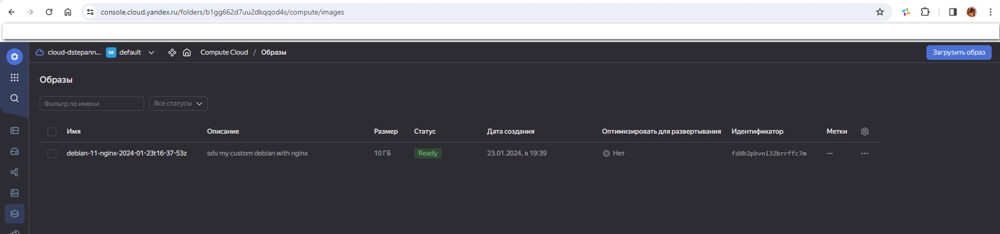
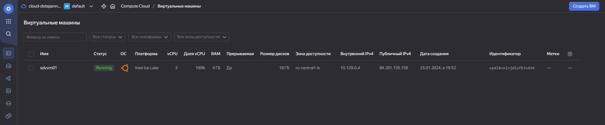
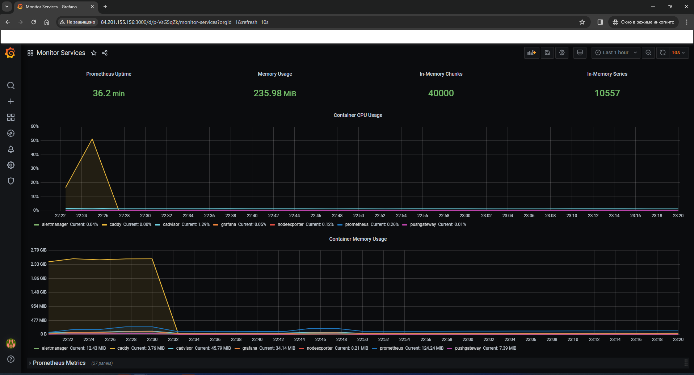

### Домашнее задание к занятию 05.4. «Оркестрация группой Docker-контейнеров на примере Docker Compose» [Степанников Денис]

---

### Задача 1
Создайте собственный образ любой операционной системы (например ubuntu-20.04) с помощью Packer (инструкция).

Чтобы получить зачёт, вам нужно предоставить скриншот страницы с созданным образом из личного кабинета YandexCloud.

### Решение:

```
sdvvm01@sdvvm01:~$ yc compute image list
+----------------------+--------------------------------------+-------------------+----------------------+--------+
|          ID          |                 NAME                 |      FAMILY       |     PRODUCT IDS      | STATUS |
+----------------------+--------------------------------------+-------------------+----------------------+--------+
| fd8b2pbvni32brrffc7m | debian-11-nginx-2024-01-23t16-37-53z | debian-web-server | f2e7gloc9nf4jo3ur4nr | READY  |
+----------------------+--------------------------------------+-------------------+----------------------+--------+

sdvvm01@sdvvm01:~$
```



### Задача 2
2.1. Создайте вашу первую виртуальную машину в YandexCloud с помощью web-интерфейса YandexCloud.

### Решение:

```
dys5324@sdvvm01:~$ ip addr
1: lo: <LOOPBACK,UP,LOWER_UP> mtu 65536 qdisc noqueue state UNKNOWN group default qlen 1000
    link/loopback 00:00:00:00:00:00 brd 00:00:00:00:00:00
    inet 127.0.0.1/8 scope host lo
       valid_lft forever preferred_lft forever
    inet6 ::1/128 scope host
       valid_lft forever preferred_lft forever
2: eth0: <BROADCAST,MULTICAST,UP,LOWER_UP> mtu 1500 qdisc mq state UP group default qlen 1000
    link/ether d0:0d:15:47:ef:5f brd ff:ff:ff:ff:ff:ff
    altname enp138s0
    altname ens8
    inet 10.129.0.4/24 metric 100 brd 10.129.0.255 scope global eth0
       valid_lft forever preferred_lft forever
    inet6 fe80::d20d:15ff:fe47:ef5f/64 scope link
       valid_lft forever preferred_lft forever
dys5324@sdvvm01:~$
```



### Задача 3

С помощью Ansible и Docker Compose разверните на виртуальной машине из предыдущего задания систему мониторинга на основе Prometheus/Grafana. Используйте Ansible-код в директории (src/ansible).

Чтобы получить зачёт, вам нужно предоставить вывод команды "docker ps" , все контейнеры, описанные в docker-compose, должны быть в статусе "Up".


### Решение:

```
root@sdvvm01:/etc/docker# sudo docker ps
CONTAINER ID   IMAGE                              COMMAND                  CREATED          STATUS                             PORTS                                                                              NAMES
0b1bd335f7cc   stefanprodan/caddy                 "/sbin/tini -- caddy…"   28 seconds ago   Up 24 seconds                      0.0.0.0:3000->3000/tcp, 0.0.0.0:9090-9091->9090-9091/tcp, 0.0.0.0:9093->9093/tcp   caddy
294509937c76   prom/prometheus:v2.17.1            "/bin/prometheus --c…"   28 seconds ago   Up 25 seconds                      9090/tcp                                                                           prometheus
475eb9e40437   grafana/grafana:7.4.2              "/run.sh"                28 seconds ago   Up 24 seconds                      3000/tcp                                                                           grafana
85590d769f26   prom/node-exporter:v0.18.1         "/bin/node_exporter …"   28 seconds ago   Up 25 seconds                      9100/tcp                                                                           nodeexporter
0850c34d3e0f   prom/pushgateway:v1.2.0            "/bin/pushgateway"       28 seconds ago   Up 24 seconds                      9091/tcp                                                                           pushgateway
e148a88e4925   prom/alertmanager:v0.20.0          "/bin/alertmanager -…"   28 seconds ago   Up 25 seconds                      9093/tcp                                                                           alertmanager
feabb26f3646   gcr.io/cadvisor/cadvisor:v0.47.0   "/usr/bin/cadvisor -…"   28 seconds ago   Up 25 seconds (health: starting)   8080/tcp                                                                           cadvisor
root@sdvvm01:/etc/docker#
```


### Задача 4

Откройте web браузер, зайдите на страницу http://<внешний_ip_адрес_вашей_ВМ>:3000. Используйте для авторизации логин и пароль из (.env-file). Изучите доступный интерфейс, найдите в интерфейсе автоматически созданные docker-compose панели с графиками(dashboards). Подождите 5-10 минут, чтобы система мониторинга успела накопить данные.

Для получения зачета, вам необходимо предоставить:

Скриншот работающего веб-интерфейса Grafana с текущими метриками.

### Решение:


