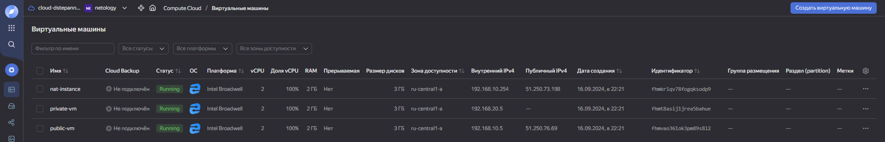

### Домашнее задание к занятию "Организация сети" [Степанников Денис]

### Подготовка к выполнению задания

1. Домашнее задание состоит из обязательной части, которую нужно выполнить на провайдере Yandex Cloud, и дополнительной части в AWS (выполняется по желанию). 
2. Все домашние задания в блоке 15 связаны друг с другом и в конце представляют пример законченной инфраструктуры.  
3. Все задания нужно выполнить с помощью Terraform. Результатом выполненного домашнего задания будет код в репозитории. 
4. Перед началом работы настройте доступ к облачным ресурсам из Terraform, используя материалы прошлых лекций и домашнее задание по теме «Облачные провайдеры и синтаксис Terraform». Заранее выберите регион (в случае AWS) и зону.

---
### Задание 1. Yandex Cloud 

**Что нужно сделать**

1. Создать пустую VPC. Выбрать зону.
2. Публичная подсеть.

 - Создать в VPC subnet с названием public, сетью 192.168.10.0/24.
 - Создать в этой подсети NAT-инстанс, присвоив ему адрес 192.168.10.254. В качестве image_id использовать fd80mrhj8fl2oe87o4e1.
 - Создать в этой публичной подсети виртуалку с публичным IP, подключиться к ней и убедиться, что есть доступ к интернету.
3. Приватная подсеть.
 - Создать в VPC subnet с названием private, сетью 192.168.20.0/24.
 - Создать route table. Добавить статический маршрут, направляющий весь исходящий трафик private сети в NAT-инстанс.
 - Создать в этой приватной подсети виртуалку с внутренним IP, подключиться к ней через виртуалку, созданную ранее, и убедиться, что есть доступ к интернету.

Resource Terraform для Yandex Cloud:

- [VPC subnet](https://registry.terraform.io/providers/yandex-cloud/yandex/latest/docs/resources/vpc_subnet).
- [Route table](https://registry.terraform.io/providers/yandex-cloud/yandex/latest/docs/resources/vpc_route_table).
- [Compute Instance](https://registry.terraform.io/providers/yandex-cloud/yandex/latest/docs/resources/compute_instance).

---

### Решение:

### Задание 1. Yandex Cloud 

```
root@sdvvm01:~/15.1# cat main.tf
# main.tf

resource "yandex_vpc_network" "my_network" {
  name = "my-vpc"
}

resource "yandex_vpc_subnet" "public_subnet" {
  name           = "public"
  network_id     = yandex_vpc_network.my_network.id
  zone           = "ru-central1-a"
  v4_cidr_blocks = ["192.168.10.0/24"]
}

resource "yandex_vpc_subnet" "private_subnet" {
  name           = "private"
  network_id     = yandex_vpc_network.my_network.id
  zone           = "ru-central1-a"
  v4_cidr_blocks = ["192.168.20.0/24"]
}

resource "yandex_compute_instance" "nat_instance" {
  name        = "nat-instance"
  zone        = "ru-central1-a"
  platform_id = "standard-v1"
  resources {
    cores  = 2
    memory = 2
  }
  boot_disk {
    initialize_params {
      image_id = "fd80mrhj8fl2oe87o4e1"
    }
  }
  network_interface {
    subnet_id  = yandex_vpc_subnet.public_subnet.id
    nat        = true
    ip_address = "192.168.10.254"
  }
}

resource "yandex_compute_instance" "public_vm" {
  name        = "public-vm"
  zone        = "ru-central1-a"
  platform_id = "standard-v1"
  resources {
    cores  = 2
    memory = 2
  }
  boot_disk {
    initialize_params {
      image_id = "fd80mrhj8fl2oe87o4e1"
    }
  }
  network_interface {
    subnet_id = yandex_vpc_subnet.public_subnet.id
    nat       = true
  }

  metadata = {
    ssh-keys = "dys5324:ssh-rsa AAAAB3NzaC1yc2EAAAADAQABAAABgQD+eBTx0Db5bOfaXqyqMeL/g3lr/Q+oX950uUsI+yk51TarnsjyL20jfLTKbRXCrVGALvClWk+HALI5gYitbPJvwOAhkJIg2MqOCw6sGtBBI4FICeQlux64j8lujDAg5ssLc0qAEVV1uUYrNPKgGk8w2RThJumnY6tm22gtj+p5F+N3FjWfwkuCM/Qi4AJCI0RqPUG4FqwN2NBTdaXtteMKAT2lYrJoZS0zREI2xhGeyjqtOoyus+fCPXbAQlFi8XKs8aw1nTRLqrnuULJMVqDt3yQYJAMh3Plt1HC8ifMn2CvpyX3kWbyC/rVn5mjhpU6KWGarmFhfy5kCsmEFtltR7vPvZTIS/KXRHRA6GuMT1TCMjaQELMXHcbfutH18CBCg3FXMLfWSIMyJy4nSUoYt+UPlbK9ThdvY+vQ2n1UQLNRtAgiAsc8lhr4DMvrxGIfXFMUt6u0IujKbgQdwk4IUVo0FVFhX1EOTBlyhzUQGgq12b2+NneULlRJ2jkrCBzU="
    user-data = <<EOF
#cloud-config
users:
  - name: dys5324
    groups: sudo
    shell: /bin/bash
    lock_passwd: false
    passwd: $6$75Abj8oEPG1AwWpT$M1yn9aQ28mlV76ZeqIp.Rr5CK1iTxhE0GZ41HrTIC1UaSYU03Wj/bgcj5BfJsV8OFnq4h5.TWmneF9Oqpv9ZT0
ssh_pwauth: true
EOF
  }
}

resource "yandex_vpc_route_table" "private_route_table" {
  network_id = yandex_vpc_network.my_network.id

  static_route {
    destination_prefix = "0.0.0.0/0"
    next_hop_address   = "192.168.10.254"
  }
}

resource "yandex_compute_instance" "private_vm" {
  name        = "private-vm"
  zone        = "ru-central1-a"
  platform_id = "standard-v1"
  resources {
    cores  = 2
    memory = 2
  }
  boot_disk {
    initialize_params {
      image_id = "fd80mrhj8fl2oe87o4e1"
    }
  }
  network_interface {
    subnet_id = yandex_vpc_subnet.private_subnet.id
  }
}
```
```
root@sdvvm01:~/15.1# cat provider.tf
terraform {
  required_providers {
    yandex = {
      source  = "yandex-cloud/yandex"
      version = "~> 0.84"
    }
  }
}

provider "yandex" {
  token     = "*****"
  cloud_id  = "b1gma921cmet0l8l5tr8"
  folder_id = "b1g96jfkjnga80nsn3ph"
  zone      = "ru-central1-a" 
}
```



```
ubuntu@fhmvao361ok3pm89s8l2:~$ ping 8.8.8.8
PING 8.8.8.8 (8.8.8.8) 56(84) bytes of data.
64 bytes from 8.8.8.8: icmp_seq=1 ttl=58 time=16.6 ms
64 bytes from 8.8.8.8: icmp_seq=2 ttl=58 time=16.1 ms
64 bytes from 8.8.8.8: icmp_seq=3 ttl=58 time=16.1 ms
^C
--- 8.8.8.8 ping statistics ---
3 packets transmitted, 3 received, 0% packet loss, time 2003ms
rtt min/avg/max/mdev = 16.140/16.309/16.611/0.259 ms
ubuntu@fhmvao361ok3pm89s8l2:~$
```