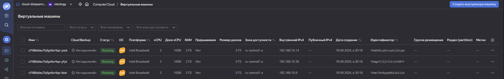
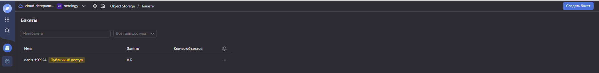
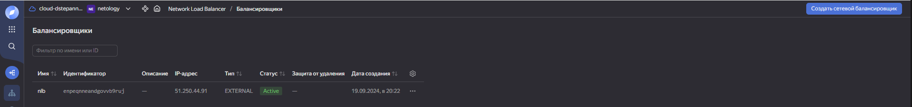

### Домашнее задание к занятию "Вычислительные мощности. Балансировщики нагрузки" [Степанников Денис]

### Подготовка к выполнению задания

1. Домашнее задание состоит из обязательной части, которую нужно выполнить на провайдере Yandex Cloud, и дополнительной части в AWS (выполняется по желанию). 
2. Все домашние задания в блоке 15 связаны друг с другом и в конце представляют пример законченной инфраструктуры.  
3. Все задания нужно выполнить с помощью Terraform. Результатом выполненного домашнего задания будет код в репозитории. 
4. Перед началом работы настройте доступ к облачным ресурсам из Terraform, используя материалы прошлых лекций и домашних заданий.

---
## Задание 1. Yandex Cloud 

**Что нужно сделать**

1. Создать бакет Object Storage и разместить в нём файл с картинкой:

 - Создать бакет в Object Storage с произвольным именем (например, _имя_студента_дата_).
 - Положить в бакет файл с картинкой.
 - Сделать файл доступным из интернета.
 
2. Создать группу ВМ в public подсети фиксированного размера с шаблоном LAMP и веб-страницей, содержащей ссылку на картинку из бакета:

 - Создать Instance Group с тремя ВМ и шаблоном LAMP. Для LAMP рекомендуется использовать `image_id = fd827b91d99psvq5fjit`.
 - Для создания стартовой веб-страницы рекомендуется использовать раздел `user_data` в [meta_data](https://cloud.yandex.ru/docs/compute/concepts/vm-metadata).
 - Разместить в стартовой веб-странице шаблонной ВМ ссылку на картинку из бакета.
 - Настроить проверку состояния ВМ.
 
3. Подключить группу к сетевому балансировщику:

 - Создать сетевой балансировщик.
 - Проверить работоспособность, удалив одну или несколько ВМ.
4. (дополнительно)* Создать Application Load Balancer с использованием Instance group и проверкой состояния.

Полезные документы:

- [Compute instance group](https://registry.terraform.io/providers/yandex-cloud/yandex/latest/docs/resources/compute_instance_group).
- [Network Load Balancer](https://registry.terraform.io/providers/yandex-cloud/yandex/latest/docs/resources/lb_network_load_balancer).
- [Группа ВМ с сетевым балансировщиком](https://cloud.yandex.ru/docs/compute/operations/instance-groups/create-with-balancer).

---

### Решение:

### Задание 1. Yandex Cloud 

```
root@sdvvm01:~/15.2# cat main.tf
# Переменные для YC и провайдеров
variable "yc_token" {
  default = "**********"
}

variable "yc_cloud_id" {
  default = "b1gma921cmet0l8l5tr8"
}

variable "yc_folder_id" {
  default = "b1g96jfkjnga80nsn3ph"
}

variable "yc_zone" {
  default = "ru-central1-a"
}

# Конфигурация Terraform
terraform {
  required_providers {
    yandex = {
      source = "yandex-cloud/yandex"
    }
  }
  required_version = ">= 0.13"
}

# Провайдер Yandex Cloud
provider "yandex" {
  token     = var.yc_token
  cloud_id  = var.yc_cloud_id
  folder_id = var.yc_folder_id
  zone      = var.yc_zone
}

# Создание сервисного аккаунта и бакета
resource "yandex_iam_service_account" "sa-bucket" {
  name = "sa-bucket"
}

resource "yandex_resourcemanager_folder_iam_member" "roleassignment-storageeditor" {
  folder_id = var.yc_folder_id
  role      = "storage.editor"
  member    = "serviceAccount:${yandex_iam_service_account.sa-bucket.id}"
}

resource "yandex_iam_service_account_static_access_key" "accesskey-bucket" {
  service_account_id = yandex_iam_service_account.sa-bucket.id
}

resource "yandex_storage_bucket" "denis-190924" {
  access_key              = yandex_iam_service_account_static_access_key.accesskey-bucket.access_key
  secret_key              = yandex_iam_service_account_static_access_key.accesskey-bucket.secret_key
  bucket                  = "denis-190924"
  default_storage_class   = "STANDARD"
  acl                     = "public-read"
  force_destroy           = true

  anonymous_access_flags {
    read        = true
    list        = true
    config_read = true
  }
}

resource "yandex_storage_object" "netology" {
  access_key = yandex_iam_service_account_static_access_key.accesskey-bucket.access_key
  secret_key = yandex_iam_service_account_static_access_key.accesskey-bucket.secret_key
  bucket     = yandex_storage_bucket.denis-190924.id
  key        = "file.jpg"
  source     = "/root/15.2/file.jpg"
}

# VPC и сеть
resource "yandex_vpc_network" "network-netology" {
  name = "network-netology"
}

resource "yandex_vpc_subnet" "public" {
  name           = "public"
  zone           = var.yc_zone
  network_id     = yandex_vpc_network.network-netology.id
  v4_cidr_blocks = ["192.168.10.0/24"]
}

# Создание instance-group с NLB
resource "yandex_iam_service_account" "sa-group" {
  name = "sa-group"
}

resource "yandex_resourcemanager_folder_iam_member" "roleassignment-editor" {
  folder_id = var.yc_folder_id
  role      = "editor"
  member    = "serviceAccount:${yandex_iam_service_account.sa-group.id}"
}

resource "yandex_compute_instance_group" "group-nlb" {
  name              = "group-nlb"
  folder_id         = var.yc_folder_id
  service_account_id = yandex_iam_service_account.sa-group.id

  instance_template {
    platform_id = "standard-v1"
    resources {
      memory = 2
      cores  = 2
    }
    boot_disk {
      initialize_params {
        image_id = "fd827b91d99psvq5fjit"  # ID образа LAMP
      }
    }
    network_interface {
      network_id = yandex_vpc_network.network-netology.id
      subnet_ids = [yandex_vpc_subnet.public.id]
    }
    metadata = {
      ssh-keys = "ubuntu:${file("~/.ssh/id_rsa_dys5324.pub")}"
      user-data = <<-EOF
        #!/bin/bash
        cd /var/www/html
        echo "<html><h1>The netology web-server with a network load balancer.</h1></html>" > index.html
      EOF
    }
  }
  labels = {
    group = "group-nlb"
  }
  scale_policy {
    fixed_scale {
      size = 3
    }
  }
  allocation_policy {
    zones = [var.yc_zone]
  }
  deploy_policy {
    max_unavailable = 2
    max_expansion   = 1
  }
  load_balancer {
    target_group_name = "target-nlb"
  }
  health_check {
    interval           = 15
    timeout            = 5
    healthy_threshold  = 5
    unhealthy_threshold = 2
    http_options {
      path = "/"
      port = 80
    }
  }
}

# NLB
resource "yandex_lb_network_load_balancer" "nlb" {
  name = "nlb"
  listener {
    name = "nlb-listener"
    port = 80
    external_address_spec {
      ip_version = "ipv4"
    }
  }

  attached_target_group {
    target_group_id = yandex_compute_instance_group.group-nlb.load_balancer.0.target_group_id
    healthcheck {
      name               = "http"
      interval           = 10
      timeout            = 5
      healthy_threshold  = 5
      unhealthy_threshold = 2
      http_options {
        path = "/"
        port = 80
      }
    }
  }
}

# Output
output "ipaddress_group-nlb" {
  value = yandex_compute_instance_group.group-nlb.instances[*].network_interface[0].ip_address
}

output "nlb_address" {
  value = flatten(yandex_lb_network_load_balancer.nlb.listener[*].external_address_spec[*].address)
}

output "picture_url" {
  value = "https://${yandex_storage_bucket.denis-190924.bucket_domain_name}/${yandex_storage_object.netology.key}"
}
root@sdvvm01:~/15.2#
```




---