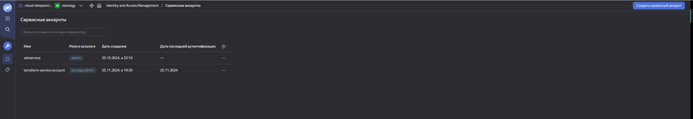
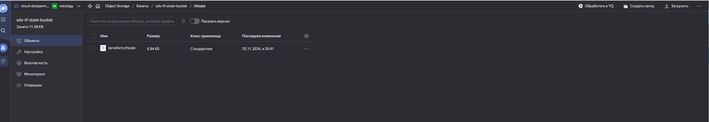
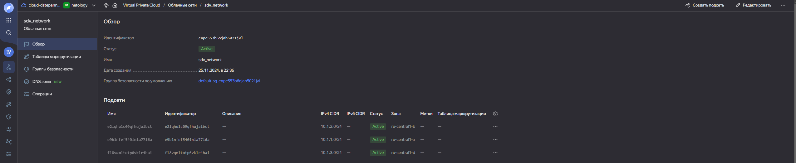

### Дипломный практикум в Yandex.Cloud [Степанников Денис]
### Этапы выполнения:

## Создание облачной инфраструктуры:
Для начала необходимо подготовить облачную инфраструктуру в ЯО при помощи Terraform.

Особенности выполнения

Предварительная подготовка к установке и запуску Kubernetes кластера.

Создайте сервисный аккаунт, который будет в дальнейшем использоваться Terraform для работы с инфраструктурой с необходимыми и достаточными правами. Не стоит использовать права суперпользователя
Подготовьте backend для Terraform:
а. Рекомендуемый вариант: S3 bucket в созданном ЯО аккаунте(создание бакета через TF) б. Альтернативный вариант: Terraform Cloud
Создайте конфигурацию Terrafrom, используя созданный бакет ранее как бекенд для хранения стейт файла. Конфигурации Terraform для создания сервисного аккаунта и бакета и основной инфраструктуры следует сохранить в разных папках.
Создайте VPC с подсетями в разных зонах доступности.
Убедитесь, что теперь вы можете выполнить команды terraform destroy и terraform apply без дополнительных ручных действий.
В случае использования Terraform Cloud в качестве backend убедитесь, что применение изменений успешно проходит, используя web-интерфейс Terraform cloud.

Ожидаемые результаты:

Terraform сконфигурирован и создание инфраструктуры посредством Terraform возможно без дополнительных ручных действий, стейт основной конфигурации сохраняется в бакете или Terraform Cloud
Полученная конфигурация инфраструктуры является предварительной, поэтому в ходе дальнейшего выполнения задания возможны изменения.

## Решение:
Каталог, конфигурации для создания сервисной уч записи и s3 бакета
```
sdvvm01@sdvvm01:~/netology-diplom/terraform/terraform-setup$ ls -lah
total 40K
drwxrwxr-x 3 sdvvm01 sdvvm01 4.0K Nov 25 17:41 .
drwxrwxr-x 6 sdvvm01 sdvvm01 4.0K Nov 27 12:19 ..
-rw-rw-r-- 1 sdvvm01 sdvvm01  238 Nov 25 17:40 auth.sh
-rw-rw-r-- 1 sdvvm01 sdvvm01 1.8K Nov 25 16:59 main.tf
drwxr-xr-x 3 sdvvm01 sdvvm01 4.0K Nov 25 17:41 .terraform
-rw-r--r-- 1 sdvvm01 sdvvm01 1.3K Nov 25 15:39 .terraform.lock.hcl
-rw-rw-r-- 1 sdvvm01 sdvvm01    0 Nov 25 17:41 terraform.tfstate
-rw-rw-r-- 1 sdvvm01 sdvvm01 6.9K Nov 25 17:41 terraform.tfstate.backup
-rw-rw-r-- 1 sdvvm01 sdvvm01  168 Oct 25 21:40 terraform.tfvars
-rw-rw-r-- 1 sdvvm01 sdvvm01  298 Oct 25 21:39 variables.tf
```
```
sdvvm01@sdvvm01:~/netology-diplom/terraform/terraform-setup$ cat main.tf
terraform {
  required_providers {
    yandex = {
      source  = "yandex-cloud/yandex"
      version = "~> 0.84"
    }
  }
  backend "s3" {
    endpoints = {
      s3 = "https://storage.yandexcloud.net"
    }
    bucket = "sdv-tf-state-bucket"
    region = "ru-central1"
    key    = "tfstate/terraform.tfstate"

    skip_region_validation      = true
    skip_credentials_validation = true
    skip_requesting_account_id  = true # Необходимая опция Terraform для версии 1.6.1 и старше.
    skip_s3_checksum            = true # Необходимая опция при описании бэкенда для Terraform версии 1.6.3 и старше.

    }

}

provider "yandex" {
  token     = var.oauth_token
  cloud_id  = var.cloud_id
  folder_id = var.folder_id
}

## Data для проверки существующего аккаунта
#data "yandex_iam_service_account" "existing_account" {
#  name = "terraform-service-account"
#}

# Создание сервисного аккаунта (если он не существует)
resource "yandex_iam_service_account" "terraform" {
  name  = "terraform-service-account"
}

# Создание IAM ключа для сервисного аккаунта
resource "yandex_iam_service_account_key" "terraform-key" {
  service_account_id = yandex_iam_service_account.terraform.id
}

# Привязка ролей к сервисному аккаунту
resource "yandex_resourcemanager_folder_iam_binding" "sa-binding" {
  folder_id = var.folder_id
  role      = "storage.admin" # Права для управления Object Storage
  members   = [
    "serviceAccount:${yandex_iam_service_account.terraform.id}"
  ]
}

resource "yandex_storage_bucket" "tf-state-bucket" {
  folder_id = "b1gpciriodg03kdqes01"
  bucket = "sdv-tf-state-bucket"
}
sdvvm01@sdvvm01:~/netology-diplom/terraform/terraform-setup$
```
```
sdvvm01@sdvvm01:~/netology-diplom/terraform/terraform-setup$ cat terraform.tfvars
# terraform.tfvars
oauth_token = "y0_AgAAAAxxxxxx"
cloud_id    = "b1gma921cmet0l8l5tr8"
folder_id   = "b1gpciriodg03kdqes01"
```
```
sdvvm01@sdvvm01:~/netology-diplom/terraform/terraform-setup$ cat variables.tf
# variables.tf
variable "oauth_token" {
  description = "OAuth Token for Yandex.Cloud"
  type        = string
}

variable "cloud_id" {
  description = "ID of the Yandex.Cloud"
  type        = string
}

variable "folder_id" {
  description = "ID of the Yandex.Cloud folder"
  type        = string
}
```
### Наличие сервисной учетной записи

### Наличие бакета s3 c сохраненным tfstate 


---
Каталог, конфигурации для VPC с подсетями в разных зонах доступности
```
sdvvm01@sdvvm01:~/netology-diplom/terraform/infrastructure$ ls -lah
total 28K
drwxrwxr-x 3 sdvvm01 sdvvm01 4.0K Nov 25 19:33 .
drwxrwxr-x 6 sdvvm01 sdvvm01 4.0K Nov 27 12:19 ..
-rw-rw-r-- 1 sdvvm01 sdvvm01  238 Nov 25 17:40 auth.sh
-rw-rw-r-- 1 sdvvm01 sdvvm01 1.3K Nov 25 19:33 main.tf
drwxr-xr-x 3 sdvvm01 sdvvm01 4.0K Nov 25 17:58 .terraform
-rw-r--r-- 1 sdvvm01 sdvvm01 1.3K Nov 25 17:58 .terraform.lock.hcl
-rw-rw-r-- 1 sdvvm01 sdvvm01  341 Nov 25 19:17 variables.tf
sdvvm01@sdvvm01:~/netology-diplom/terraform/infrastructure$
```

```
sdvvm01@sdvvm01:~/netology-diplom/terraform/infrastructure$ cat main.tf
terraform {
  required_providers {
    yandex = {
      source  = "yandex-cloud/yandex"
      version = "~> 0.84"
    }
  }
  backend "s3" {
    endpoints = {
      s3 = "https://storage.yandexcloud.net"
    }
    bucket = "sdv-tf-state-bucket"
    region = "ru-central1"
    key    = "main/terraform.tfstate"

    skip_region_validation      = true
    skip_credentials_validation = true
    skip_requesting_account_id  = true # Необходимая опция Terraform для версии 1.6.1 и старше.
    skip_s3_checksum            = true # Необходимая опция при описании бэкенда для Terraform версии 1.6.3 и старше.

    }

}

provider "yandex" {
}


resource "yandex_vpc_network" "sdv_network" {
  name = "sdv_network"
}

resource "yandex_vpc_subnet" "sdv-network-a" {
  v4_cidr_blocks = ["10.1.1.0/24"]
  zone           = "ru-central1-a"
  network_id     = yandex_vpc_network.sdv_network.id
}

resource "yandex_vpc_subnet" "sdv-network-b" {
  v4_cidr_blocks = ["10.1.2.0/24"]
  zone           = "ru-central1-b"
  network_id     = yandex_vpc_network.sdv_network.id
}

resource "yandex_vpc_subnet" "sdv-network-d" {
  v4_cidr_blocks = ["10.1.3.0/24"]
  zone           = "ru-central1-d"
  network_id     = yandex_vpc_network.sdv_network.id
}

sdvvm01@sdvvm01:~/netology-diplom/terraform/infrastructure$
```
```
sdvvm01@sdvvm01:~/netology-diplom/terraform/infrastructure$ cat variables.tf
# variables.tf
#variable "oauth_token" {
#  description = "OAuth Token for Yandex.Cloud"
#  type        = string
#  default = "${env.YC_TOKEN}"
#}

#variable "cloud_id" {
#  description = "ID of the Yandex.Cloud"
#  type        = string
#}

#variable "folder_id" {
#  description = "ID of the Yandex.Cloud folder"
#  type        = string
#}
```
### Наличие VPC с подсетями в разных зонах доступности



